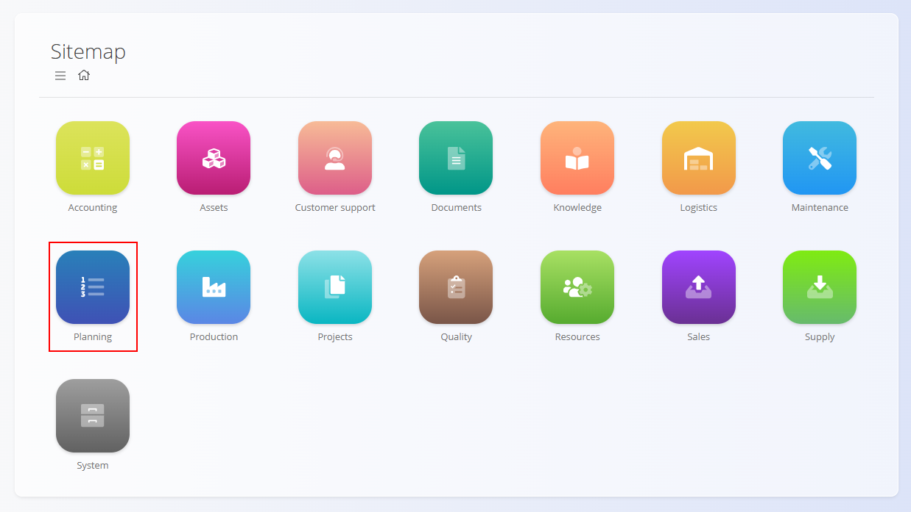
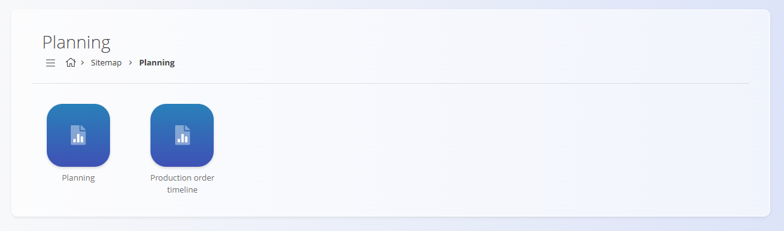

<!-- app_route: /sitemap/planning -->
<!-- app_label: Planning domain -->
<!-- canonical_source_url: https://github.com/Tom-PIT/Connected.Docs/blob/main/en/Domains/Planning/Domain/PlanningDomain.md -->
<!-- canonical_source_title: Planning -->

# Planning

The **Planning** domain is used for **scheduling and monitoring production orders**. It provides visual tools to manage production timelines and track planned work.

To access this domain, navigate to **Planning** from the [navigation](../../../Common/UI/Navigation.md).

## Available views

The domain includes the following views:

- **[Planning](../Views/Planning.md)** – calendar view of planned production orders, where you can schedule and adjust production timelines  
- **Production order timeline** – timeline-based view showing the sequence and duration of production orders  

