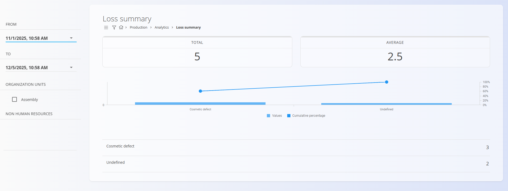

<!-- app_route: /production/analytics/loss-summary -->
<!-- app_label: Loss summary -->
<!-- canonical_source_url: https://github.com/Tom-PIT/Connected.Docs/blob/main/en/Domains/Production/Analytics/LossSummary.md -->
<!-- canonical_source_title: Loss summary -->

# Loss summary

The Loss summary page provides an overview of defective or unusable items recorded during production within a selected time period. It helps identify the most common loss types and evaluate their impact on production quality.

To access this page, go to **Production / Analytics / Loss summary** in the [**navigation**](../../../Common/UI/Navigation.md).

> [!TIP]
> For a full walkthrough of production analytics, see the **[Loss summary](https://www.youtube.com/watch?v=BnboA1WuUu0)** video tutorial.

## Filters

### From / To  
Select the date range for which loss records will be analyzed.

### Organization units  
Filter losses by specific organizational units.

### Non human resources  
Filter losses by equipment or other non-human resources.

## Summary values

At the top of the page, two key indicators are displayed:

### Total  
The total number of defective or unusable units recorded in the selected period.

### Average  
The average number of defective units per operation or per recorded event (based on system calculation).

## Loss distribution chart

Below the summary values, the page displays:

- A bar representing the **number of losses** per loss classification  
- A **cumulative percentage line**, helping visualize which loss types contribute most to the overall defects  

This chart helps identify major sources of quality issues and supports Pareto-style analysis.

## Loss details

Under the chart, a detailed breakdown lists each loss classification along with the number of defective units recorded for that category.

Example categories may include any custom classifications defined in [**Loss classification tags**](../Management/LossClassificationTags.md)

Selecting a row may provide more context depending on system configuration.

