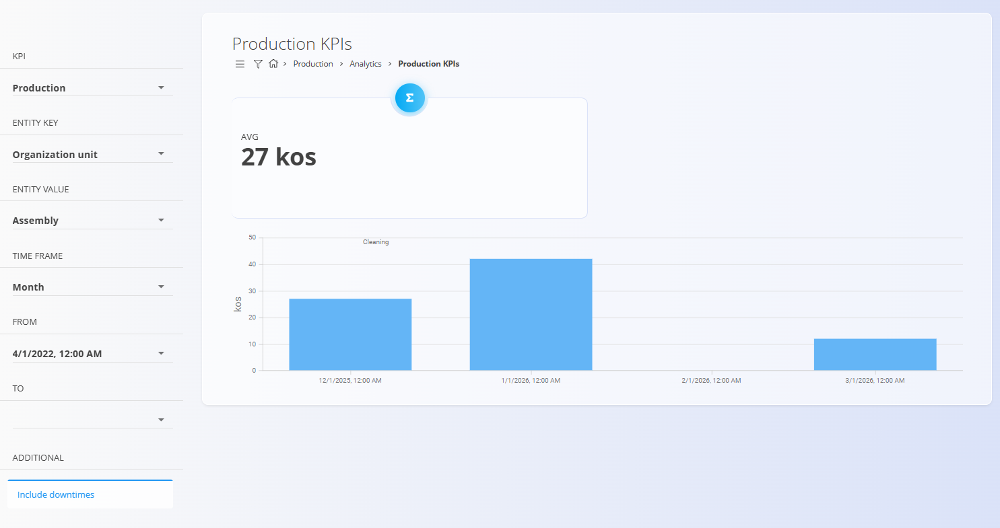
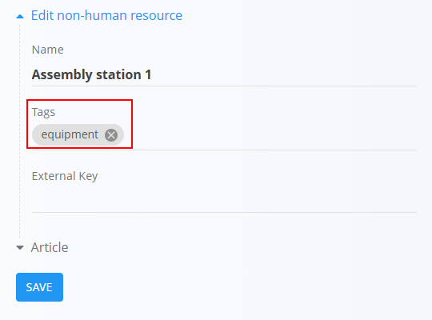
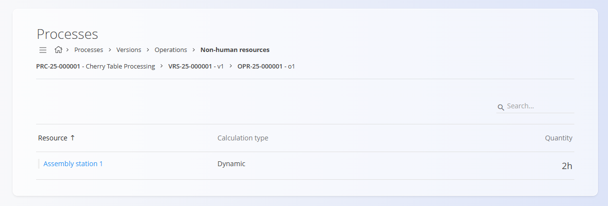

<!-- app_route: /production/analytics/kpis -->
<!-- app_label: Production KPIs -->
<!-- canonical_source_url: https://github.com/Tom-PIT/Connected.Docs/blob/main/en/Domains/Production/Analytics/ProductionKPIs.md -->
<!-- canonical_source_title: Production KPIs -->

# Production KPIs

The **Production KPIs** page provides analytical insights into production performance and equipment efficiency.

KPIs help monitor:
- production quality
- equipment availability
- downtime
- production effectiveness
- overall equipment effectiveness (OEE)

KPI calculations are based on [standard OEE methodology](https://www.oee.com/calculating-oee/).

To access this page, go to **Production / Analytics / Production KPIs** in the [**navigation**](../../../Common/UI/Navigation.md).



> [!TIP]
> For a full walkthrough of production analytics, see the **[Key Performance Indicators](https://www.youtube.com/watch?v=zzs6wJh-tQY)** video tutorial.

> [!NOTE]
> KPI values may appear with a short delay after production data is entered.

## Equipment requirements

To collect production KPI data:
- non-human resources must contain the ```equipment``` tag

  

- the specific equipment must be assigned to production operations

  

## Filters

The left-side panel includes several filters that define what KPI data is shown.

### KPI
Select which production indicator to analyze.

| KPI | Meaning |
|-----|---------|
| **Actual operation time** | Total operation time, including downtimes |
| **Actual production time** | Time spent producing, excluding downtime |
| **Ideal production** | Expected production quantity based on standards |
| **Quality ratio** | Percentage of compliant products relative to total production |
| **Unplanned downtime** | Total time of unplanned stoppages |
| **Incompliant production** | Number of defective units |
| **Planned downtime** | Total time of planned stoppages |
| **Production** | Total number of produced units |
| **Availability** | Percentage of time equipment was available for production |
| **Overall equipment effectiveness (OEE)** | Combined indicator of availability, effectiveness, and quality |
| **Effectiveness** | Comparison between actual and expected production performance |
| **Compliant production** | Number of good (non-defective) units |

### Entity key
Defines what type of asset the KPI is measured for:
- **Equipment**
- **Organization unit**

### Entity value
Select the specific equipment or organizational unit, based on the entity key.

### Time frame
Defines the reporting granularity, for example:
- **Quarter hour**
- **Hour**
- **Day**
- **Week**
- **Month**
- **Year**

> [!NOTE]
> The selected **Time frame** determines how KPI data is grouped.
>
> - Hour → hourly values
> - Day → daily values
> - Month → monthly values
>
> More detailed time frames provide more precise analysis, but meaningful results depend on how frequently production data is entered.

### From / To
Select the date and time range for which KPI data should be displayed.

### Additional settings
- **Include downtimes** – When enabled, downtime values are included in KPI calculations where applicable.

## KPI results

The KPI results are displayed at the top of the page and include:
- **AVG** – The average value of the selected KPI over the chosen period  
- A **bar or line chart** showing the KPI trend across the selected time frame  

> [!NOTE]
> The **AVG** value is calculated from the original production data, not as an average of the displayed chart values.
>
> Because of this, the AVG value may differ from the visual average shown in the graph.

Depending on the selected KPI, additional details may appear below the graph:
- For **downtime KPIs**, downtime reasons and durations  
- For **production KPIs**, compliant and incompliant quantities  
- For **equipment KPIs**, daily or hourly performance indicators  

> [!NOTE]
> Missing values in the graph do not necessarily mean the KPI value was zero. In some cases, no production data was recorded for the selected time period.

