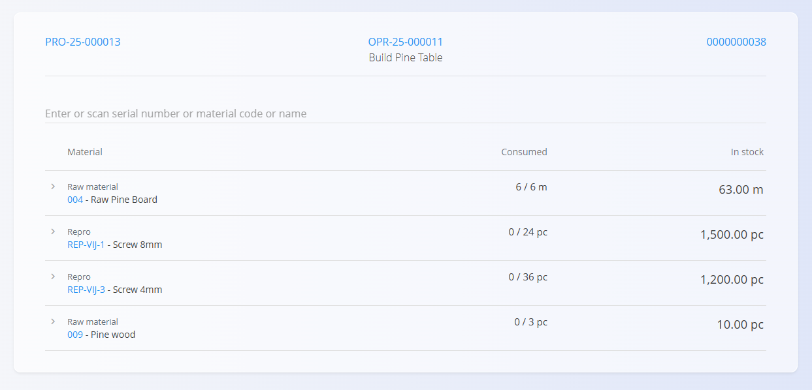
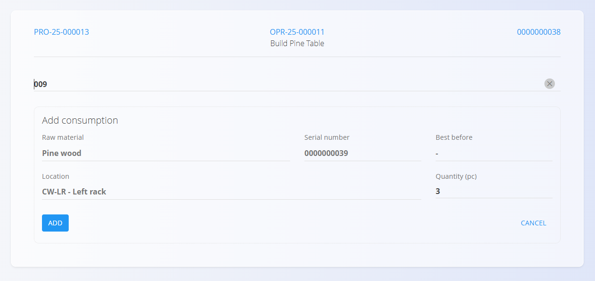

# Consumed

The **Consumed** activity records the usage of input materials during an operation. Use it when you take materials from stock to make products (for example: screws, glue, paint, wiring, or a specific serial/batch). This keeps stock accurate and ensures full traceability of inputs (materials, serials, batches).

Open the **Consumed** screen from the main [**Execution**](Execution.md) page via the activity selection menu (click the [action button](../../../Common/UI/ActionButton.md) and select **Consumed**).

## Recording a consumption

1. Open the **Consumed** page from the [**Execution action menu**](Execution.md#action-menu-and-activities).  
2. Review the list of consumed materials (with stock info).  
3. Select a material from the list, or search/scan by name, code, serial, or EAN.  
4. On the **Add consumption** screen, enter the quantity to consume. 

   

5. Click **Add** to save the consumption.  
6. Repeat for other materials as needed.

The consumed quantity is linked to the operation and reflected in stock in real time.

### Validations

The system validates:

- Availability in stock (sufficient quantity)
- Correct warehouse and location
- Serial/batch ownership and status

If any validation fails, an error is shown and the consumption is not recorded.

