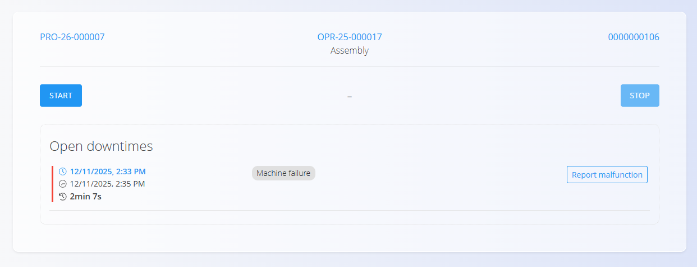

<!-- app_route: /production-orders/execution -->
<!-- app_label: Execution -->
<!-- canonical_source_url: https://github.com/Tom-PIT/Connected.Docs/blob/main/en/Domains/Production/Documents/Downtime.md -->
<!-- canonical_source_title: Downtime -->

# Downtime

The **Downtime** activity records interruptions during an operation (e.g., waiting for materials, machine issues, changeovers). It helps track time losses and improves visibility for analysis.

Open **Downtime** from the [**Execution**](Execution.md) screen via the activity selection menu (tap the [action button](../../../Common/UI/ActionButton.md), then choose **Downtime**).

## Recording a downtime

1. Open the **Downtime** page from the [**Execution action menu**](Execution.md#action-menu-and-activities).  
2. Click **Start** to begin tracking the interruption.  
3. Click **Stop** when the interruption ends. 
4. Click on a downtime record to: 
    1. Choose a reason using [**Downtime tags**](../Management/DowntimeTags.md).  
    2. Adjust start/end times if needed.  
    3. Add any relevant equipment affected by the downtime (optional).
5. Click **Save**.

Click the **Report malfunction** button to create a Malfunction report — see [**Reported malfunctions**](../../Maintenance/Documents/ReportedMalfunctions.md).

Saved downtimes are linked to the production order and operation and appear in the execution overview.

### Editing and corrections

Select a downtime entry to adjust times, change the tag, add equipment, or delete it if added by mistake.

## Analytics and reporting

Downtime entries feed several analytics pages:

- [Downtime Summary](../Analytics/DowntimeSummary.md)
- [Production KPIs](../Analytics/ProductionKPIs.md)
- [Organization Unit Downtime](../Analytics/OrganizationUnitDowntime.md)

Consistent tagging improves the accuracy of KPIs.

