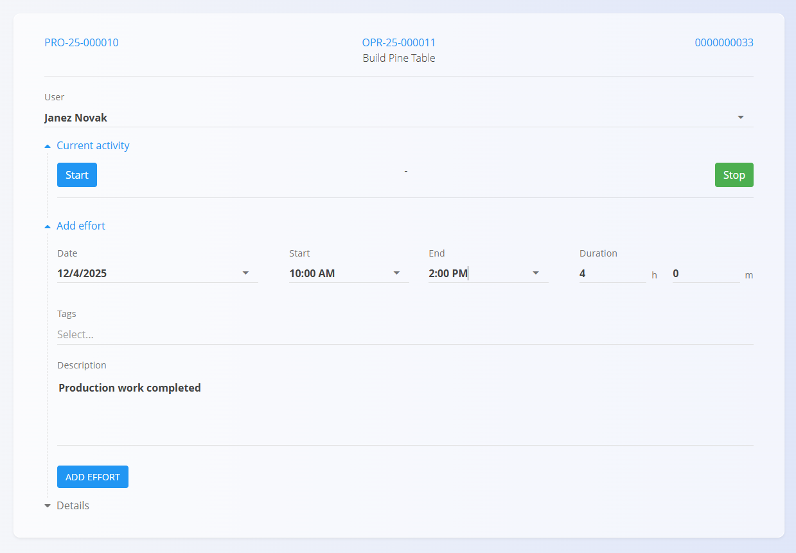

<!-- app_route: /production-orders/execution -->
<!-- app_label: Execution -->
<!-- canonical_source_url: https://github.com/Tom-PIT/Connected.Docs/blob/main/en/Domains/Production/Documents/Execution.md -->
<!-- canonical_source_title: Execution -->

# Execution – Quick User Guide

This guide shows the **essential steps** to perform production using the Execution screen.

> [!NOTE]
>
>For more information and details refer to the full **[Execution](Execution.md)** documentation.

## 1. Select your production order

When you open **Execution**, select the production order and operation you will work on.  
If nothing is selected, the screen will prompt you to choose a **Production order**.

## 2. Start the operation

You can start work in two ways:

### Option A — Press Start
Tap **Start** to begin timing and working on the operation.

### Option B — Press Produce
Pressing **Produce** will **automatically start the operation**, even if you don’t change the quantity.

## 3. Produce items

1. Enter the number of items you produced (e.g., **1**).  
2. Press **Produce**.  
3. The system updates:  
   - Produced quantity  
   - Remaining quantity  

Repeat whenever more items are completed.

> **NOTE**  
> Review **Instructions** if they appear or whenever needed:  
> - Tap **Instructions** to view assembly steps, visuals, or operation-specific notes.

## 4. Complete quality checklists (if applicable)

[Checklists and quality controls](Execution.md#checklists-and-quality-controls) are simple step-by-step checks that help keep work safe and products correct. A checklist can pop up at the start, during the job, or before you finish, based on how the operation is set up.

1. Follow the steps shown on screen.  
   
   

2. Complete each step. When you’re done, tap **Finish**.  
3. If you need to do a checklist again:
    1. Open the action menu via the [**action button**](../../../Common/UI/ActionButton.md).
    2. Enter the **[Quality](Quality.md)** section.
    3. Tap **Repeat** for the checklist you want to redo.

> [!NOTE]
> You can’t stop the operation if a required checklist isn’t finished.

## 5. Record losses (if applicable)

1. Go to the action menu by clicking the [**action button**](../../../Common/UI/ActionButton.md).
2. Enter the **[Loss](Execution.md#loss)** section.  
3. Enter the defective quantity.  
4. Select the loss reason.  
5. Confirm by clicking the yellow **Loss** button.

## 6. Record consumed materials

Use this when materials are used during the operation:

1. Go to the action menu by clicking the [**action button**](../../../Common/UI/ActionButton.md).
2. Enter the **[Consumed](Execution.md#consumed)** section.  
3. Scan, type, or select the material.  
4. Enter the quantity consumed.  
5. Confirm.

## 7. Record downtime (if applicable)

1. Go to the action menu by clicking the [**action button**](../../../Common/UI/ActionButton.md).
2. Enter the **[Downtime](Execution.md#downtime)** section.
3. Click start and stop to record the interruption period.  
4. Choose the reason for the interruption.  
5. Adjust the times if necessary.  
6. Save.

Use this for any interruption, such as waiting for materials or machine issues.

## 8. Record effort (working time)

1. Go to the action menu by clicking the [**action button**](../../../Common/UI/ActionButton.md).
2. Enter the **[Effort](Execution.md#effort)** section if required by your workflow.

### Automatic:
Tap **Start** → work → tap **Stop**.

### Manual:
Open **Effort**, then enter:  
- Date  
- Start/end time or duration  
- Notes (optional)  

Save the entry. The list of recorded efforts can be found below.

## 9. Finish the operation

When all production work is completed:

1. Verify produced quantity.  
2. Record any losses, downtime, consumed materials, or checklists.  
3. Tap **Stop** to finish the operation.

