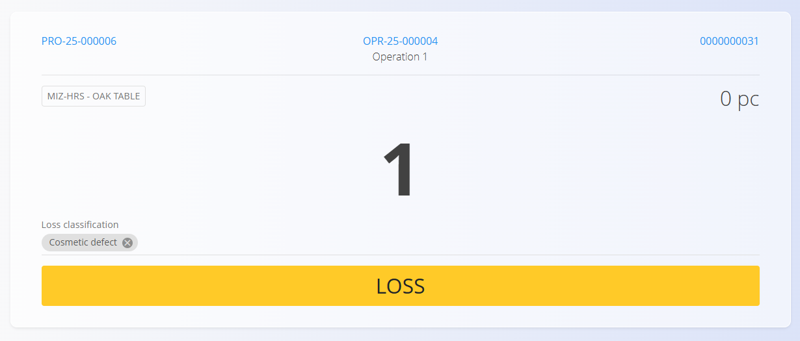

<!-- app_route: /production-orders/execution -->
<!-- app_label: Execution -->
<!-- canonical_source_url: https://github.com/Tom-PIT/Connected.Docs/blob/main/en/Domains/Production/Documents/Loss.md -->
<!-- canonical_source_title: Loss -->

# Loss

The **Loss** activity records defective or unusable items produced during an operation. It helps keep quality visible and ensures accurate reporting and traceability.

Open **Loss** from the [**Execution**](Execution.md) screen via the activity selection menu (tap the [action button](../../../Common/UI/ActionButton.md), then choose **Loss**).

## Recording a loss

1. Open the **Loss** page from the [**Execution action menu**](Execution.md#action-menu-and-activities).  
2. Enter the defective quantity.  

    

3. Select a **Loss classification** (reason) tag — see [Loss classification tags](../Management/LossClassificationTags.md).   
4. Click **Loss** (yellow button) to save.  
5. Repeat for additional losses as needed.

Saved losses are linked to the production order and operation and appear in the execution overview.

## Classifications and tags

Loss reasons are managed as tags (e.g., cosmetic defect, wrong dimension, machine fault). Choose the best matching tag to support downstream analysis. See [Loss classification tags](../Management/LossClassificationTags.md).

## Analytics and reporting

Loss entries feed several analytics pages:

- [Loss Summary](../Analytics/LossSummary.md)
- [Production KPIs](../Analytics/ProductionKPIs.md)
- [Organization Unit Loss](../Analytics/OrganizationUnitLoss.md)

Use consistent tagging to get meaningful KPIs.

