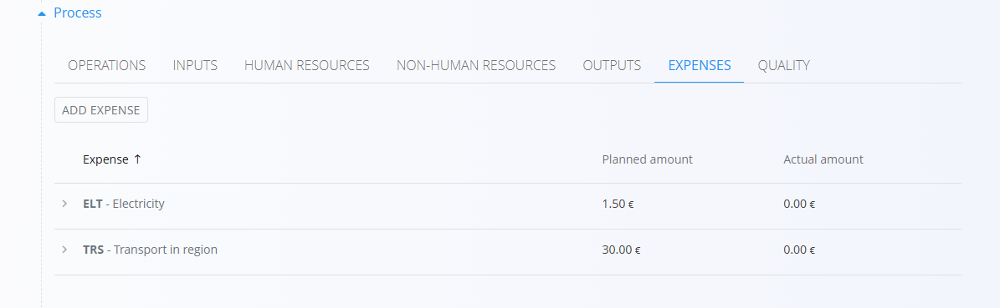
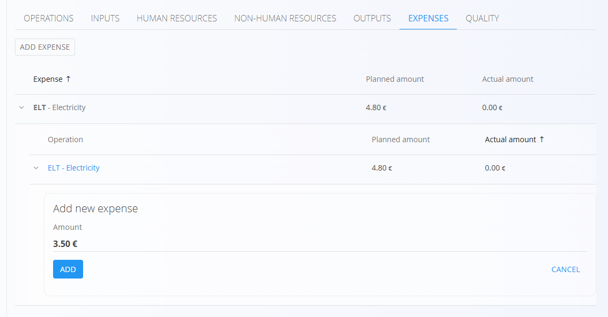
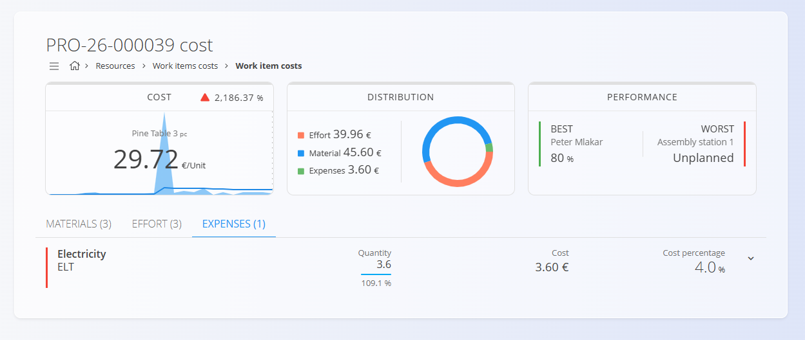

<!-- app_route: /production-orders -->
<!-- app_label: Production order -->
<!-- app_navigation_hint: Open a production order, then open the **Expenses** section. -->
<!-- canonical_source_url: https://github.com/Tom-PIT/Connected.Docs/blob/main/en/Domains/Production/Documents/ProductionOrderExpenses.md -->
<!-- canonical_source_title: Production order - Expenses section -->

# Production orders - Expenses

Expenses related to a [production order](ProductionOrders.md) can be recorded in the **Expenses** section of the order details. This allows tracking of both planned and actual expenses for a production order, providing better insights into the costs associated with the production process.

Expenses are typically [added to an operation](../Management/OperationExpenses.md) in the production process, but they can also be added directly to the production order if they are not linked to a specific operation.

## Add or edit an expense

In order to calculate more accurately the actual costs of a produced item, planned expenses can be added or edited on the **Expenses** tab: 

- To edit a planned expense, click on the expense in the list to open its details, make the necessary changes, and click **Save**.
- To add a new expense:
    1. Click on the **Add planned expense** button.
    2. Select the operation expense and the cost.
    3. Click **Add** to save the new expense.

> [!IMPORTANT]
> The planned expense cost is calculated **per order**. For example, if the cost is **$2** per item and the quantity planned to produce is 10, the expense cost will be **$20**.

## Record the actual expense cost

Planned expenses represent expected costs, while actual expenses represent the real recorded cost during production execution. Actual costs can be recorded if they differ from the planned expense. This allows tracking the difference between planned and actual costs, which is essential for cost control and analysis.

To record the actual expense cost:

1. Click on the arrow next to the expense on the list to open its details.
1. Click on **Add actual expense**.
2. Enter the actual cost of the expense, date and time.
3. Click **Add**.

Actual costs can be edited or deleted if necessary. To edit or delete an actual expense click on the amount to open its details, make the necessary changes, and click **Save** or **Delete**.

## Expenses cost review

The recorded expenses are added and summarized in the [**Work items cost]**(../../Resources/Views/WorkItemsCosts.md) view, where you can analyze the cost distribution of the work item. 

This view is also accessible through the production orders list, where the cost per unit is displayed for each order. Clicking on the cost per unit opens the [**Work items cost]**(../../Resources/Views/WorkItemsCosts.md) view filtered on the selected order, allowing you to analyze the cost distribution of the work item and review the expenses in detail.

