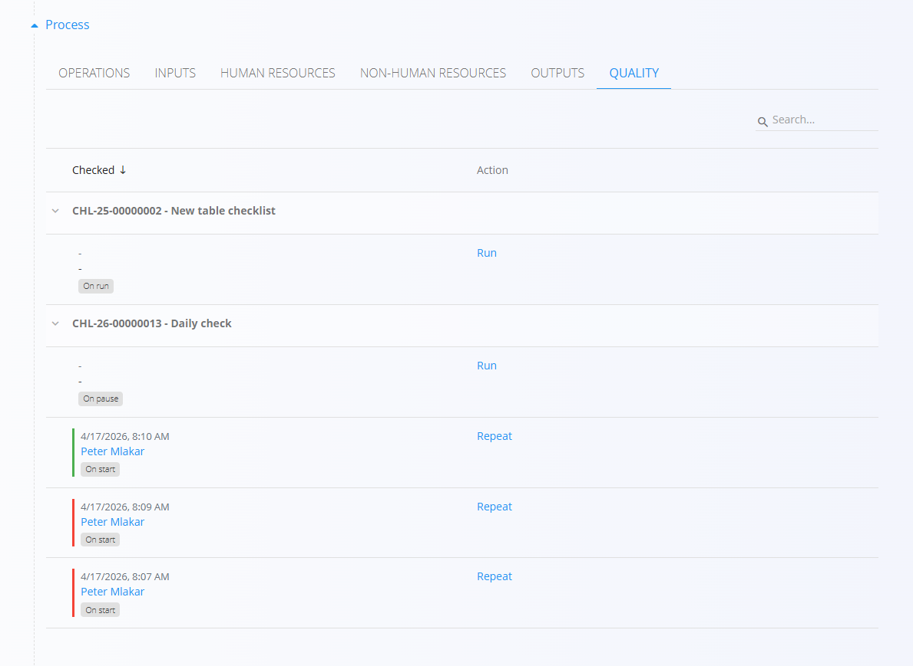

<!-- app_route: /production-orders -->
<!-- app_label: Production order -->
<!-- app_navigation_hint: Open a production order, then open the **Quality** section. -->
<!-- canonical_source_url: https://github.com/Tom-PIT/Connected.Docs/blob/main/en/Domains/Production/Documents/ProductionOrderQuality.md -->
<!-- canonical_source_title: Production order - Quality section -->

# Production orders - Quality

The **Quality** section displays all [**checklists**](../Management/Checklists.md) associated with the selected **[production](ProductionOrders.md) or [maintenance](../../Maintenance/Documents/MaintenanceOrders.md) order**. 

These checklists are added to a specific **[process](../Management/Processes.md) or [operation](../Management/Operations.md)** to ensure that quality control procedures are performed during the execution of the order.

## Overview

The list shows all checklists linked to the order with its name and code. Each checklist shows the different execution records for that checklist. Each record shows:

- **Date and time** of completion  
- **Operator** who executed the checklist  
- **Trigger badge** – indicates when the checklist was planned to run (e.g. *On start*, *On run*, *On pause*)  

Completed checklists are visually marked:

- **Green** – checklist completed successfully  
- **Red** – checklist failed (e.g. values outside permitted limits)  

## Actions

The following actions are available:

- **Run** - Starts the checklist manually. Checklists are usually configured to run automatically at a specific time (e.g. *On start*, *On pause*), but they can also be triggered manually using this action.

- **Repeat** - Runs the checklist again, creating a new execution record. This is useful when a checklist needs to be repeated (e.g. after correcting an issue).

- **Delete** - Deletes a **currently running checklist**.

> [!IMPORTANT]
> The **Delete** action is used to **force stop and remove** a checklist that is stuck and preventing the completion of the production order.
