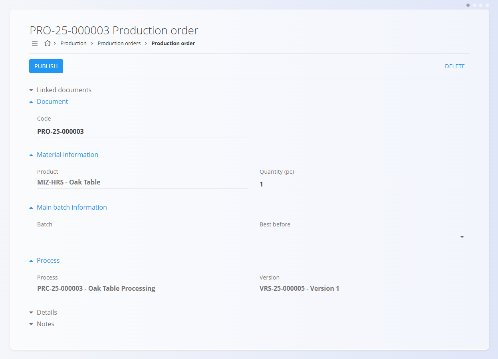
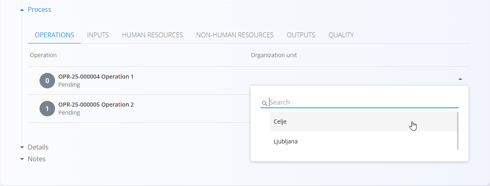
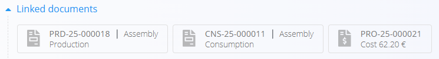
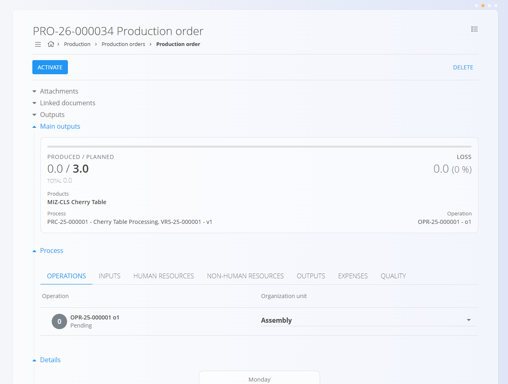
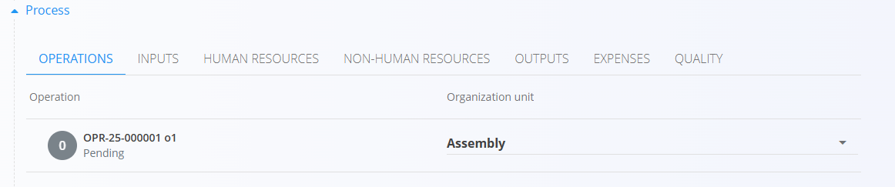
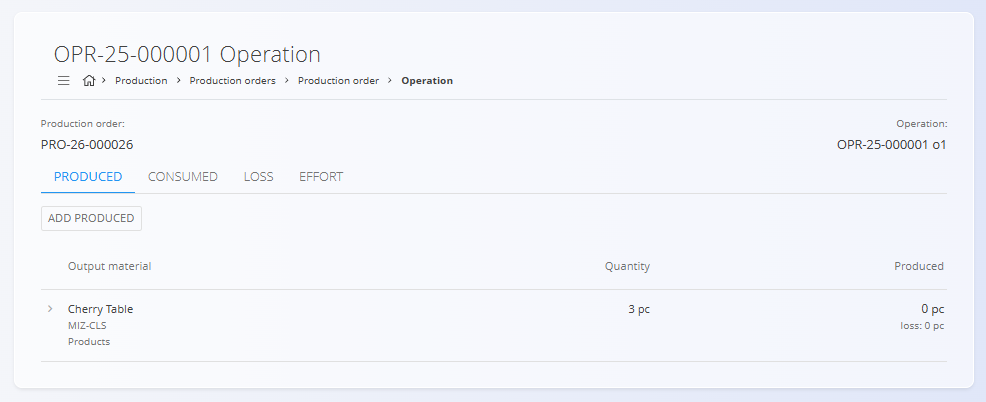
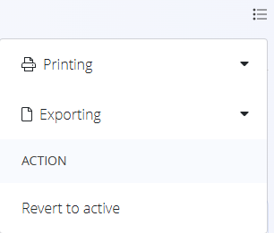

<!-- app_route: /production-orders -->
<!-- app_label: Production orders -->
<!-- canonical_source_url: https://github.com/Tom-PIT/Connected.Docs/blob/main/en/Domains/Production/Documents/ProductionOrders.md -->
<!-- canonical_source_title: Production orders -->

# Production orders

Production orders define the work required to manufacture products according to a selected process and version.  
They move through the life cycle **Draft → Pending → Active → Closed**, and can include multiple operations, resources, inputs, outputs, and quality checks based on the assigned process.

> [!NOTE]
> **Prerequisites**  
> 
>Before creating a new production order, ensure that the following are configured:
> - At least one **[Process](../Management/Processes.md)** with an active **version**
> - Assigned **[Organization units](../Management/OrganizationUnits.md)** for production  
> - Optional supporting definitions such as **[resources](../Management/Resources.md)**, **[downtime tags](../Management/DowntimeTags.md)**, **[loss classification tags](../Management/LossClassificationTags.md)** and **[checklists](../Management/Checklists.md)** depending on your workflow (recommended)

> [!TIP]
> For a full demonstration, see the **[Production order](https://www.youtube.com/watch?v=q4UjiYpWph8)** video tutorial.

To access production orders, go to **Production / Production orders** in the [navigation](../../../Common/UI/Navigation.md).

## List of production orders

The Production orders page displays all orders grouped by status. Use the filters on the left to refine the list.

### Filters

- **Production order dates** – Filter orders by date range.  
- **View** – Shows orders by life cycle stage:  
  -  **Draft** — Editable order created through the wizard
  -  **Pending** — Finalized order, ready to activate
  -  **Active** — Being executed; visible in **[Execution](Execution.md)**
  -  **Closed** — Finished; results recorded 
- **Project** – Filter production orders linked to a specific project.

The search bar at the top allows filtering by production order code or material name.

## Create a production order

To create a production order, click on the [action button](../../../Common/UI/ActionButton.md) and follow the [guided three-step wizard](ProductionOrderCreate.md).

## Draft production orders

A newly created order appears with status **Draft**.

Drafts allow editing of:

- Code
- Quantity  
- Batch 
- Best before date
- Notes  
- Process 
- Version

### Publish a draft production order

To move the draft to **Pending**, the **Organization unit** must be selected, if not already predefined in the [operation](../Management/Operations.md).

Click **Publish** when ready.

## Edit a production order

Draft orders can be edited freely, while Active and Closed orders have limited editability. To edit an order:

1. Click on the desired order from the list to open its details.
2. Make the necessary changes.
3. Click **Save** to apply the changes or **Cancel** to discard them.

## Pending production orders

A **Pending** order is fully prepared and waiting to be activated. No production execution can begin yet.

From the Pending state, you can:

- Review operations  
- Add attachments  
- Add notes  
- Manage linked documents

When the order is ready for production, click **Activate**.

## Linked documents

You may attach other documents that relate to the production order, such as:

- [**Projects**](../../Projects/Domain/ProjectsDomain.md)  
- [**Supply orders**](../../Supply/Documents/SupplyOrders.md)
- [**Inquiries**](../../Supply/Documents/Inquiries.md)
- Other production orders (linked or input-producing)  

Production orders also display any linked documents created during the order's lifecycle, such as cost and consumption reports.

## Active production orders

When activated, the order becomes **Active** and is ready for execution on the shop floor.

Production workers can now execute operations through the **[Execution](Execution.md)** module.

The **Process** section displays all planned [operations](../Management/Operations.md), [inputs](../Management/Inputs.md), resources, [outputs](../Management/Outputs.md), [expenses](ProductionOrderExpenses.md), and [quality checks](ProductionOrderQuality.md) for the chosen version and its operations.

> [!NOTE]
> The input and output sections: 
> - Show the **planned** and **actual** quantities. The planned quantity is determined by the selected process version and the order quantity, while the actual quantity reflects the production execution data. 
> - Show the **stock** on hand for the materials, allowing workers to verify availability before starting production.

Clicking on an operation opens the detailed view, where workers can record execution data, such as:

- **Produced**
- **Consumed**
- **Loss**
- **Effort**

Each section has an **Add entry** button to record execution details. For example, in the **Produced** section, you can log the material produced, the quantity produced, and the production times.

### Expenses

**[Production order expenses](ProductionOrderExpenses.md)** allow tracking planned and actual operational costs. 

### Quality

The [**Quality**](ProductionOrderQuality.md) section displays all [**checklists**](../Management/Checklists.md) associated with the selected production order.

## Closed production orders

Once production is completed and all operations have been executed, the order is set to **Closed**, appears in the list under the **Closed** status.

The list also displays the cost per unit produced and an arrow indicating whether the cost has increased or decreased compared to the previous closed order for the same material. Clicking on the cost per unit opens the [**Work items costs**](../../Resources/Views/WorkItemsCosts.md) view filtered on the selected order, allowing you to analyze the cost distribution of the work item and review the expenses in detail.

Closed orders:

- Cannot be modified  
- Provide a complete production history  
- Show produced vs. planned quantities, losses, and outputs 

The **Process** section displays the full execution history. Click on the different tabs to see the details, for example, inputs used during production:

Closed production orders offer additional options in the action menu:

- Printing
- Exporting (PDF)
- Revert to active - allows reopening the order for corrections if needed

### Revert a closed production order to active

If modifications are necessary after closing, you can revert the order back to **Active**:

1. Open the closed production order
1. Select **Revert to active** from the action menu
1. Click **Reactivate** on the desired process

## Delete a production order

A production order can be deleted only when in **Draft or Pending states** and if it is not referenced by other documents.  

To delete a production order:

1. Select a draft or pending order from the list to open its details.
2. Click **Delete**. A confirmation dialog will appear. If confirmed, the order will be permanently removed from the system.

> [!NOTE]
>
> Closed orders cannot be deleted, but they can be reverted to active for modifications if necessary.
