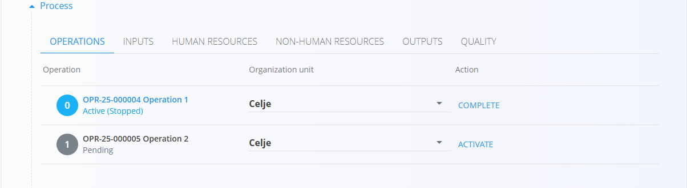

# Production orders

Production orders define the work required to manufacture products according to a selected process and version.  
They move through the life cycle **Draft → Pending → Active → Closed**, and can include multiple operations, resources, inputs, outputs, and quality checks based on the assigned process.

> [!NOTE]
> **Prerequisites**  
> 
>Before creating a new production order, ensure that the following are configured:
> - At least one **[Process](../Management/Processes.md)** with an active **version**
> - Assigned **[Organization units](../Management/OrganizationUnits.md)** for production  
> - Optional supporting definitions such as **[resources](../Management/Resources.md)**, **[downtime tags](../Management/DowntimeTags.md)**, **[loss classification tags](../Management/LossClassificationTags.md)** and **[checklists](../Management/Checklists.md)** depending on your workflow (recommended)

> [!TIP]
> For a full demonstration, see the **[Production order](https://www.youtube.com/watch?v=q4UjiYpWph8)** video tutorial.

To access production orders, go to **Production / Production orders** in the [**navigation**](../../../Common/UI/Navigation.md).

## List of production orders

The Production orders page displays all orders grouped by status. Use the filters on the left to refine the list.

### Available filters

- **Production order dates** – Filter orders by date range.  
- **View** – Shows orders by life cycle stage:  
  -  **Draft** — Editable order created through the wizard
  -  **Pending** — Finalized order, ready to activate
  -  **Active** — Being executed; visible in **[Execution](Execution.md)**
  -  **Closed** — Finished; results recorded 
- **Project** – Filter production orders linked to a specific project.

The search bar at the top allows filtering by production order code or material name.

## Creating a production order

Click the [**action button**](../../../Common/UI/ActionButton.md) and follow the guided three-step wizard:

### **Step 1 — Select material**

Choose the **Material type** (e.g., Products or Semi products), then select the specific [**material**](../../Assets/Domain/Materials.md) and quantity to be manufactured.

### **Step 2 — Select process**

Choose the **[Process](../Management/Processes.md)** and **Process version** that defines how the material will be produced.

> [!NOTE]
> If no processes are listed in this step, verify configuration in the **[Processes](../Management/Processes.md)** code list. Ensure the process includes the “Production” tag and has an active version. Missing the tag is a common reason the process does not appear here.

### **Step 3 — Provide additional information**

This step defines scheduling and order type.

#### **Mode**
Determines how the production order will behave:

- **Standard** — Creates a single production order for the total quantity.
- **Parent** — Creates a parent (master) order that acts only as a container for subordinate orders.  
  The parent order has **no operations** and is not executed.
- **Parent with partial productions** — Creates a parent order and automatically generates several subordinate production orders that each produce part of the total quantity.  
  Two fields appear:
  - **Number of partial productions** — how many subordinate orders should be created  
  - **Partial production quantity** — automatically calculated based on the total quantity

**Example:**  
If total quantity = **3 pieces**  
- 3 partial productions → each = **1 piece**  
- 2 partial productions → each = **1.5 pieces**

#### **Dates**

Specify scheduling details (optional):
- **Deadline date**
- **Planned start date**
- **Planned end date**

Click **Finish** to create the **Draft** production order.

## Draft production orders

A newly created order appears with status **Draft**.

Drafts allow editing of:

- Code
- Quantity  
- Batch 
- Best before date
- Notes  

### Publishing a draft

To move the draft to **Pending**, the **Organization unit** must be selected.

Click **Publish** when ready.

## Pending production orders

A **Pending** order is fully prepared and waiting to be activated. No production execution can begin yet.

From the Pending state, you can:

- Review operations  
- Add attachments  
- Add notes  
- Manage linked documents

When the order is ready for production, click **Activate**.

## Linked documents

You may attach other documents that relate to the production order, such as:

- [**Projects**](../../Projects/Domain/ProjectsDomain.md)  
- [**Supply orders**](../../Supply/Documents/SupplyOrders.md)
- [**Inquiries**](../../Supply/Documents/Inquiries.md)
- Other production orders (linked or input-producing)  

Production orders also display any linked documents created during the order's lifecycle, such as cost and consumption reports.

## Active production orders

When activated, the order becomes **Active** and is ready for execution on the shop floor.

Production workers can now execute operations through the **Execution** module. See **[Execution](Execution.md)** for more details.

The **Process** section displays all planned operations, inputs, resources, outputs, and quality checks for the chosen version.

## Closed production orders

Once production is completed and all operations have been executed, the order is set to **Closed**, appears in the list under the **Closed** status.

The list also displays the cost per unit produced and an arrow indicating whether the cost has increased or decreased compared to the previous closed order for the same material.

Closed orders:

- Cannot be modified  
- Provide a complete production history  
- Show produced vs. planned quantities, losses, and outputs 

The **Process** section displays the full execution history. Click on the different tabs to see the details, for example, inputs used during production:

Closed production orders offer additional options in the action menu:

- Printing
- Exporting (PDF)
- Revert to active - allows reopening the order for corrections if needed

### Reverting to active

If modifications are necessary after closing, you can revert the order back to **Active**:

1. Open the closed production order
1. Select **Revert to active** from the action menu
1. Click **Reactivate** on the desired process

## Deletion

A production order can be deleted only when in **Draft or Pending states** and if it is not referenced by other documents.  

Use the **Delete** option in the header.

> [!NOTE]
>
> Closed orders cannot be deleted, but they can be reverted to active for modifications if necessary.
