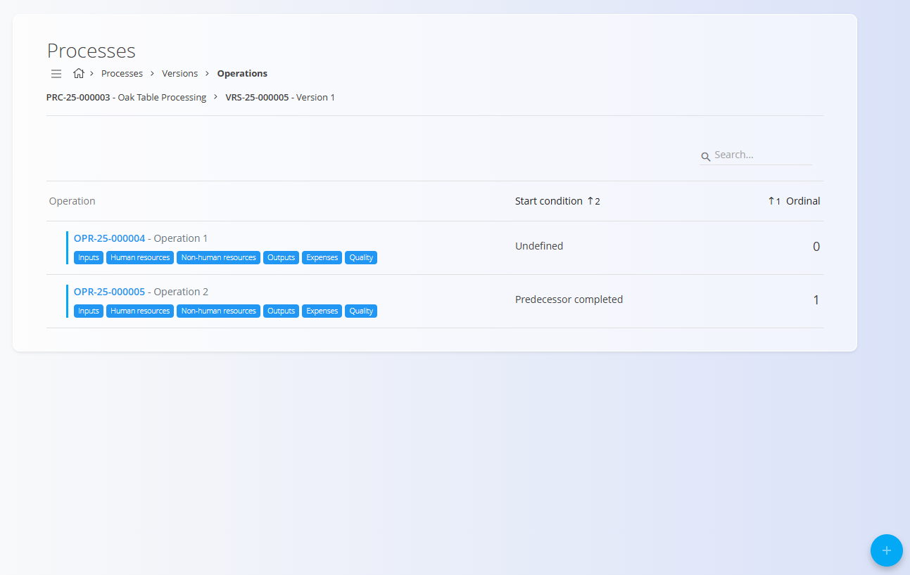
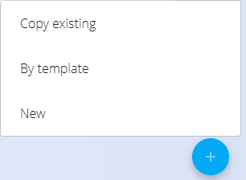

<!-- app_route: /management/processes -->
<!-- app_label: Processes -->
<!-- app_navigation_hint: Open a process, select a version, click Operations, then open the relevant operation. -->
<!-- canonical_source_url: https://github.com/Tom-PIT/Connected.Docs/blob/main/en/Domains/Production/Management/Operations.md -->
<!-- canonical_source_title: Operations -->

# Operations

Operations represent the **individual steps inside a process version**. Each process version contains one or more operations, executed in sequence or according to defined conditions. Operations define **what resources are used**, **what inputs and outputs are handled**, **how long the step takes**, and **which organizational units or expenses apply**.

To access operations: 
1. Go to **Production / Management / Processes** and select a [**Process**](Processes.md)
2. select a **Version**
3. Click **Operations**.

> [!TIP]
> For a full demonstration, see the **[Operations](https://www.youtube.com/watch?v=rPyLL6pSZA0)** video tutorial.

## Schema

| Field | Description |
|-------|-------------|
| [**Code**](../../../Common/UI/DocumentCodes.md) | Automatically generated operation code. |
| **Name** | The operation name (mandatory). |
| **Description** | Optional description of the operation. |
| **Ordinal** | Defines the order of execution within the process version. |
| **Start condition** | Determines when the operation can start: • Undefined • Predecessor activated • Predecessor completed • Anytime |
| **Activation sub-status** | Initial state of the operation: **Running** or **Stopped**. |
| **Automatic completion condition** | Defines if the operation completes automatically (e.g., *After execution time*). |
| **Time impact** | Indicates whether the operation’s duration affects the total process duration: • Undefined • Include • Exclude |
| **Parent** | Allows nesting an operation under another one. |
| **Default organization unit** | Assigns the organizational unit responsible for the operation. |
| **Article** | Adds an article from the [Knowledge base](../../Knowledge/KnowledgeBase/KnowledgeBase.md) to the version and provide more detailed instructions, descriptions, or images. Enter the article title or select it from the dropdown menu. (optional). |
| **Tags** | Optional tags for grouping or categorizing operations. |
| **[**Expense**](../../Supply/Management/Expenses.md)** | Expense category linked to this operation. |

## List view

The list displays all operations defined inside the selected process version. Each row includes:
- Operation code and name  
- Start condition  
- Ordinal  
- Quick-access buttons for:  
- **[Inputs](Inputs.md)** – Materials or items consumed by the operation  
- **[Human resources](HumanResources.md)** – Workers or job positions required  
- **[Non-human resources](NonHumanResources.md)** – Machines or equipment  
- **[Outputs](Outputs.md)** – Materials or items produced by the operation  
- **[Expenses](OperationExpenses.md)** – Costs associated with the operation
- **[Quality](QualityChecklists.md)** – Assigned checklists and quality requirements

Use the **Search** field to filter operations by name or code.

## Creating a new operation

1. Click the [**action button**](../../../Common/UI/ActionButton.md) and choose:  
   - **New**  
   - **By template** - if templates are available in [**Protocol operations instance templates**](ProtocolOperationsInstanceTemplates.md).
   - **Copy existing**  

   

2. Fill in the fields:

   ")  
   ")

3. Click **Add** to create the operation.

## Editing an operation

To edit an operation:
1. Click an operation in the list.  
2. Modify any of the fields as needed.  
3. Click **Save** to apply changes.

Operations can be **enabled or disabled**, affecting whether they appear in production workflows.

## Completion conditions and sequence

Operations run in the order defined by **Ordinal** unless overridden by the **Start condition**. For example:
- **Predecessor completed** → waits for the previous step to finish  
- **Anytime** → can run independently  
- **Predecessor activated** → starts when the previous step begins  

These rules define how the process behaves in production.

## Related operation sections

Each operation contains several sub-pages, each with its own list and screens. These are documented separately:
- **[Inputs](Inputs.md)**
- **[Human resources](HumanResources.md)** 
- **[Non-human resources](NonHumanResources.md)**
- **[Outputs](Outputs.md)** 
- **[Expenses](../../Supply/Management/Expenses.md)**
- **[Quality](QualityChecklists.md)**

You can access these from the operation entry:

## Deletion

Operations **can be deleted** on the Edit page, but only if they are:
- Not referenced by other operations (e.g., as a parent)  
- Not used in active production orders  

