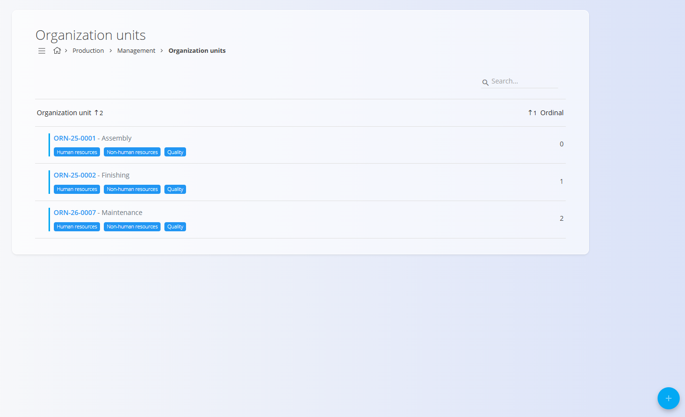
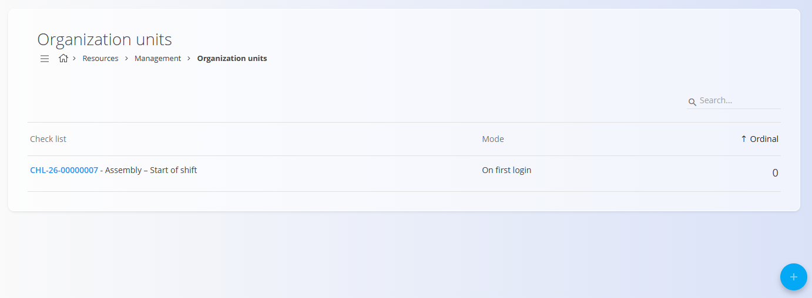

<!-- app_route: /management/resources/organization-units -->
<!-- app_label: Organization units -->
<!-- canonical_source_url: https://github.com/Tom-PIT/Connected.Docs/blob/main/en/Domains/Production/Management/OrganizationUnits.md -->
<!-- canonical_source_title: Organization units -->

# Organization units

The **Organization units** code list defines operational organizational entities used across **Production** and **Maintenance** workflows — for example manufacturing cells, assembly lines, maintenance departments, or service teams. Use this page to view, add, edit and delete organization units and to manage their basic properties (name, tags, parent hierarchy, and availability) that other features reference.

Organization units are used by planners and supervisors to scope operations, filter lists, and control workflow routing (for example, selecting the correct input/output warehouse location or assigning duties). Example: the Organization unit with Code **ORN-25-0002** corresponds to **Finishing**, a production unit responsible for finishing the product before packaging; similarly, a **Maintenance** unit might be **Electrical Maintenance** for equipment servicing.

To access Organization units, navigate to the **Production** or **Maintenance** domains, then go to **Management / Organization units** in the [navigation](../../../Common/UI/Navigation.md).

> [!TIP]
> For a full demonstration, see the **[Organization units](https://www.youtube.com/watch?v=qGkHEuOEWT4)** video tutorial.

## Schema

| Field | Description |
|-------|-------------|
| [**Code**](../../../Common/UI/DocumentCodes.md) | Unique code for the organization unit (system-generated). |
| **Name** (mandatory) | Display name of the organization unit. |
| **Description** | Short description of the unit's responsibilities or scope. |
| **Ordinal** | Integer to control ordering in lists. |
| **Tags** | Optional tags for categorization (e.g., Production, Maintenance). |
| **Parent** | Optional parent organization unit (hierarchy). |
| **Enabled** | Toggle to enable or disable the organization unit. Disabled units are not used in new workflows. |

## Management

Open this screen to view, add and edit organization units used across Production and Maintenance.

### Organization units list

The list shows the organization unit **Code** and **Name** and displays tags and the **Ordinal** value. Use the search box in the header to find records. Click an organization unit to open the edit form.

Each record includes a status indicator to the left of its name:
- **Blue** indicates the organization unit is active
- **Gray** indicates the organization unit is inactive

Use the buttons under each organization unit to attach human, non-human resources, and quality checklists to the selected organization unit. See **[Resources](Resources.md)** for details on defining people, machines, teams, and maintenance tools.

### Actions

### Create a new organization unit

Click the [action button](../../../Common/UI/ActionButton.md) to open the form to create a new organization unit.

Fill in the fields on the form:

- **Code** — shown and assigned by the system.
- **Name** (mandatory) — enter the unit name.
- **Description** — optional description.
- **Ordinal** — numeric order (default 0).
- **Tags** — select zero or more tags (e.g., Production, Maintenance).
- **Parent** — optionally select a parent unit to build a hierarchy.
- **Enabled** — check to enable the unit.

Click **Add** to save the new organization unit, or **Cancel** to discard.

### Quality in organization units

Organization units can have [**quality checklists**](Checklists.md) assigned to them. A checklist can be used to require users to complete basic tasks (for example, at the start of a shift) before continuing.

> [!NOTE]
> Currently, the only available mode is **On first login**.

#### Add a quality checklist to an organization unit

1. In the organization units list, click **Quality** on the desired organization unit.
2. Click the action button to add a new checklist.
3. Select:
   - **Checklist** (configured in [Checklists](Checklists.md))
   - **Mode** (currently **On first login**)
   - **Ordinal** (order in which checklists are shown)
4. Click **Add** to save or **Cancel** to discard.

### Edit a organization unit

Click on an organization unit in the list to open the Edit form. Adjust the following fields as needed:

- **Name** 
- **Description** 
- **Ordinal** 
- **Tags**
- **Parent** 
- **Enabled** 
 
Click **Save** to persist changes or **Cancel** to discard. Use **Delete** to remove the record if no longer required.

## Delete an organization unit

Click on an organization unit in the list to open the Edit form and select **Delete**.

If confirmed, the record is permanently removed from the Organization units list; referenced data in other domains is not affected.
