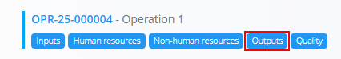
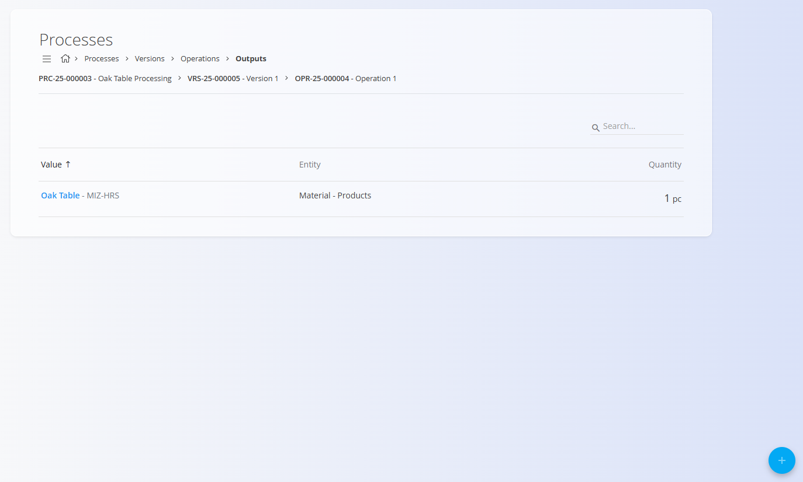
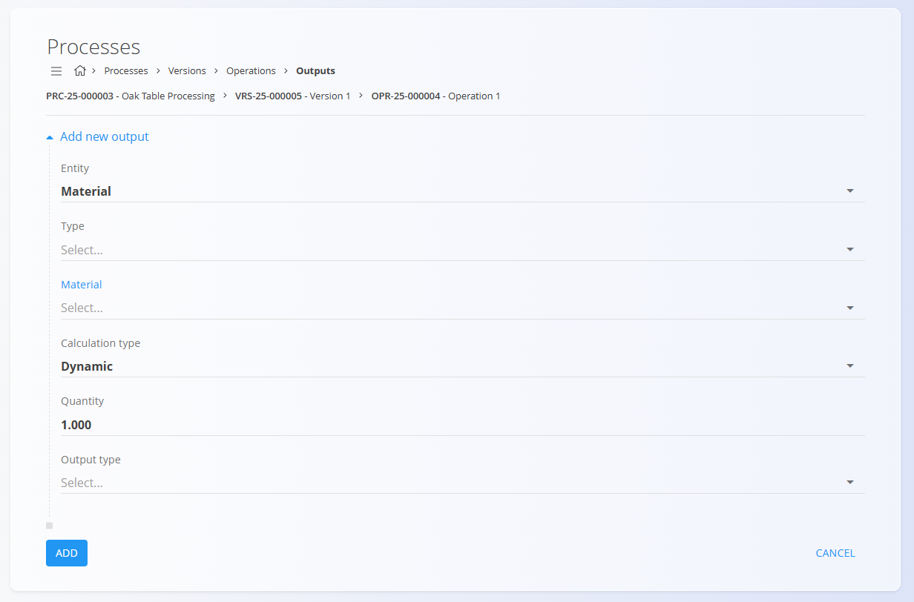

<!-- app_route: /management/processes -->
<!-- app_label: Processes -->
<!-- app_navigation_hint: Open a process, select a version, click Operations, then open Outputs for the relevant operation. -->
<!-- canonical_source_url: https://github.com/Tom-PIT/Connected.Docs/blob/main/en/Domains/Production/Management/Outputs.md -->
<!-- canonical_source_title: Outputs -->

# Outputs

Outputs define the materials produced during an **operation** inside a process version. Each output specifies the resulting product, its quantity, and optional classification tags.

To access this page, open a process version from **Production / Management / [Processes](Processes.md)**,  click [**Operations**](Operations.md), then select **Outputs** for a specific operation.

> [!TIP]
> For a full demonstration, see the **[Inputs & Outputs](https://www.youtube.com/watch?v=647sT70tNZc)** video tutorial.

## Schema

| Field | Description |
|-------|-------------|
| **Entity** | Select whether the output refers to a [**Material**](../../Assets/Domain/Materials.md) or a **Material tag**. |
| **Type** | The material category to output:  • **[Products](../../Assets/Materials/Products.md)** • **[Raw materials](../../Assets/Materials/RawMaterials.md)** • **[Repro materials](../../Assets/Materials/ReproMaterials.md)** • **[Semi products](../../Assets/Materials/SemiProducts.md)** |
| **Material** | The specific material or product produced by this operation. |
| **Calculation type** | Defines how the quantity is calculated: **Dynamic** or **Static**. |
| **Quantity** | The produced quantity. The measure unit depends on the selected material (pcs, kg, m, etc.). |
| **Output type** | Additional output classification (dropdown). |
| **Tags** | Optional tags used to categorize the output. |
| **Ordinal** | Defines the order in which outputs are listed. |

## List view

The list displays all outputs belonging to the selected operation. Each row shows the material, its type, and the quantity produced.

### Menu

The menu in the top-right corner of the screen provides quick access to the following actions:

- **Delete all outputs** – Deletes all outputs linked to the operation.

## Create a new output

1. Click the **action button** in the bottom-right corner and choose one of the following:

    

    - **Copy existing outputs**
    - **New**

2. Fill in the required fields.

    

3. Click **Add** to save the output.

## Edit an output

1. Click an existing output in the list.  
2. Modify any of the fields.  
3. Click **Save**.

## Delete an output

Click an existing output in the list to open the edit page, then click **Delete**. If confirmed, it is removed from the operation.
