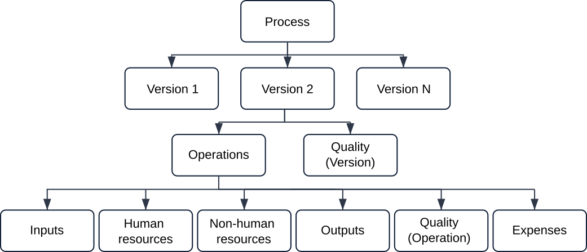
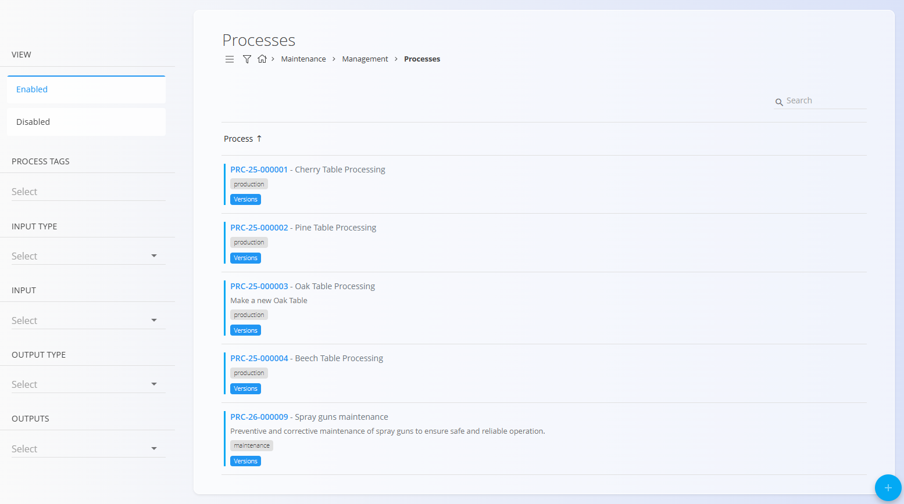
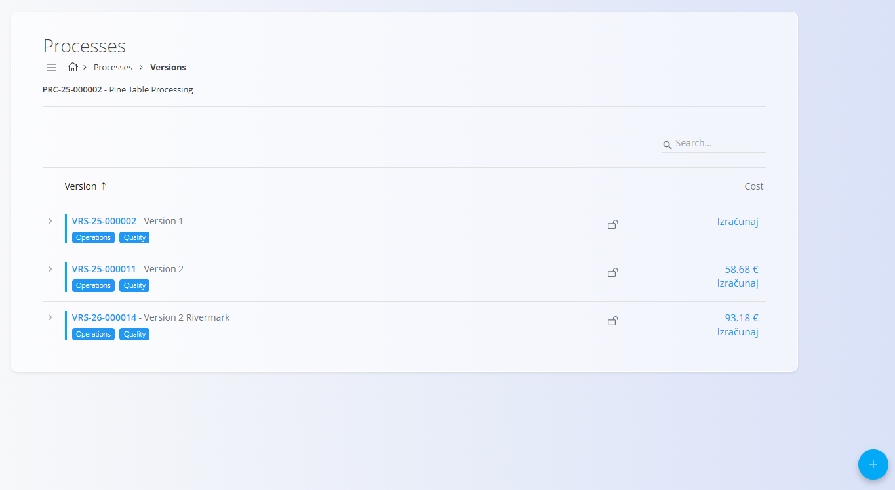

<!-- app_route: /management/processes -->
<!-- app_label: Processes -->
<!-- canonical_source_url: https://github.com/Tom-PIT/Connected.Docs/blob/main/en/Domains/Production/Management/Processes.md -->
<!-- canonical_source_title: Processes -->

# Processes

Processes define the structured steps used across **Production** and **Maintenance** to transform inputs into outputs (finished, intermediate, or serviced equipment states). They form the backbone of operational workflows and are used in **documents** to calculate materials, resources, workloads, and execution steps:
- **[Production orders](../Documents/ProductionOrders.md)** for production workflows
- **[Maintenance orders](../../Maintenance/Documents/MaintenanceOrders.md)** for maintenance workflows

This page allows you to create and manage processes, their versions, and their operational structure.

A process may contain one or more **versions**, for example, different versions for different product sizes or maintenance variants. Each version contains a sequence of [**operations**](Operations.md), which define inputs, resources (human and non-human), outputs, and quality requirements.

To access this page, go to **Production / Management / Processes** in the [navigation](../../../Common/UI/Navigation.md). Processes are shared and can be tagged for Production or Maintenance usage.

> [!TIP]
> For a full demonstration, see the **[Processes and versions](https://www.youtube.com/watch?v=4svpFCm7rkk)** video tutorial.

## Schema

### Process fields

| Field | Description |
|-------|-------------|
| [**Code**](../../../Common/UI/DocumentCodes.md) | Automatically generated process code (read-only). |
| **Name** | The name of the process (mandatory). |
| **Description** | A short explanation of what the process accomplishes. |
| **Tags** | Tags used to group or categorize the process (e.g., **Production**, **Maintenance**). |

### Version fields

| Field | Description |
|-------|-------------|
| [**Code**](../../../Common/UI/DocumentCodes.md) | Automatically generated version code (read-only). |
| **Name** | Version name (mandatory). |
| **Description** | Optional additional details about the version. |
| **Article** | Optional link to a specific instruction article from the [**Knowledge base**](../../Knowledge/KnowledgeBase/KnowledgeBase.md). |

## List view

The Processes list displays all configured processes. Each row includes the process code, name, description, and tags. Use the **Search** bar to find processes by name or code.

The left-side panel provides filters for:

- **View**: Enabled / Disabled  
- **Process tags** (e.g., Production, Maintenance)  
- **Input type**  
- **Input**  
- **Output type**  
- **Outputs**

## Create a new process

1. Click the [action button](../../../Common/UI/ActionButton.md) and select **New** or **Copy existing**.
2. Fill in the following fields:  
   - **Name** – Required  
   - **Description** – Optional  
   - **Tags** – Optional, but **required** to link the process to specific areas. For example:  
     - Add the **Production** tag to make the process available when creating a new [**Production order**](../Documents/ProductionOrders.md).  
     - Add the **Maintenance** tag to make the process available when creating a new [**Maintenance order**](../../Maintenance/Documents/MaintenanceOrders.md).

    

3. Click **Add** to create the new process.

> [!IMPORTANT]
> Tags control where the process can be used. If you do not add a relevant tag (e.g., **Production** or **Maintenance**), the process will not be available when creating documents in that area (e.g., a [**Production order**](../Documents/ProductionOrders.md) or a [**Maintenance order**](../../Maintenance/Documents/MaintenanceOrders.md)).

## Edit a process

To edit an existing process:

1. Select a process from the list.
2. Update the **Name**, **Description**, or **Tags** as needed.
3. Click **Save** to apply changes.

## Versions

Each process may include multiple **versions**, allowing you to update or improve a workflow over time while keeping older versions intact.

From the Versions screen, you can:

- Add a new version  
- Edit or disable a version  
- Lock a version  
- Open a version to work with its operations and configuration screens  

A version includes:

- Basic version information  
- A list of **operations**  
- Enable/disable controls  
- The option to **lock** a version to prevent edits  
- Version cost calculation and analysis features

### Pre-calculation (Version cost calculation)

From the **Versions** screen you can estimate the **production cost per item** for a specific process version.

Each version displays a **Cost** column with:

- **Calculate** – calculates the estimated production cost for the selected version.
- **Cost value** – the last calculated cost per item.

When **Calculate** is clicked, the system calculates the estimated cost of producing one item using that version. The calculation takes into account:

- **Material prices** - set in [**Supplier material**](../../Supply/Management/SupplierMaterials.md) price lists
- **Human work** (labor effort)  - set in [**Resources cost**](../../Resources/Management/ResourcesCosts.md)
- **Non-human resources** (machines, workstations) - set also in [**Resources cost**](../../Resources/Management/ResourcesCosts.md)
- **Additional expenses** associated with the version - set in the [**Expenses**](../../Supply/Management/Expenses.md) code list

If changes are made to the version (for example operations, materials, or resources), the cost should be recalculated.

Clicking on the **cost value** opens the detailed [**version cost analysis**](../Analytics/VersionCostView.md) page, where the full cost structure is displayed.

### Operations inside a version

A version contains a sequence of **[operations](Operations.md)**, each representing a step of the process. Operations may include, for example, cutting, painting, assembly, packaging (production), or inspection, lubrication, calibration (maintenance).

To access the list operations of a version click on the **[Operations](Operations.md)** button:

Each operation includes:

- **[Inputs](Inputs.md)** – Materials or items consumed by the operation  
- **[Human resources](HumanResources.md)** – Workers or job positions required  
- **[Non-human resources](NonHumanResources.md)** – Machines or equipment  
- **[Outputs](Outputs.md)** – Materials or items produced by the operation  
- **[Quality](QualityChecklists.md)** – Assigned checklists and quality requirements

## Quality in process versions

The **[Quality](QualityChecklists.md)** button opens the configuration page for the selected process version or operation. This page allows you to assign one or more [**Checklists**](../../Quality/Management/Checklists.md), which define the quality-control steps required during execution.

> [!NOTE]
> Quality checklists can be assigned either to the **process version** (applies to the entire process) or to individual **operations** (performed during a specific operation).

## Delete a process

A process can be deleted only if it is **not used by documents** (e.g., production or maintenance orders) and **not referenced by other processes**.  

To delete a process, select it from the list and click **Delete**. 

After confirmation, the process will be permanently removed from the list of processes. If the process is in use, an error message will appear.