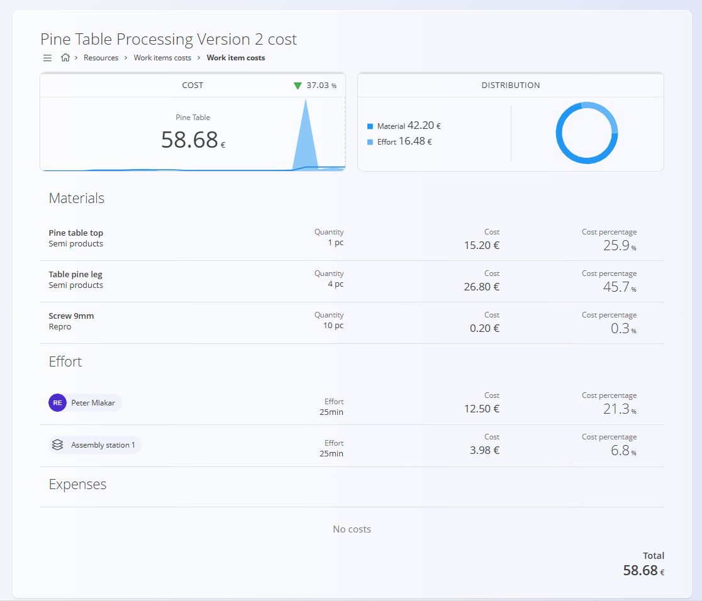

# Version cost analysis

The **Version cost analysis** screen displays the **estimated production cost per item** for a specific **process version**.

This view is opened by clicking the **cost value** in the **Cost** column on the **[Versions](Processes.md#versions)** screen.

The page provides a detailed breakdown of how the total production cost is calculated, including materials, work effort, and additional expenses.

## Cost summary

The **Cost** panel shows the **total estimated cost per produced item** for the selected version.

Displayed information includes:

- **Item name** – the output item associated with the process version
- **Total estimated cost**
- **Trend indicator** showing the difference compared to the previous calculated value

The cost is calculated based on all resources and materials defined within the version operations.

## Cost distribution

The **Distribution** panel shows a visual breakdown of the total cost.

A **chart and legend** display how the cost is divided between:

- **Materials** – cost of all input materials consumed by the operations
- **Effort** – cost of human and machine work required to execute the operations

This view helps quickly identify which components contribute most to the total cost.

## Materials

The [**Materials**](../../Assets/Domain/Materials.md) section lists all materials consumed by the process operations.

Each row displays:

- **Material name**
- **Material type** (e.g., semi-product, raw material)
- **Quantity required**
- **Cost contribution**
- **Cost percentage** relative to the total item cost

Material prices are taken from the **current material pricing configuration** in the system.

## Effort

The **Effort** section shows the cost generated by work resources used during the process. These costs are calculated based on the **effort duration** and the **hourly rates** of the assigned resources. The costs are taken from the [**Resources costs**](../../Resources/Management/ResourcesCosts.md) code list.

This may include:

- **Human resources** (operators, workers)
- **Non-human resources** (machines, workstations)

Each entry shows:

- **Resource name**
- **Effort duration**
- **Calculated cost**
- **Cost percentage** relative to the total cost

Effort costs are calculated using the configured **resource hourly rates**.

## Expenses

The **Expenses** section lists any **additional costs** applied to the process version.

Examples may include:

- External services
- Energy consumption
- Operational overheads

If no expenses are configured, the section displays **No costs**.

## Total cost

The **Total** value at the bottom of the page shows the final **estimated production cost per item**, calculated as the sum of:

- Materials
- Work effort
- Additional expenses

This value corresponds to the **cost shown in the Versions list**.

If operations, materials, or resources are modified in the process version, the cost must be recalculated using **Izračunaj** on the **[Versions](Processes.md#versions)** page.