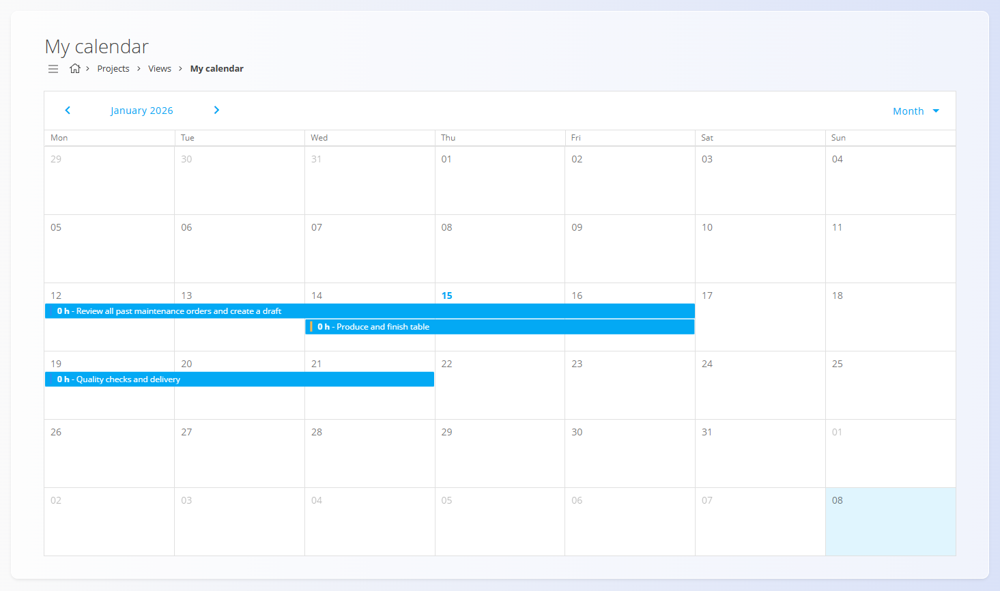
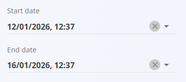

<!-- app_route: /projects/my-calendar -->
<!-- app_label: My calendar -->
<!-- canonical_source_url: https://github.com/Tom-PIT/Connected.Docs/blob/main/en/Domains/Projects/Views/MyCalendar.md -->
<!-- canonical_source_title: My calendar -->

# My calendar

The **My calendar** view provides a calendar-based overview of all **[tasks assigned to the current user](../Documents/Tasks.md)**. It helps users understand *when* work is planned and how tasks are distributed over time.

This view is available under **Projects / Views / My calendar** in the [**navigation**](../../../Common/UI/Navigation.md).

## Calendar overview

Tasks are displayed in a calendar format based on their **start** and **end dates**.

- Each calendar entry represents a task assigned to the user
- The task name is shown inside the calendar cell
- The displayed duration reflects the task’s defined start and end dates

Both **monthly** and **weekly** views are available and can be switched using the view selector in the top-right corner.

## Displaying tasks in the calendar

To appear in **My calendar**, a task must have:

- A **Start date**
- An **End date**

These dates are defined directly on the task.

Once the dates are saved, the task automatically appears in the calendar for the assigned user.

## Interacting with calendar entries

Click a task in the calendar to open a **task detail pop-up**, allowing the user to:

- Review task information
- Navigate to the full task view
- Continue working on the task (for example, adding comments or recording effort)

This enables quick access to tasks directly from the calendar without navigating through project or task lists.

## Typical usage

The **My calendar** view is commonly used to:

- Get a personal overview of upcoming work
- Understand task scheduling and overlaps
- Navigate quickly to tasks planned for a specific day or period

It complements the **My tasks** list by providing a time-oriented perspective on assigned work.

For detailed information about task structure, lifecycle, and effort recording, see:
- **[Tasks](../Documents/Tasks.md)** — Detailed task execution and tracking
- **[Project management](../Management/ProjectsManagement.md)** — Project setup and configuration

---
