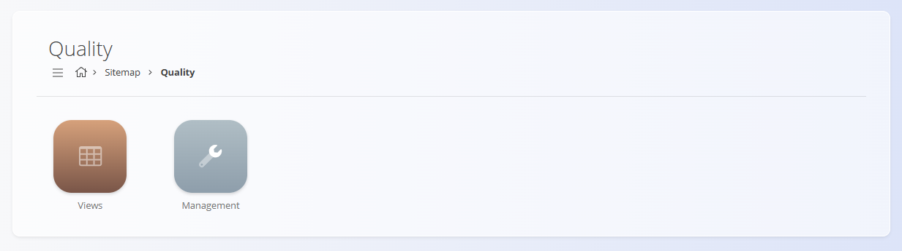
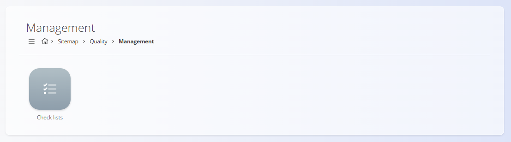
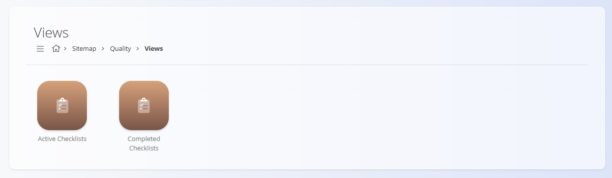

<!-- app_route: /sitemap/quality -->
<!-- app_label: Quality -->
<!-- canonical_source_url: https://github.com/Tom-PIT/Connected.Docs/blob/main/en/Domains/Quality/Domain/QualityDomain.md -->
<!-- canonical_source_title: Quality -->

# Quality

The **Quality** domain provides a focused workspace to visualize and manage operational **checklists** used across production and maintenance. It centralizes how checklists are defined (via templates), executed by operators, and reviewed for compliance and traceability.

Use this domain to:
- Monitor active checklist executions on the shop floor or in maintenance
- Review and analyze completed checklists for compliance and continuous improvement
- Access and maintain the checklist definitions used in day-to-day operations

To access the Quality domain, navigate to **Quality** in the [navigation](../../../Common/UI/Navigation.md).

> [!NOTE]
> The available domains depend on each company’s configuration and business model.

## What is included in the Quality domain?

The domain is structured into two functional areas:
- **Management** - Configure and maintain checklist definitions used by production and maintenance.
- **Views** - Operate and analyze real-time and historical checklist executions.

### Management

The [**Checklists**](../../Production/Management/Checklists.md) code list lets you manage checklist templates (structure, steps, criteria, and thresholds).

> [!TIP]
See all management entries in the **[Management Index](../../../ManagementIndex.md)**.

### Views

The views section focuses on monitoring active and completed quality executions

  - [**Active checklists**](../Views/ActiveChecklists.md) — View all checklists currently in progress or awaiting completion. Typical columns include checklist name, process/asset, assignee, start time, due date, and status. Common actions: open the record, continue execution, or mark as completed (subject to permissions).
  - [**Completed checklists**](../Views/CompletedChecklists.md) — Review finished checklists with outcomes, timestamps, responsible users, and any recorded nonconformities. Supports filtering (date ranges, processes, business units, results) and exporting for audits.

