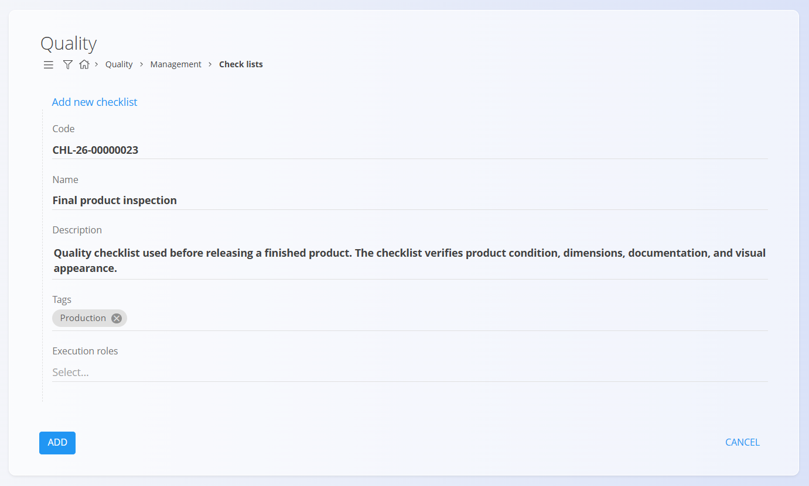
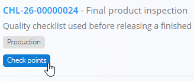
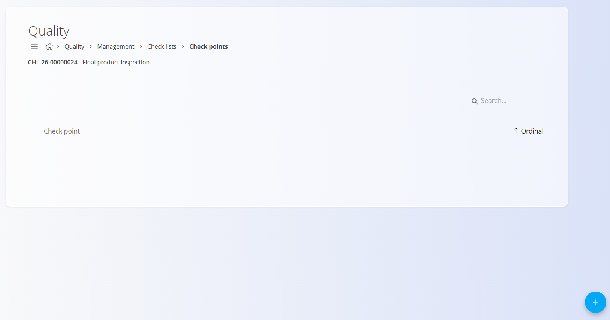
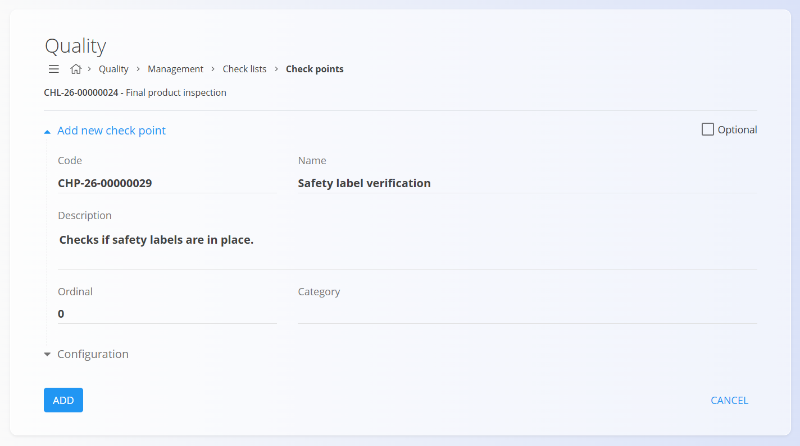
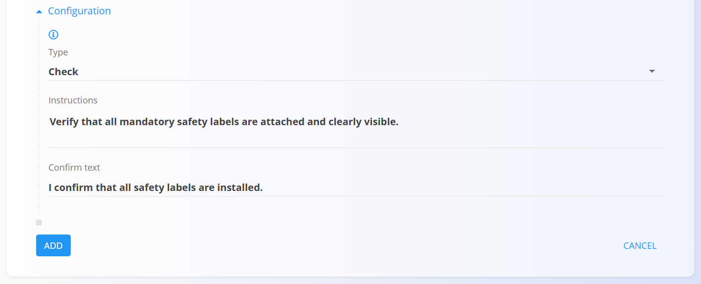
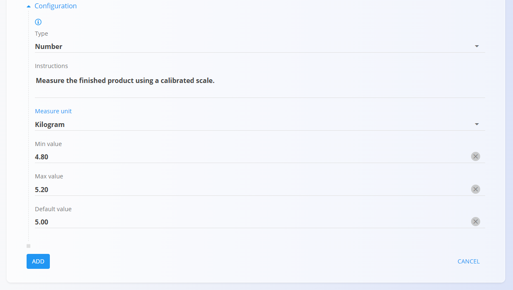
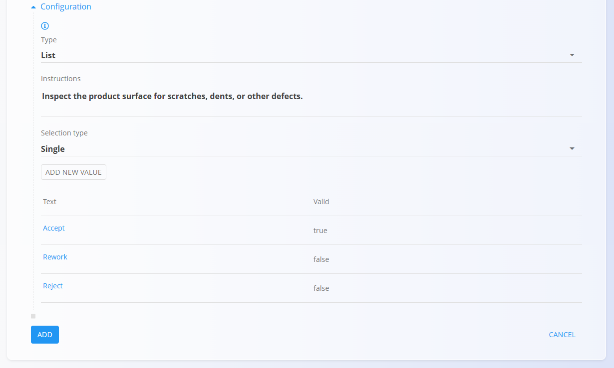
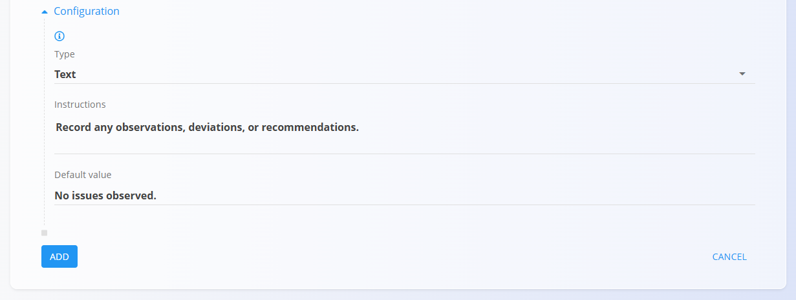
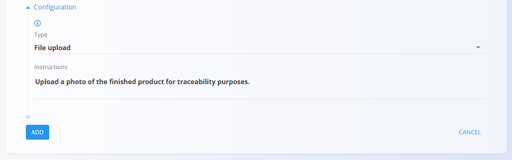
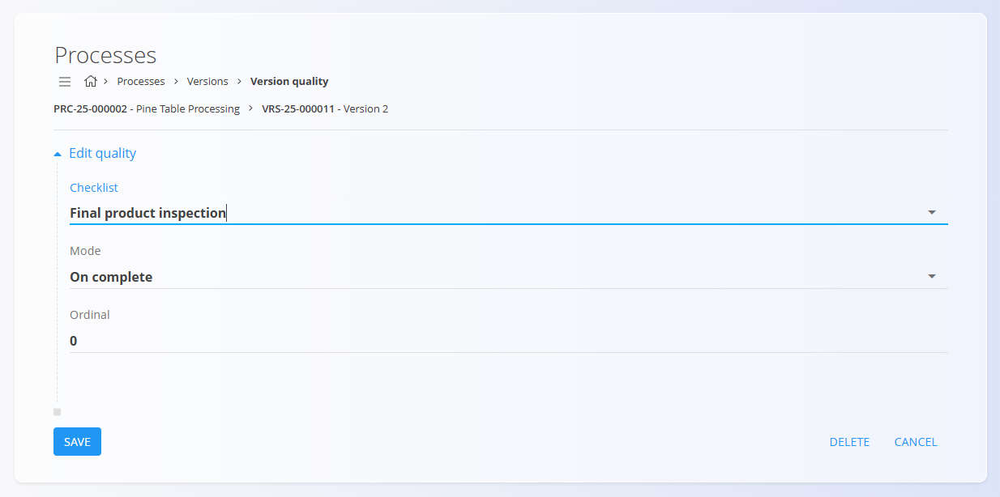

# How to create a quality checklist

Quality checklists help ensure that production and maintenance activities are performed consistently and according to defined procedures.

This tutorial explains how to create a checklist and configure different types of check points that operators can complete during execution.

> [!TIP]
> Provide clear instructions and use appropriate check point types to ensure that operators can easily understand and complete the required checks. Clear instructions improve consistency and reduce operator errors.

## Step 1: Create a new checklist

Open **Production / Management / Checklists** or **Maintenance / Management / Checklists**.

1. Click the [action button](../../../Common/UI/ActionButton.md).
2. Enter a **Name** for the checklist.
3. Optionally enter a **Description**.
4. Select one or more **Tags** to categorize the checklist.
5. Optionally select **Execution roles** to define which job positions may perform the checklist.
6. Click **Add**.

The checklist is now created and ready to receive check points.

## Step 2: Open the check points page

Each checklist consists of one or more check points.

To manage check points:

1. Open the **Checklists** page.
2. Locate the checklist.
3. Click **Check points**.

The **Check points** page opens.

## Step 3: Create your first check point

The check points list displays all check points belonging to the selected checklist.

When creating a new checklist, this list is initially empty.

To add a check point:

1. Click the [action button](../../../Common/UI/ActionButton.md).
2. Enter the basic information:
   - **Name**
   - **Description** (optional)
   - **Ordinal**
   - **Category** (optional)
   - **Optional**
   - **Type**
   - **Instructions** (optional)
3. Click **Add**.

> [!NOTE]
> Use the **Ordinal** field on each check point to define the order in which check points appear.

After creating the check point, additional settings may be available depending on the selected **Type**.

## Step 4: Add a confirmation check

Confirmation checks are useful when operators must verify that a task has been completed.

Example:

* Verify safety guards are installed
* Verify packaging is complete
* Verify machine cleaning was performed

When creating the check point:

* Enter a **Name**
* Set **Type** to **Check**
* Enter the **Instructions** and **Confirm text** displayed next to the checkbox

### Example

* **Name**: *Safety label verification*
* **Instructions**: *Verify that all mandatory safety labels are attached and clearly visible.*
* **Confirm text**: *I confirm that all safety labels are installed.*

## Step 5: Add a measurement check

Measurement checks allow operators to enter numerical values.

Example:

* Product weight
* Temperature
* Length
* Thickness

When creating the check point:

* Enter a **Name**
* Set **Type** to **Number**
* Select a **Measure unit**
* Optionally define **Minimum** and **Maximum** values

### Example

* Name: *Product weight*
* Unit: *kg*
* Min value: *4.8*
* Default value: *5.0*
* Max value: *5.2*

## Step 6: Add a predefined selection

Selection checks allow operators to choose from predefined values.

When creating the check point:

* Enter a **Name**
* Set **Type** to **List**
* Select whether single or multiple values can be selected
* Add the available values

### Example

* **Name**: *Surface quality*
* **Selection type**: *Single*
* **Values**:

  * *Accept* - *Valid*
  * *Rework* - *Not valid*
  * *Reject* - *Not valid*

This ensures that only valid options will confirm the check point.

## Step 7: Add a comment section

Comment checks allow operators to enter free text information.

Example uses include:

* Describing defects
* Providing additional details about a measurement
* Providing feedback or observations

When creating the check point:

* Enter a **Name**
* Set **Type** to **Text**

### Example

* **Name**: *Inspector comments*
* **Instructions**: *Record any observations, deviations, or recommendations.*
* **Default value**: *No issues observed.*

## Step 8: Add a file attachment check

File attachment checks require operators to upload a document or image.

Typical uses include:

* Product photographs
* Inspection reports
* Certificates
* Signed documents

When creating the check point:

* Enter a **Name**
* Set **Type** to **File upload**

Example:

* **Name**: *Upload finished product photo*
* **Instructions**: *Upload a photo of the finished product for traceability purposes.*

## Step 9: Add the checklist to a process

Once configured, the checklist can be attached to production or maintenance processes according to your organization's setup.

> [!NOTE]
> Checklists can also be attached to [organization units](../../Production/Management/OrganizationUnits.md), allowing them to be automatically included in any process executed by that unit.

During execution, operators complete the required check points and provide the requested information.

Completed results are stored in the system and can be reviewed later for quality control, traceability, and audits.

## Next steps

For detailed information about checklist configuration, see:

* [**Checklists**](Checklists.md)
* [**Check points**](CheckPoints.md)
