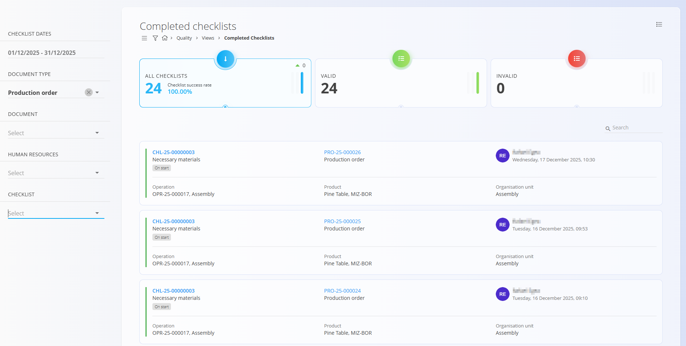

<!-- app_route: /quality/views/completed-checklists -->
<!-- app_label: Completed checklists -->
<!-- canonical_source_url: https://github.com/Tom-PIT/Connected.Docs/blob/main/en/Domains/Quality/Views/CompletedChecklists.md -->
<!-- canonical_source_title: Completed checklists -->

# Completed checklists

The **Completed checklists** view provides an analytical overview of all **checklist executions that have been completed** within a selected time period. It allows supervisors and quality managers to review results, validate execution quality, and inspect completed checklist reports.

To access this view, navigate to **Quality / Views / Completed checklists** in the [navigation](../../../Common/UI/Navigation.md).

### Overview

At the top of the screen, several indicators summarize the current state of completed checklists:

- **All checklists**  
  Shows the total number of completed checklist executions and the **checklist success rate** (percentage of fully confirmed checklists).

- **Valid**  
  Number of completed checklists where **all checkpoints were confirmed**.

- **Invalid**  
  Number of completed checklists where **at least one checkpoint was not confirmed**.

Clicking any indicator filters the list accordingly.

## Completed checklists list

The list shows completed checklist executions with their main contextual information. Each row represents a **single completed checklist execution**. Use the search bar in the top-right corner to quickly filter results.

Displayed information typically includes:

- **Checklist** — checklist code and name (e.g. `CHL-25-00000003` · Necessary materials)
- **Document** — source document and code (e.g. Production order `PRO-25-000026`)
- **Operation** — operation code and name (e.g. `OPR-25-000017, Assembly`)
- **Product** — product name and code
- **Organization unit** — responsible unit
- **Checked by** — user who completed the checklist
- **Completion date and time**

Rows are **not expandable**. To see checklist details, open the checklist report.

### Row interactions

- Click the **Checklist code** to open the **Checklist report**.
- Click the **Production order code** to open the related [production order](../../Production/Documents/ProductionOrders.md) document.

## Menu

The **Menu** in the top-right corner provides:

- **Printing**
- **Export CSV**

## Filters

Use the filters in the left sidebar to narrow down the list:

- **Checklist dates** — filter by checklist completion date range
- **Document type** — limit results to:
  - [Production order](../../Production/Documents/ProductionOrders.md)
  - [Maintenance order](../../Maintenance/Documents/MaintenanceOrders.md)
- **Document** — filter by a specific document
- **Human resources** — filter by the user who completed the checklist
- **Checklist** — filter by checklist definition

All filters are optional and can be combined.

## Checklist report

Clicking a checklist code opens the **Checklist report** screen, which shows the full result of a completed checklist execution.

The report includes:

- **Checklist information**
  - Code and name
  - Completion date and time
  - Checked by (user who completed the checklist)

- **Checklist overview**
  - List of checkpoints
  - Final state of each checkpoint (confirmed / not confirmed)
  - Any recorded **comments**, **measurements**, or **attachments**, if they were part of the checklist definition

The checklist report is **read-only** and cannot be edited after completion.

> [!NOTE]
> - Only completed checklist executions appear in this view.  
> - A checklist is considered **valid** only when all checkpoints are confirmed.  
> - **Invalid** checklists indicate that one or more checkpoints were not confirmed.  
> - Comments, measurements, and attachments are shown only if they were defined in the checklist template.

## Related views

- **[Active checklists](ActiveChecklists.md)** — monitor checklists that are currently in progress
- **[Production orders](../../Production/Documents/ProductionOrders.md)** — review production documents linked to checklists
- **[Maintenance orders](../../Maintenance/Documents/MaintenanceOrders.md)** — review maintenance documents linked to checklists
