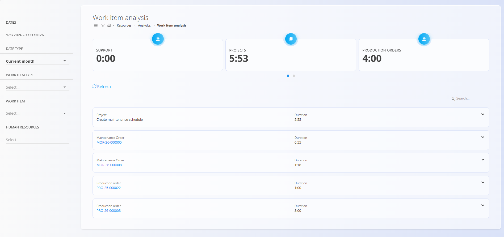
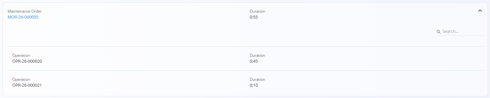
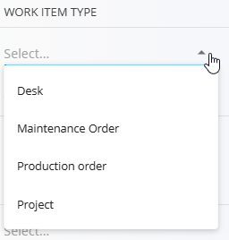

<!-- app_route: /resources/views/work-item-analysis -->
<!-- app_label: Work Time Analysis -->
<!-- canonical_source_url: https://github.com/Tom-PIT/Connected.Docs/blob/main/en/Domains/Resources/Analytics/WorkTimeAnalysis.md -->
<!-- canonical_source_title: Work Time Analysis -->

# Work Time Analysis

## Introduction

**Work Time Analysis** provides an analytical overview of recorded work time in the system.  
It aggregates effort logged on different work items (projects, production orders, maintenance orders, desk work) and presents both **summary indicators** and **detailed breakdowns**.

This view is mainly used to understand how time is distributed across work item types and specific work items within a selected period.

## Overview indicators

At the top of the screen, summary cards display the total recorded duration grouped by work item type, for example:

- Support
- Projects
- Production orders
- Maintenance orders

These values automatically update based on the active filters.

## Work item list

Below the summary indicators, the screen displays a list of work items with their total recorded duration.

Each entry shows:
- **Work item type** (Project, Production order, Maintenance order, etc.)
- **Work item reference** (code or name)
- **Total duration** recorded for the selected period

Clicking on a work item opens its detailed view.

Items can be expanded to inspect their internal breakdown if available. When a work item is expanded, its internal structure is displayed (for example, operations belonging to a maintenance or production order), together with the duration recorded for each element.

## Filters

The panel on the left allows refining the analysis using the following filters:

- **Dates**  
  Select a custom date range for the analysis.

- **Date type**  
  Predefined ranges: **Current month** and **Current day**.

- **Work item type**  
  Filter by:
  - Desk
  - Maintenance order
  - Production order
  - Project

- **Work item**  
  Limit the analysis to a specific work item.

- **Human resources**  
  Filter by one or more users whose work time should be included.

Changing any filter immediately recalculates the indicators and the list.

## Menu

The menu in the top-right corner of the screen provides quick access to the following actions:

- **Export** the **Effort cost details** to CSV format.

The resulting file shows the expenses linked to the recorded work time.

## Refresh data

The **Refresh** action reloads the analysis data using the currently selected filters.