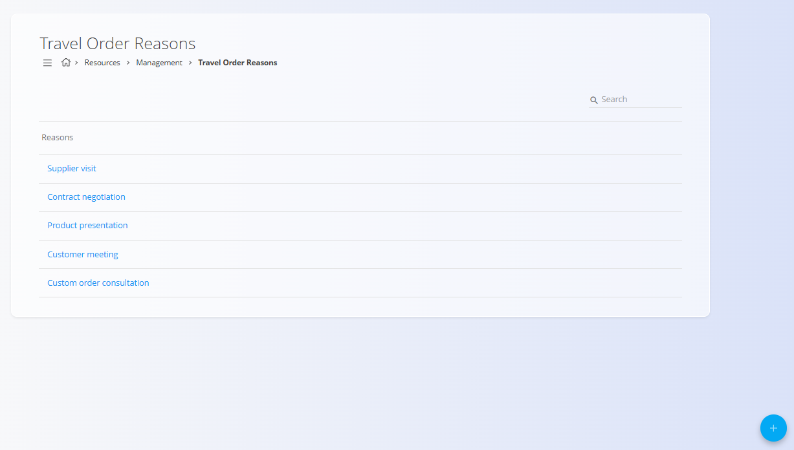
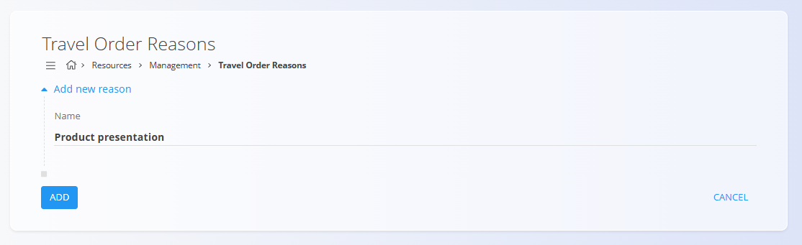

<!-- app_route: /management/resources/travel-order-reasons -->
<!-- app_label: Travel order reasons -->
<!-- canonical_source_url: https://github.com/Tom-PIT/Connected.Docs/blob/main/en/Domains/Resources/Management/TravelOrderReasons.md -->
<!-- canonical_source_title: Travel order reasons -->

# Travel order reasons

Travel order reasons define the possible purposes of a business trip. They are used when creating [travel orders](../Documents/TravelOrders.md), allowing users to select a predefined reason instead of entering free text.

To access **Travel order reasons**, go to **Resources / Management / Travel order reasons** in the [**navigation**](../../../Common/UI/Navigation.md).

## Schema

| Field | Description |
|------|------------|
| **Name** | The name of the travel order reason as shown to users when creating a travel order (for example: *Supplier visit*, *Customer meeting*). |

## Travel order reasons list

The list displays all configured travel order reasons.

- Each row represents a single reason.
- Clicking a reason opens it for editing.
- The search field can be used to quickly find specific reasons.

## Creating a travel order reason

To create a new travel order reason:

1. Click [**action button**](../../../Common/UI/ActionButton.md) to create a new entry.
2. Enter the **Name** of the reason.
3. Click **Add** to save.

## Editing a travel order reason

To edit an existing reason:

1. Click the reason in the list.
2. Update the **Name** as needed.
3. Save the changes.

## Deleting a travel order reason

Travel order reasons can be deleted from the edit view.

Deleted reasons are no longer available when creating new travel orders.