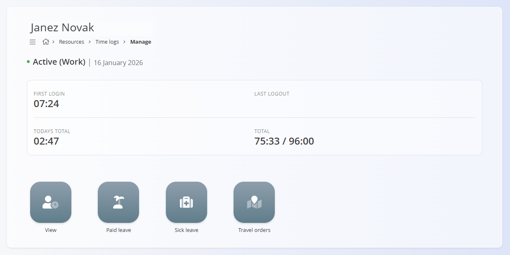
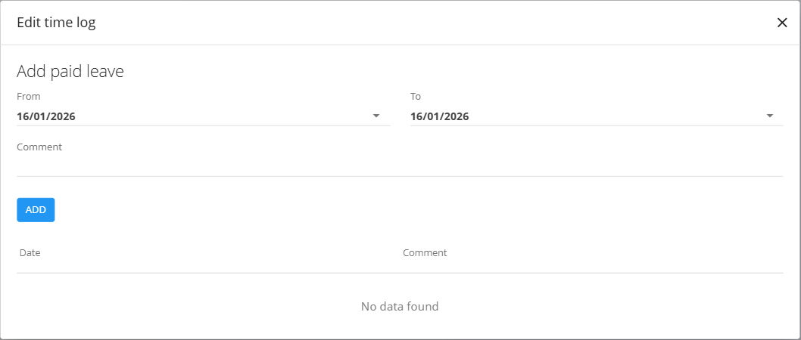

# Time logs – Manage

The **Time logs – Manage** view is used for **real-time attendance tracking and daily time logging**.  
It allows workers to record when they start and end work, take breaks, go on business trips, or log private time.

To access **Time logs – Manage**, go to **Resources / Time logs / Manage** in the [**navigation**](../../../Common/UI/Navigation.md).

### Purpose of this view

This view is designed primarily for **daily sign-in / sign-out workflows** and live tracking of working time.

Typical use cases include:

- Logging the start and end of the working day
- Recording lunch breaks and other interruptions
- Tracking business trips and private time
- Providing an immediate overview of today’s attendance
- Giving quick access to leave-related actions (paid leave, sick leave, travel orders)

## Typical on-site workflow (card reader)

In many setups, this view is used together with a **physical card reader** (for example at the entrance of a facility).

A typical on-site workflow looks like this:

1. The worker **scans their card** when arriving at work  
2. The system registers the **start of the working day**
3. When the worker scans the card again, **time logging buttons** appear on the card reader screen
4. The worker selects an action (for example **Lunch**)
5. After lunch, the worker scans the card again, which ends lunch and resumes **Work**
6. At the end of the day, the worker scans the card and selects **Logoff**, closing the working day

In this scenario, the worker **does not interact with the application UI directly**, but the same actions are reflected in the **Time logs – Manage** view.

## Remote or computer-based usage

In other setups (for example **remote work or office-based users**), the same time logging actions can be performed directly from a computer.

In this case:

- The worker opens **Time logs – Manage**
- Uses the available buttons to:
  - Start work
  - Record lunch or private time
  - End the working day

This allows the same attendance logic to be used consistently, regardless of whether the worker is on-site or remote.

> **Note**  
> Time logging actions may not be available to all users **from their work computers**. In many environments, workers record attendance primarily via a **physical card reader** (for example at the entrance).  
>
> In some setups (for example remote work), the same actions may also be available through the application.

## Header information

At the top of the screen, the following information is displayed:

- **Worker name**
- **Current status** (for example *Active – Work*)
- **Current date**
- **First login time**
- **Last logout time**
- **Today’s total time**
- **Total time for the selected period**

This section provides a quick overview of attendance and working progress.

## Time logging actions

When available, the following time logging actions can be shown:

Common actions include:

- **Logoff** – End the current working session
- **Lunch** – Record a lunch or break period
- **Business trip** – Log time spent on a business trip
- **Private** – Log private time during the working day

Selecting an action immediately updates the worker’s status and records the corresponding time entry.

## Leave and travel actions

From this view, users can also access actions related to absences and travel.

Clicking on a **leave-related action** (such as **Paid leave** or **Sick leave**) opens a dialog where the user can record or request time off.

In this dialog, the user can:

- Select the **from** and **to** dates  
- Add an optional **comment**  
- Select the reason for the sick leave (if applicable)
- Confirm the entry to record the leave  

Recorded leave entries are then reflected in the user’s time logs and summaries.

Clicking **Travel orders** opens the **Travel orders** document, where business trips are created and managed:

- **[Travel orders](../Documents/TravelOrders.md)**

Clicking **View** opens the detailed time log overview for the selected period:

- **[Time logs – View](TimeLogsView.md)**

These actions allow users to manage attendance, absences, and travel directly from the time logging context.