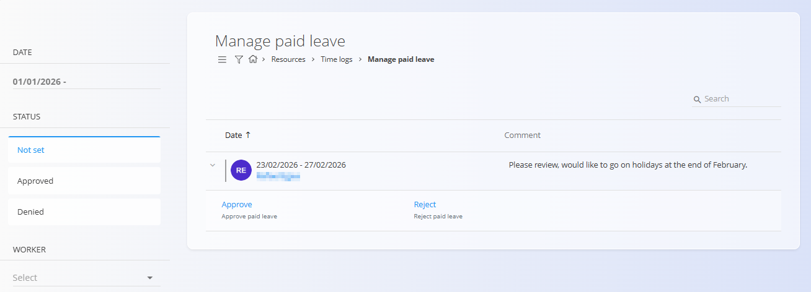
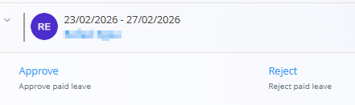

# Manage paid leave

The **Manage paid leave** view is intended primarily for managers and responsible users to **review, approve, or reject paid leave requests** submitted by employees.

To access **Manage paid leave**, go to **Resources / Time logs / Manage paid leave** in the [**navigation**](../../../Common/UI/Navigation.md).

## Overview

This screen provides a centralized overview of paid leave requests, including:

- Requested date range
- Employee submitting the request
- Optional comment or explanation
- Current request status

Requests are listed chronologically and can be filtered using the panel on the left.

## Leave request statuses

Each paid leave request has a status that reflects its current state:

- **Not set** – The request is awaiting a decision  
- **Approved** – The request has been approved  
- **Denied** – The request has been rejected  

The left-hand filters allow you to quickly switch between these states and focus on pending or completed requests.

## Reviewing requests

Requests with status **Not set** can be expanded directly in the list.

When expanded, the following actions are available:

- **Approve** – Confirms the paid leave for the selected dates  
- **Reject** – Denies the request  

Once a decision is made:

- The request is automatically removed from the *Not set* list
- It appears under **Approved** or **Denied**, depending on the action taken

This allows managers to clearly track both pending and completed decisions.

## Filtering and search

The left sidebar provides filters to help manage larger volumes of requests:

- **Date** – Filter requests by date range  
- **Status** – Not set, Approved, Denied  
- **Worker** – View requests for a specific employee  

A search field in the top-right corner allows quick lookup of specific requests.

## Relationship to time logs

Approved paid leave requests are reflected in the employee’s time records and are visible in **Time logs – View**.

This screen focuses on **decision-making and approval workflows**, while detailed attendance and hour summaries are handled elsewhere.