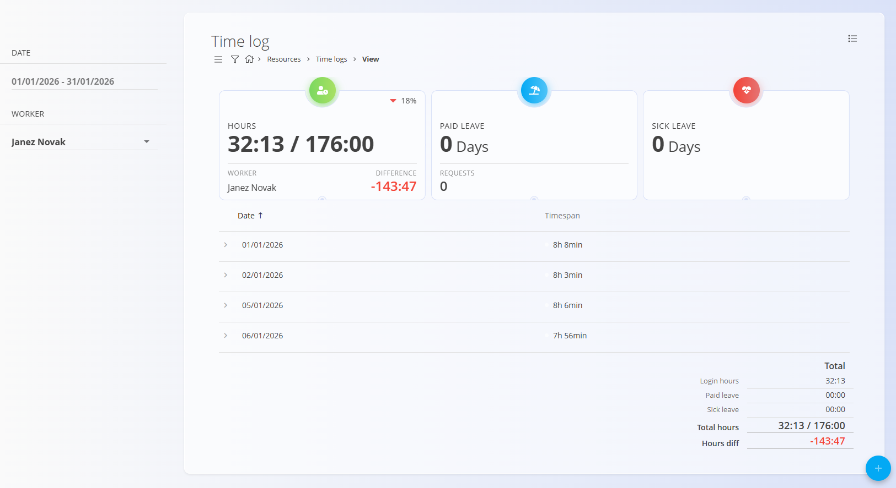

<!-- app_route: /time-logs/view -->
<!-- app_label: Time log – View -->
<!-- canonical_source_url: https://github.com/Tom-PIT/Connected.Docs/blob/main/en/Domains/Resources/Views/TimeLogsView.md -->
<!-- canonical_source_title: Time log – View -->

# Time log – View

The **Time log – View** screen provides a detailed overview of recorded working time for a specific worker and period. It is used to review daily attendance, inspect individual time entries, and manually add or correct time logs when needed.

To access the **Time log** view, go to **Resources / Time logs / View** in the [**navigation**](../../../Common/UI/Navigation.md).

### Purpose

The Time log view is primarily used to:

- Review logged working hours for a selected period  
- Inspect daily time breakdowns (work, lunch, private, etc.)  
- Add or adjust time entries when required  
- Compare logged hours with expected working hours  

Workers typically use this screen to **track their own time**, while approved users can **review and manage time logs** for other workers.

## Filters and context

On the left sidebar, the following filters and selectors are available:

- **Date range** – Select the period to display (for example, a full month)
- **Worker** – Select the worker whose time logs are shown  
  - This selector is visible only to approved users  
  - Workers see the same screen without the worker selector

Changing any of these values refreshes the displayed time logs and summary indicators.

## Summary indicators

At the top of the screen, summary cards provide a quick overview of the selected period:

- **Hours** – Logged hours compared to expected working hours  
- **Paid leave** – Total approved paid leave days  
- **Sick leave** – Total approved sick leave days  

These indicators help quickly assess attendance and deviations.

## Daily time log list

Below the summary, time logs are grouped by **day**.

Each row shows:

- **Date**
- **Total logged time for the day**

### Expand a day record

Clicking a day expands the row to reveal individual time entries, such as:

- Work
- Lunch
- Private
- Other configured time types

Each entry displays its start and end time.

## Edit time entries

Clicking on an individual entry (for example, **Work** or **Lunch**) opens the **Edit time log** dialog.

From this dialog, approved users can:

- Adjust **start and end time**
- Change the **time type**
- Set whether the entry was **on location**
- Add or update a **comment**

Changes are saved immediately and reflected in the daily and total summaries.

When editing the **From** and **To** fields, a combined **calendar and clock picker** is used.

This allows precise selection of both the date and the exact time for a time log entry. Changes are applied once confirmed and reflected immediately in the daily totals.

## Add a new time log

Using the **action button** (bottom-right), approved users can manually add a new time entry.

This is typically used when:

- A worker was unable to log time themselves  
- Corrections are required after the fact  

The same dialog is used as for editing existing entries, ensuring a consistent workflow.

## Totals and expected working hours

At the bottom of the screen, totals for the selected period are displayed:

- Logged working hours  
- Paid leave  
- Sick leave  
- Expected working hours  
- Difference between logged and expected hours  

These values provide a clear overview of compliance and discrepancies for the selected worker and timeframe.
