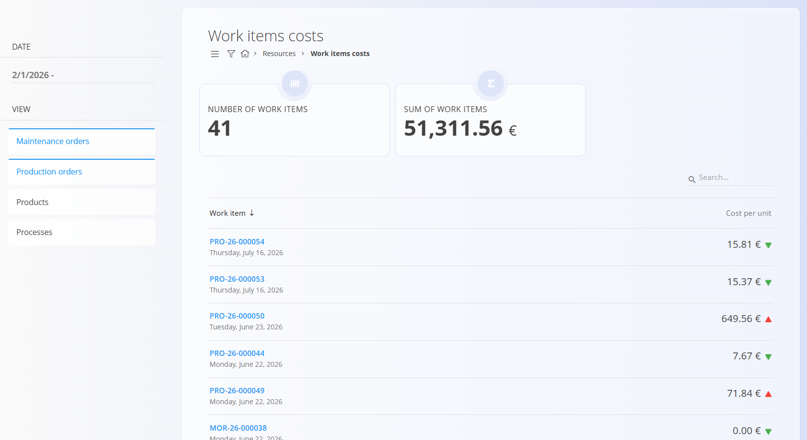
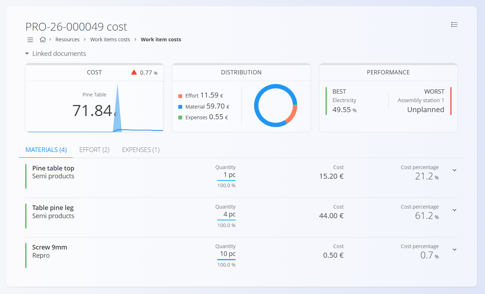
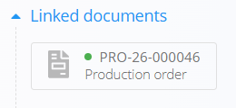

<!-- app_route: /work-items-costs -->
<!-- app_label: Work items costs -->
<!-- canonical_source_url: https://tom-pit.github.io/Connected.Docs/en/Domains/Resources/Views/WorkItemsCosts/ -->
<!-- canonical_source_title: Work items costs -->

# Work items costs

The **Work items costs** view provides cost analysis for production and maintenance work items, products, and process versions. It is primarily used to analyze processes, [production](../../Production/Documents/ProductionOrders.md), and [maintenance orders](../../Maintenance/Documents/MaintenanceOrders.md) and understand cost distribution and performance.

To access **Work items costs**, go to **Resources / Work items costs** in the [navigation](../../../Common/UI/Navigation.md).

> [!NOTE]
> When the **Processes** view is selected, the screen displays estimated [process version costs](../../Production/Analytics/VersionCostView.md) rather than actual work item costs.

## Work items costs list

The list shows the cost records matching the selected filters.

Depending on the selected **View**, each row represents a work item, product, or process version and displays:

- Reference or name
- Date
- Calculated cost per unit
- Visual indicators showing cost changes compared to previous values, when available

Use the **View** filter to select one or more types of cost analysis:

- **Maintenance orders** – shows actual costs of maintenance work items
- **Production orders** – shows actual costs of production work items
- **Products** – shows products and their calculated cost per unit
- **Processes** – shows process versions and their estimated cost per unit

Multiple views can be selected at the same time.

Use the **Date** filter to limit the records displayed in the list.

Click an item to open the corresponding cost analysis.

## Product costs

When **Products** is selected in the **View** filter, the list displays products with their calculated **Cost per unit**.

Click a product to open the **Product costs** view.

The following key indicators are available:

* **Average price per unit in the last order** – cost per unit from the most recent production order for the selected product.
* **Average price per unit in the last month** – average cost per unit calculated from production orders in the last month.
* **Average price per unit in the last year** – average cost per unit calculated from production orders in the last year.

Below the indicators, the table lists production work items associated with the selected product and displays:

* **Work item**
* **Cost per unit**

Use the **Date** filter to limit the records displayed in the table.

> [!NOTE]
> The **Date** filter affects only the table. The three average cost indicators are calculated using their predefined periods and are not affected by the selected date range.

## Process costs

When **Processes** is selected in the **View** filter, the list displays process versions and their calculated **Cost per unit**.

Each row represents a process version and may include a trend indicator showing whether the calculated cost has increased or decreased compared to the previous value.

Clicking a process version opens its detailed [**Version cost analysis**](../../Production/Analytics/VersionCostView.md).

## Work item cost details

Selecting a work item opens a detailed view with a full cost analysis.

### Cost overview

At the top of the screen, key indicators provide a quick summary:

- **Cost per unit**
- **Cost trend** compared to previous values
- **Cost distribution** between materials and effort
- **Performance indicators**, such as best and worst contributors

Any linked documents (e.g., production or maintenance orders) are also shown for reference.

### Materials

This section lists all materials used to manufacture the item, including:

- Material name and type
- Quantity used
- Total cost
- Percentage of total cost

Expanding a material row shows additional details when available.

### Effort

The effort section shows time spent by users on the work item, including:

- User
- Recorded duration
- Calculated effort cost
- Percentage of total cost

Effort costs are calculated using resource cost definitions.

### Expenses

Any additional [expenses](../../Supply/Management/Expenses.md) linked to the work item are listed here. If no expenses are recorded, the section is displayed as empty.

## Usage notes

- Work item costs are **read-only** and fully calculated by the system.
- Accuracy depends on properly configured:
  - Resource costs
  - Material prices
  - Effort tracking
- This view is typically used by production managers and analysts.

## Menu

The menu provides additional actions available on this page.

Available actions:

- **Export to PDF**
- **Recalculate** – recalculates the costs of the selected work item or process version using the latest materials, resources, and expenses.

For details about menu actions, see [**Menu actions**](../../../Common/Concepts/MenuActions.md).
