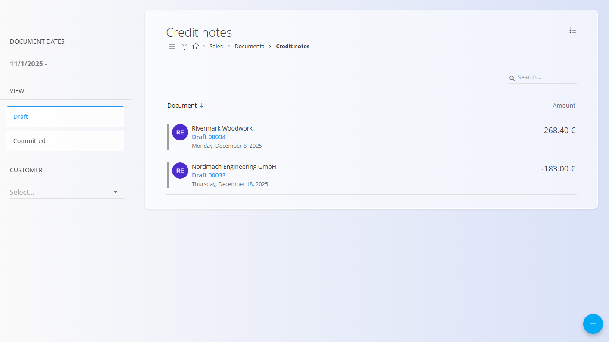

# Credit notes

A **Credit note** is a sales document used to reduce or cancel all or part of an already issued invoice. It is typically created when goods are returned, an overcharge occurred, or a correction is required after invoicing.  

Credit notes decrease the customer’s outstanding balance. For increases or additional charges, see **[Debit notes](DebitNotes.md)**.

> [!TIP]
>
> You can easily review the current **debit and credit records** for each customer in the **[Company cards](../Views/CompanyCards.md)** view.

To access this page, go to **Sales / Documents / Credit notes**.

## How credit notes fit into the sales workflow

Credit notes are used after an invoice has already been issued:

1. Issue an **[Issued invoice](IssuedInvoices.md)** for delivered goods or services.  
2. Identify the need for a correction (return, discount, or pricing error).  
3. Create a **Credit note** linked to the issued invoice or as a standalone document.  
4. Review and publish the credit note, moving it to **Committed**.  
5. The credited amount reduces the customer’s balance or is refunded according to payment terms.  
6. Reverse the credit note if it was created by mistake (see **[Reversals](../../Logistics/Documents/Reversals.md)**).

Credit notes affect accounting only and do not impact inventory.

## Schema

  
<strong>Document</strong>

| Field | Description |
|-------|-------------|
| [**Code**](../../../Common/UI/DocumentCodes.md) | System-generated identifier of the credit note. |
| **Purchase order code** | Optional reference to the customer’s purchase order. |
| **Customer** | Customer receiving the credit, selected from the [**Business directory**](../../../Common/Management/BusinessDirectory.md) (mandatory). |
| **Issue date** | Date when the credit note is issued. |
| **Delivery date** | Original delivery date of the invoiced goods or services. |
| **Due date** | Date when the credit becomes effective (mandatory). |
| **Reference type** | Type of payment reference used (mandatory). |
| **Reference number** | Reference number based on the chosen reference type. |
| **[Organization bank account](../Management/OrganizationBankAccounts.md)** | Bank account used for refunds or accounting (mandatory). |
| **[Cost center](../../../Common/Management/CostCenters.md)** | Optional allocation to a cost center. |
| **Purpose code** | Optional reason or classification for the credit. |
| **Rebate** | Overall rebate applied to the credit note. |
| **Content top** | Introductory text from [**Predefined texts**](../../../Common/Management/PredefinedTexts.md). |
| **Content bottom** | Closing or legal text from [**Predefined texts**](../../../Common/Management/PredefinedTexts.md). |

  
<strong>Transport, Alternative currency, and Delivery</strong>

| Field | Description |
|--------|-------------|
| **[Delivery term](../../../Common/Management/DeliveryTerms.md)** | Delivery conditions  as agreed upon with the customer. |
| **[Mode of transport](../../../Common/Management/ModeOfTransport.md)** | Transport method  as agreed upon with the customer. |
| [**Alternative currency**](../../../Common/Management/Currencies.md) | Alternative currency to the default one used in the document |
| [**Exchange rates**](../Management/ExchangeRates.md) | Exchange rate of the alternative currency with respect to the default currency	|
| **Delivery** | Delivery company and address information. |

  
<strong>Intrastat</strong>

| Field | Description |
|------|-------------|
| [**Country dispatch**](../../../Common/Management/Countries.md) | Country from which the goods were dispatched. This value is typically derived from the material’s Intrastat configuration. |
| [**Nature of transaction**](../../Accounting/Management/Intrastat/NatureOfTransactions.md) | Classification of the transaction type used for Intrastat reporting (for example, direct sales or purchases). |
| [**Place of delivery**](../../Accounting/Management/Intrastat/PlaceOfDelivery.md) | Indicates where the goods are delivered, according to Intrastat definitions. |

  
<strong>Details</strong>

| Field | Description |
|--------|-------------|
| **Asset** | Product, service, or asset selected for this line. |
| **Detail name** | Display name of the selected item (can be edited if allowed). |
| **[Tax rate](../../../Common/Management/TaxRates.md)** | Tax rate applied to the line (defined in tax configuration). |
| **Net price (per unit)** | Price per unit excluding tax. |
| **Tax price (per unit)** | Price per unit including tax (calculated automatically based on tax rate). |
| **Quantity** | Quantity of the selected asset. |
| **Discount (%)** | Percentage discount applied to the net price. |
| **Total amount excluding tax** | Calculated net total (Net price × Quantity − Discount). |
| **Total amount with tax** | Total amount including tax. |
| **Tax calculation type** | Defines how tax is calculated when special VAT rules apply: • **Trilateral supplies** – For triangular EU transactions where VAT is accounted for by the final buyer (reverse charge). • **Tax is accounted** – Applies reverse charge VAT; the customer accounts for the tax instead of the seller. • **Export services** – Used for services provided to customers outside the EU (typically VAT exempt). • **Transport services** – Special VAT treatment for goods transport services. • **Passenger transport** – VAT rules specific to passenger transport activities. • **Travel agencies** – Applies the VAT margin scheme for travel agency services. • **According to customs procedures 42 and 63** – Used for imports where VAT is deferred to the destination EU country. • **Sale of recalled goods from the EU** – Special VAT handling for returned or recalled goods within the EU. |
| **Description** | Optional additional information for the line. |
| **Use alternative currency** | Option to express the line amount in a selected alternative currency. When selected, the amount is recalculated based on the exchange rate defined in the document. |

  
<strong>Ledger and Interstat details</strong>

| Field | Description |
|--------|-------------|
| **Ledger - Account revenue / expense** | General [ledger account](../../Accounting/Management/Ledger/ChartOfAccounts.md) used to post the line amount (e.g., sales revenue or purchase expense). |
| **Ledger - Account tax** | General [ledger account](../../Accounting/Management/Ledger/ChartOfAccounts.md) used to post the tax amount associated with the document line. |
| **[Intrastat – Tariff](../../Accounting/Management/Intrastat/Tariffs.md)** | Commodity code used for Intrastat reporting. |
| **Intrastat – Country of origin** | Country where the goods originate. |
| **Intrastat – Net weight (kg)** | Net weight used for statistical reporting. |
| **Intrastat – Statistical value** | Declared statistical value of goods for Intrastat reporting. |

## Management

Credit notes can have **Draft** and **Committed** states.

### List view

The credit notes list can be filtered by:
- **Document dates**
- **View** (Draft / Committed)
- **Customer**

Each row displays:
- Customer  
- Document code  
- Document date  
- Credit amount (negative value)  

Drafts can be edited; committed credit notes are final unless reversed.

## Actions

### Creating a new credit note

Credit notes can be created in two ways:

- Via the [**action button**](../../../Common/UI/ActionButton.md) on the **Credit notes** screen  
- From an existing [**Issued invoice**](IssuedInvoices.md) via *Linked documents → + Credit note*

Once you start a new credit note, follow these steps:

1. Create a new draft credit note using one of the methods above.

   

2. Fill in the required header fields such as **Customer**, **Dates**, **Reference type**, and **Organization bank account**.

3. Add items in the **Details** section by typing or scanning an **asset name**, **EAN**, or **serial number**.  
   - Matching items are displayed for selection.

   

4. Edit quantities and values as needed, then click **Save** to confirm the detail.

> [!NOTE]
> When adding a new detail to a **Credit note**, the **quantity is set to `-1` by default** as credit notes represent a reduction of the invoiced amount.

5. When ready, click **Publish** at the top of the page.  
   The document moves from **Draft** to **Committed** and becomes financially effective.

> [!NOTE]  
> Once published, a credit note cannot be edited. Any corrections must be done via reversal.

#### Details

Details define the ordered items and their quantities, prices, taxes, and discounts. Each detail line corresponds to a specific product, service, or asset.

##### Ledger details

The **Ledger** section defines how the document is posted to the general ledger. It determines which accounts are used for revenue, expense, and tax postings when the document is saved and posted.

When the document is posted:

- The **net amount** is posted to the selected revenue or expense account.
- The **tax amount** is posted to the selected tax account.
- The system creates corresponding journal entries in the ledger.

The available accounts are defined in the **[Chart of accounts](../../Accounting/Management/Ledger/ChartOfAccounts.md)**.

##### Intrastat details

When Intrastat reporting is enabled and the transaction involves a customer from another EU country, an additional **Intrastat** section becomes available in the detail edit form. This section collects statistical information required for Intrastat reporting.

These fields are mandatory for cross-border EU transactions when the organization is Intrastat-obliged.

### Editing a credit note

Only **Draft** credit notes can be edited.

You can modify:
- Header fields  
- Alternative currency
- Transport
- Delivery information
- Detail lines  
- Content texts (top and bottom)

Committed credit notes are read-only.

#### Attachments

Files can be added in the **Attachments** section to store supporting documents such as return confirmations or agreements.

#### Linked documents

The **Linked documents** section allows you to link a previously created **Issued invoice**.

Published credit notes do **not** display the Linked documents section.

#### Alternative currency

The Alternative currency section allows prices in the document to be expressed in a currency different from the system’s default currency. This is typically used for international sales. Rates are taken from the [Exchange rates](../Management/ExchangeRates.md) code list.

When an alternative currency is selected, document prices are automatically recalculated using the specified exchange rate.

## Transport and Intrastat sections

When **Intrastat** is set to **Obliged** in **System / Configuration / Intrastat**, additional sections become available in the document form.

- **Transport** - Used to capture logistics-related information about how the goods were delivered.
- **Intrastat** - Used to collect data required for Intrastat reporting. These fields are only shown when Intrastat reporting is enabled for the system.

> [!NOTE]  
Several Intrastat-related values are taken from **material code lists** (Intrastat configuration), such as country and transaction nature. These fields are not freely configurable per document and depend on predefined master data.

## Menu

The document menu provides additional actions:

- **Printing**
- **Exporting**
- **Send as email**
- **Reverse document**
- **Return to draft** (only if allowed)

Reversing a credit note negates its financial effect. For details, see **[Reversals](../../Logistics/Documents/Reversals.md)**.

## Deletion

Draft credit notes can be deleted only if they contain **no details**. Details can be removed via Menu → **Delete all details**.

If you need to delete some individual detail lines:
1. Open each detail line by clicking on them.
2. Remove it using **Delete**.
3. Repeat until all desired lines are removed.

Once empty, the **Delete** action can be performed.

Committed credit notes **cannot** be deleted, but they can be [reversed](../../Logistics/Documents/Reversals.md) or **returned to draft**.
