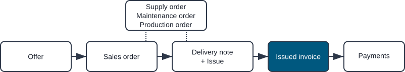
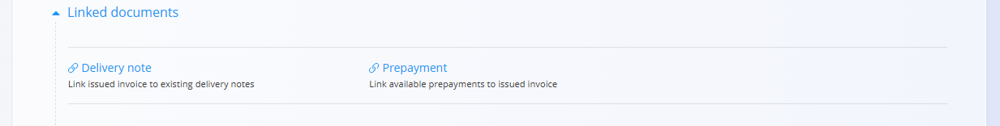
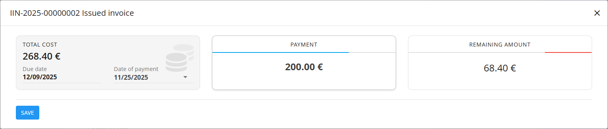

<!-- app_route: /sales/documents/issued-invoices -->
<!-- app_label: Issued invoices -->
<!-- canonical_source_url: https://github.com/Tom-PIT/Connected.Docs/blob/main/en/Domains/Sales/Documents/IssuedInvoices.md -->
<!-- canonical_source_title: Issued invoices -->

# Issued invoices

**Issued invoices** are financial documents sent to customers so they can pay for confirmed sales. They summarize delivered goods or services, taxes, due dates, and chosen payment methods. From the **Issued invoices** page you can also record partial or full payments directly against each invoice.

To access this page, go to **Sales / Documents / Issued invoices** in the [navigation](../../../Common/UI/Navigation.md).

## How issued invoices fit into the sales workflow

Issued invoices are typically created at the end of the sales chain:

1. A customer accepts an **[Offer](Offers.md)**.  
2. A **[Sales order](SalesOrders.md)** is created and fulfilled.  
3. Goods are shipped using **[Delivery notes](DeliveryNotes.md)** and related issues.  
4. Finally, an issued invoice is created (often from the delivery note or sales order) and sent to the customer for payment.

Invoices can also be created manually as stand-alone documents when required.

## Schema

  
<strong>Document</strong>

| Field | Description |
|-------|-------------|
| [**Code**](../../../Common/UI/DocumentCodes.md) | Unique identifier of the invoice (system-generated). |
| **Purchase order code** | Optional reference to the customer’s purchase order. |
| **Customer** | Customer receiving the invoice, selected from the [**Business directory**](../../../Common/Management/BusinessDirectory.md) (mandatory). |
| **Issue date** | Date when the invoice is issued. |
| **Delivery date** | Date when the goods or services were delivered. |
| **Due date** | Payment deadline shown to the customer  (mandatory). |
| **Reference type** | Type of payment reference (e.g., structured reference, model)  (mandatory). |
| **Reference number** | Reference number used on payment documents, based on the chosen reference type. |
| **[Organization bank accounts](../Management/OrganizationBankAccounts.md)** | Account where the payment should be received, selected from the Organization bank accounts code list (mandatory). |
| **[Cost center](../../../Common/Management/CostCenters.md)** | Optional allocation of revenue to a cost center. |
| **Purpose code** | Optional code describing the purpose of the invoice (if configured). |
| **Rebate** | Overall rebate applied to the total invoice amount. |
| **Content top** | Introductory text from [**Predefined texts**](../../../Common/Management/PredefinedTexts.md). |
| **Content bottom** | Closing or legal text from [**Predefined texts**](../../../Common/Management/PredefinedTexts.md). |
| **Payment method** | Payment option selected from [**Payment methods**](../Management/PaymentMethods.md). |

  
<strong>Transport, Alternative currency, and Delivery</strong>

| Field | Description |
|--------|-------------|
| **[Delivery term](../../../Common/Management/DeliveryTerms.md)** | Delivery conditions  as agreed upon with the customer. |
| **[Mode of transport](../../../Common/Management/ModeOfTransport.md)** | Transport method  as agreed upon with the customer. |
| [**Alternative currency**](../../../Common/Management/Currencies.md) | Alternative currency to the default one used in the document |
| [**Exchange rates**](../Management/ExchangeRates.md) | Exchange rate of the alternative currency with respect to the default currency	|
| **Delivery** | Delivery company and address information. |

  
<strong>Intrastat</strong>

| Field | Description |
|------|-------------|
| [**Country dispatch**](../../../Common/Management/Countries.md) | Country from which the goods were dispatched. This value is typically derived from the material’s Intrastat configuration. |
| [**Nature of transaction**](../../Accounting/Management/Intrastat/NatureOfTransactions.md) | Classification of the transaction type used for Intrastat reporting (for example, direct sales or purchases). |
| [**Place of delivery**](../../Accounting/Management/Intrastat/PlaceOfDelivery.md) | Indicates where the goods are delivered, according to Intrastat definitions. |

  
<strong>Details</strong>

| Field | Description |
|--------|-------------|
| **Asset** | Product, service, or asset selected for this line. |
| **Detail name** | Display name of the selected item (can be edited if allowed). |
| **[Tax rate](../../../Common/Management/TaxRates.md)** | Tax rate applied to the line (defined in tax configuration). |
| **Net price (per unit)** | Price per unit excluding tax. |
| **Tax price (per unit)** | Price per unit including tax (calculated automatically based on tax rate). |
| **Quantity** | Quantity of the selected asset. |
| **Discount (%)** | Percentage discount applied to the net price. |
| **Total amount excluding tax** | Calculated net total (Net price × Quantity − Discount). |
| **Total amount with tax** | Total amount including tax. |
| **Tax calculation type** | Defines how tax is calculated when special VAT rules apply: • **Trilateral supplies** – For triangular EU transactions where VAT is accounted for by the final buyer (reverse charge). • **Tax is accounted** – Applies reverse charge VAT; the customer accounts for the tax instead of the seller. • **Export services** – Used for services provided to customers outside the EU (typically VAT exempt). • **Transport services** – Special VAT treatment for goods transport services. • **Passenger transport** – VAT rules specific to passenger transport activities. • **Travel agencies** – Applies the VAT margin scheme for travel agency services. • **According to customs procedures 42 and 63** – Used for imports where VAT is deferred to the destination EU country. • **Sale of recalled goods from the EU** – Special VAT handling for returned or recalled goods within the EU. |
| **Description** | Optional additional information for the line. |
| **Use alternative currency** | Option to express the line amount in a selected alternative currency. When selected, the amount is recalculated based on the exchange rate defined in the document. |

  
<strong>Ledger and Intrastat details</strong>

| Field | Description |
|--------|-------------|
| **Ledger - Account revenue / expense** | General [ledger account](../../Accounting/Management/Ledger/ChartOfAccounts.md) used to post the line amount (e.g., sales revenue or purchase expense). |
| **Ledger - Account tax** | General [ledger account](../../Accounting/Management/Ledger/ChartOfAccounts.md) used to post the tax amount associated with the document line. |
| **[Intrastat – Tariff](../../Accounting/Management/Intrastat/Tariffs.md)** | Commodity code used for Intrastat reporting. |
| **Intrastat – Country of origin** | Country where the goods originate. |
| **Intrastat – Net weight (kg)** | Net weight used for statistical reporting. |
| **Intrastat – Statistical value** | Declared statistical value of goods for Intrastat reporting. |

## Management

### Document states

Issued invoices use payment-based workflow states:

- **Draft** – The invoice is not yet published. All fields can be edited freely.

- **Committed** – The invoice has been published and is now an official financial document. Once Committed, only limited fields can be changed, and the document cannot be deleted.

    - **Unpaid invoices** – The invoice has been issued but no payments have been recorded.  
    - **Partially paid invoices** – One or more payments have been recorded, but an outstanding amount remains.  
    - **Fully paid invoices** – The invoice has been completely settled; no outstanding amount remains.
    - **Reversed** – A reversal document has been created to correct or cancel the invoice.

These states determine what actions are available (payment recording, reversal, exporting, etc.) and how the invoice appears in the list views.

### List view

The list view shows all invoices that match the selected filters and date ranges.

**Indicators**

At the top of the list, the system displays key indicators that summarize the currently filtered data. The following indicators are shown:

- **Unpaid overdue** (interactive) – Number and value of invoices that are past their due date and still unpaid. Click it to display exclusively these invoices on the list.  
- **Total amount** – Total gross amount of invoices in the current view.  

These indicators update based on the filters on the left:

- **Document dates**
- **Delivery date**
- **Due date**
- **View**  
  - **Drafts**  
  - **Committed**  
  - **Unpaid invoices**  
  - **Partially paid invoices**  
  - **Fully paid invoices**  
  - **All**
- **Reversal state** (for reversed invoices)  
- **Customer**  
- **Payment method**

Use the **Search** bar to quickly find invoices by code, customer, or other visible values.

## Actions

### Create a new issued invoice

To create a new issued invoice, click the [action button](../../../Common/UI/ActionButton.md) on the **Issued invoices** screen. 

See the [**How to create an issued invoice**](IssuedInvoicesCreate.md) guide for a step-by-step walkthrough of the creation process.

### Edit an issued invoice

Click any issued invoice in the list to open it. Draft invoices can be edited freely. The document is divided into multiple expandable sections. 

While the invoice is in **Draft** status you can edit all sections:

- [Header fields](IssuedInvoicesCreate.md#step-2--fill-in-header-information) (dates, references, customer, bank account, etc.)
- [**Alternative currency**](IssuedInvoicesCreate.md#alternative-currency)
- [**Transport and Intrastat**](IssuedInvoicesCreate.md#transport-and-intrastat-sections)
- [**Delivery information**](IssuedInvoicesCreate.md#delivery)
- [**Details**](IssuedInvoicesCreate.md#step-3--add-details) – add, remove, or change invoice lines
- [**Payment methods**](IssuedInvoicesCreate.md#payment-methods) – define how the customer is expected to pay
- [**Content top** and **Content bottom**](IssuedInvoicesCreate.md#content-top-and-content-bottom) – choose predefined texts from [Clause templates for issued invoices](../Management/ClauseTemplatesIssuedInvoices.md).

#### Linked documents

The linked documents section enables the creation of operational or follow-up documents. This section also shows any previously linked documents.

> [!NOTE]
> The available **Linked document** actions depend on the document type and status.

Example for a new draft document:

Available actions may include:

- **Issued invoice** - Copy current document to a new issued invoice
- [**+ Credit note**](CreditNotes.md) - Create a credit note
- [**+ Debit note**](DebitNotes.md) - Create a debit note
- [**Delivery note**](DeliveryNotes.md) - Link to an exiting delivery note.
- [**Prepayments**](Prepayments.md) - Link to an exiting prepayment.

### Publish an invoice

When you are ready, click **Publish** to confirm the invoice and move it out of the **Draft** state. Once published, all related invoice actions become available.

### Record payments

After an invoice is published, use the **Payment** button to record incoming payments.

In the payment dialog you can see:

- **Total cost** – Invoice gross amount and due date.  
- **Payment** – Amount being paid now and date of payment.  
- **Remaining amount** – Outstanding balance after the payment.

You can register multiple payments over time. The system automatically updates the invoice status:

- **Unpaid** – No payments recorded.  
- **Partially paid** – Some payments recorded, but an outstanding amount remains.  
- **Fully paid** – Remaining amount is zero.

> [!NOTE]  
> When an invoice is fully covered by recorded payments, it appears in the **Fully paid invoices** view. Partially paid documents appear under **Partially paid invoices**, and unpaid ones under **Unpaid invoices**.

### Delete an issued invoice

Draft invoices can be deleted in the edit view, **only if they contain no details**.

If the draft still includes items in the **Details** section:

1. Open the document menu (top right corner).
2. Select **Delete all details** to remove all detail lines at once.
3. Once the document contains no details, click **Delete** to remove the draft.

If you need to remove only a specific material instead of clearing the entire document:

1. Click the material serial number to open the **Edit detail** screen.
2. Click **Delete** inside the Edit detail window.

> [!NOTE]
> Deletion is only possible for draft documents. 
> Committed invoices **cannot** be deleted, but they can be [reversed](../../Logistics/Documents/Reversals.md) or **returned to draft**.

## Menu

This page includes menu actions in two places.

Menu actions are available through the **Menu** button located in the top-right corner of the list or document page.

### List menu

The list menu provides actions for the currently displayed list.

Available actions:

- **Export to CSV** – There are two report options:
    - **Documents** – Exports all the list of invoices on the list.
    - **Details** – Exports all line item details for all invoices on the list.

### Document menu

The document menu provides actions for the currently opened document.

Available actions:

- **Print**
- **Export to PDF**
- **Send as email** 
- **Delete all details** (only for drafts)
- **[Reverse document](../../Logistics/Documents/Reversals.md)**
- **Return to draft**

For details about menu actions, see [**Menu actions**](../../../Common/Concepts/MenuActions.md).

