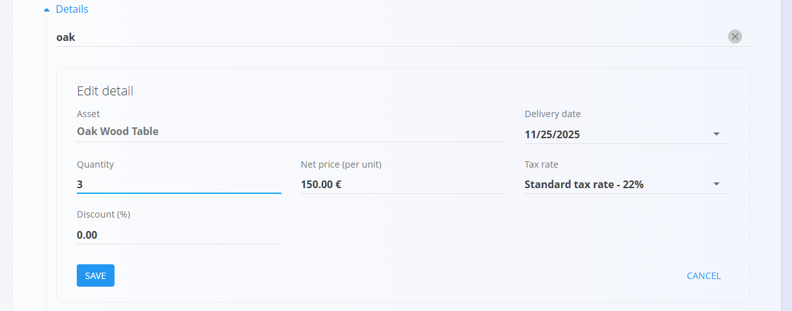
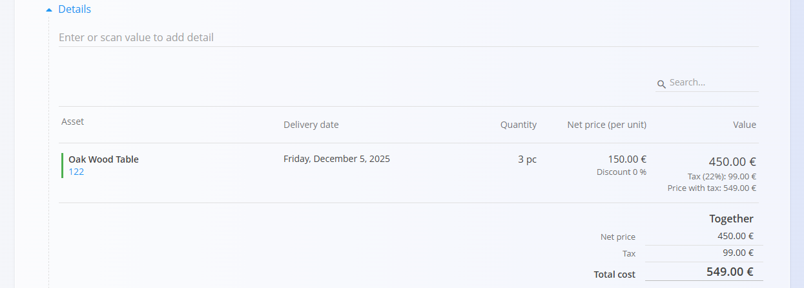
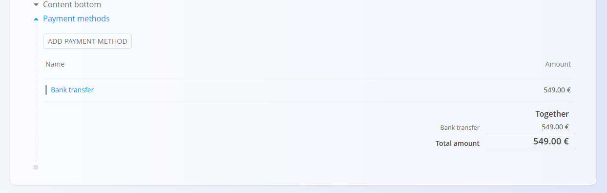
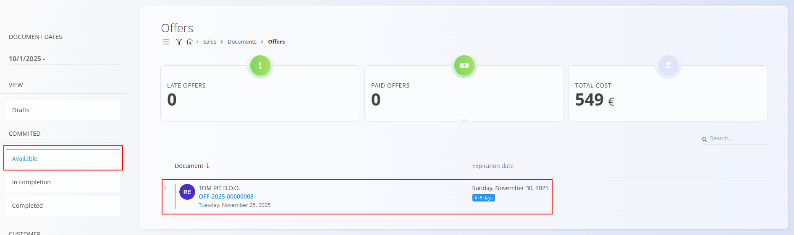
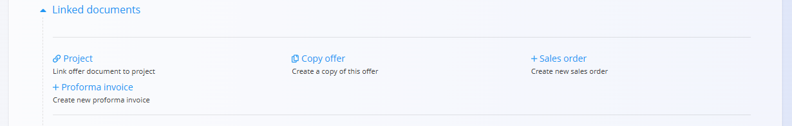
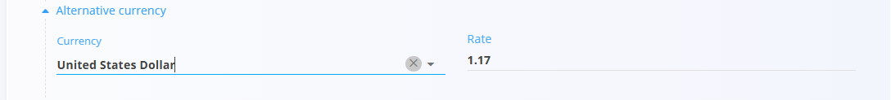

# Offers

An **Offer** is a sales document used to present a proposed price, quantity, and delivery terms to a customer before a sale is confirmed.  
Offers help formalize quotations, compare pricing options, and smoothly transition into follow-up documents such as **Sales orders**, **Delivery notes**, and **Issued invoices**.

To access this page, go to **Sales / Documents / Offers** in the [**navigation**](../../../Common/UI/Navigation.md).

## How offers fit into the sales workflow

A typical flow:

1. Create an **Offer** and send it to the customer.  
2. When approved, convert it into a [**Sales order**](SalesOrders.md) using the [**Linked documents**](#linked-documents) section.  
3. From the sales order, continue the operational workflow—production, purchasing, delivery, etc.  
4. Eventually, generate a [**Delivery note**](DeliveryNotes.md), and finally an [**Issued invoice**](IssuedInvoices.md).

## Schema

  
<strong>Document</strong>

| Field | Description |
|-------|-------------|
| [**Code**](../../../Common/UI/DocumentCodes.md) | System-generated identifier of the offer. |
| **Customer** | The customer receiving the quotation, selected from the [Business directory](../../../Common/Management/BusinessDirectory.md) (mandatory). |
| **Document date** | Date when the offer is created. |
| **Expiration date** | Validity date of the offer (mandatory). |
| **Rebate** | Optional overall discount applied to the entire offer (e.g., enter *2* for a 2% discount). |
| **Content top** | Predefined introductory text from [Predefined texts](../../../Common/Management/PredefinedTexts.md) (entity: *Offer*). |
| **Content bottom** | Closing or legal statements from [Predefined texts](../../../Common/Management/PredefinedTexts.md) (entity: *Offer*). |
| [**Payment methods**](../Management/PaymentMethods.md) | Available payment methods shown to the customer. |

  
<strong>Transport, Alternative currency, and Delivery</strong>

| Field | Description |
|--------|-------------|
| **[Delivery term](../../../Common/Management/DeliveryTerms.md)** | Delivery conditions  as agreed upon with the customer. |
| **[Mode of transport](../../../Common/Management/ModeOfTransport.md)** | Transport method  as agreed upon with the customer. |
| [**Alternative currency**](../../../Common/Management/Currencies.md) | Alternative currency to the default one used in the document |
| [**Exchange rates**](../Management/ExchangeRates.md) | Exchange rate of the alternative currency with respect to the default currency	|
| **Delivery** | Delivery company and address information. |

  
<strong>Intrastat</strong>

| Field | Description |
|------|-------------|
| [**Country dispatch**](../../../Common/Management/Countries.md) | Country from which the goods were dispatched. This value is typically derived from the material’s Intrastat configuration. |
| [**Nature of transaction**](../../Accounting/Management/Intrastat/NatureOfTransactions.md) | Classification of the transaction type used for Intrastat reporting (for example, direct sales or purchases). |
| [**Place of delivery**](../../Accounting/Management/Intrastat/PlaceOfDelivery.md) | Indicates where the goods are delivered, according to Intrastat definitions. |

  
<strong>Details</strong>

| Field | Description |
|--------|-------------|
| [**Asset**](../../Assets/Assets/Assets.md) | Item or service being offered.  |
| **Delivery date** | Planned delivery date for this item. |
| **Quantity** | Quantity of the asset. |
| **Net price (per unit)** | Unit price taken from the asset’s configuration or applicable [asset price list](../../Assets/Assets/AssetPriceLists.md). |
| **Discount (%)** | Optional discount applied to this specific line. |
| [**Tax rates**](../../../Common/Management/TaxRates.md) | Applied tax rule. |
| **[Intrastat – Tariff](../../Accounting/Management/Intrastat/Tariffs.md)** | Commodity code used for Intrastat reporting. |
| **Intrastat – Country of origin** | Country where the goods originate. |
| **Intrastat – Net weight (kg)** | Net weight used for statistical reporting. |
| **Intrastat – Statistical value** | Declared statistical value of goods for Intrastat reporting. |
| **Value** | Total line value (quantity × net price, after discounts). |

## Management

### Document states

Documents move through several possible states during their lifecycle:

- **Draft** – The document is not yet published. All fields can be edited freely.
- **Committed** – The document has been published. It cannot be deleted or freely modified.
    - **Available** – The document is valid and ready for further processing.
    - **In completion** – The document is partially processed (e.g., partially delivered or received).
    - **Completed** – All actions related to the document have been fully executed.

### List view

The Offers list provides an overview of all quotations, separated into **Drafts**, **Available**, **In completion**, and **Completed**.  

At the top of the Offers list, the system displays key indicators that summarize the currently filtered data. The following indicators are shown:

- **Late offers** – Offers whose expiration date has passed and have not been accepted or completed.
- **Paid offers** (interactive) – Offers for which full payment has been recorded. Click it to display exclusively the offers that have been paid.
- **Total cost** – The combined total value of all offers included in the active filter. 

Filters on the left help narrow down results by **document dates**, **status**, and **customer**.

An example of a list with **Completed** offers:

## Actions

### Creating a new offer

1. Use the [**action button**](../../../Common/UI/ActionButton.md) to create a new draft offer.  

2. Fill in the [**Customer**](../../../Common/Management/BusinessDirectory.md), **Expiration date**, and **Rebate** (optional) fields.

    

3. Add items into the details section. Type or scan a **serial number**, **EAN**, or **material name** into the Details bar.  
   - The system displays **all matching materials and serial numbers**. If multiple matches exist, select the correct one from the list.

    

4. Click **Save** the confirm added details. Repeat step 3 to add more items.

    

5. Select the [**Payment method**](../Management/PaymentMethods.md).

   

6. When ready, click **Publish** located at the top of the page to finalize the offer. This moves the document to the **Available** state and enables additional document actions.

    

> [!NOTE]
> When you click **Publish**, the document is confirmed and moves from the **Draft** state into the **Committed** group of states.

### Editing an offer

Click any offer in the list to open it. Draft offers can be edited freely. The Document is divided into multiple expandable sections. 

Published offers allow limited modifications depending on system configuration.

#### Attachments

At the top of every document, an **Attachments** section is available. 

You can upload any relevant file—such as delivery notes, transport documents, photos, or supporting records. All attached files remain stored together with the document and can be reviewed at any time.

#### Linked documents

Offers support the creation of several related documents, allowing a complete business process flow.

> [!NOTE]
> The available **Linked document** actions depend on the document type and status.

Common actions include:

- **Project** – link the offer to a project  
- **Copy offer** – duplicate this offer  
- **+ Proforma invoice** – create a proforma invoice  
- **+ Sales order** – create a [sales order](SalesOrders.md) directly from the offer (typical workflow when a customer accepts the offer)

#### Alternative currency

The Alternative currency section allows prices in the document to be expressed in a currency different from the system’s default currency. This is typically used for international sales. Rates are taken from the [Exchange rates](../Management/ExchangeRates.md) code list.

When an alternative currency is selected, document prices are automatically recalculated using the specified exchange rate.

#### Transport and Intrastat sections

When **Intrastat** is set to **Obliged** in **System / Configuration / Intrastat**, additional sections become available in the receive document form.

- **Transport** - Used to capture logistics-related information about how the goods were delivered.
- **Intrastat** - Used to collect data required for Intrastat reporting. These fields are only shown when Intrastat reporting is enabled for the system.

> [!NOTE]  
Several Intrastat-related values are taken from **material code lists** (Intrastat configuration), such as country and transaction nature. These fields are not freely configurable per document and depend on predefined master data.

#### Delivery section

The Delivery section defines where the goods will be shipped. It is filled automatically from the customer or vendor data but can be adjusted for each document.  

These values affect the printed document and follow-up logistics documents, but do not modify the master data.

#### Details

Details define the ordered items and their quantities, prices, taxes, and discounts. Each detail line corresponds to a specific product, service, or asset.

Add a new detail:

Saved detail:

> [!NOTE]
> When Intrastat is enabled, additional fields appear in the details section, such as Tariff, Country of origin, Net weight, and Statistical value. These fields are required for Intrastat reporting but do not affect the sales order processing.

### Completing an offer
Once the offer in the **Available** status is ready, click on **Complete**.

> [!NOTE]
> An offer is also automatically moved to the **completed** status when a new [**Sales order**](SalesOrders.md) is created directly from it using the **Linked documents** action.

## Menu

The top menu provides options for: 
- **Printing**
- **Exporting** (to PDF)
- **Sending the document via email**
- **Return to draft** (only for Committed documents)

## Deletion

Draft documents can be deleted on the edit screen, but only if they contain **no details**. Committed documents **cannot** be deleted.

If the draft still includes items in the **Details** section:

1. Click the material serial number to open the **Edit detail** screen.  
2. Click **Delete** inside the Edit detail window to remove the material.  
3. Repeat this for all remaining materials.

Once the document contains no materials, you can click **Delete** to remove the draft.

> [!NOTE]  
> An offer can be deleted only if it is not linked to another dependent document (e.g., Sales orders).

