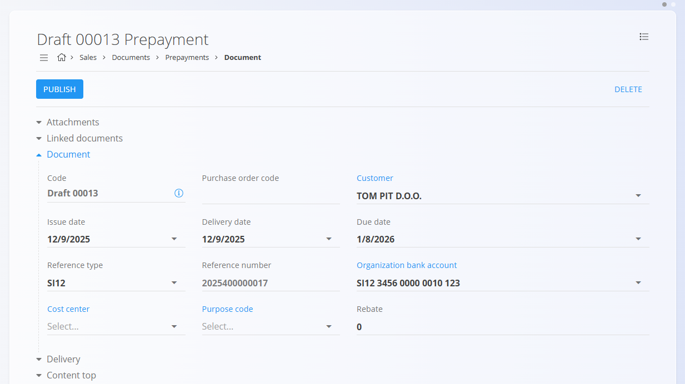

# Prepayments

A **Prepayment** is a sales document used when a customer pays an agreed amount in advance before goods or services are delivered. It records received funds that can later be fully or partially applied to [issued invoices](IssuedInvoices.md). Prepayments can be created manually or directly from a committed [**Proforma invoice**](ProformaInvoices.md), linking them to the sales process.

To access this page, go to **Sales / Documents / Prepayments**.

## How prepayments fit into the sales workflow

Prepayments are used when a customer pays part of the amount in advance. They integrate into the standard sales process as follows:

1. Create an **[Offer](Offers.md)** and convert it into a [**Proforma invoice**](ProformaInvoices.md).  
2. Commit the Proforma invoice, making it eligible for prepayments.  
3. Create a **Prepayment** – either manually or through *Linked documents → + Prepayment* on the Proforma invoice.  
4. Record the received amount and publish the prepayment (it becomes Committed).  
5. Apply the prepayment when issuing the **[final invoice](IssuedInvoices.md)**, fully or partially reducing the amount due.  
6. Reverse the prepayment if the advance payment must be canceled or refunded (see **[Reversals](../../Logistics/Documents/Reversals.md)**).

Prepayments track received funds and do not affect inventory.

## Schema

  
<strong>Document</strong>

| Field | Description |
|-------|-------------|
| [**Code**](../../../Common/UI/DocumentCodes.md) | System-generated identifier of the prepayment. |
| **Purchase order code** | Optional reference to the customer's purchase order. |
| **Customer** | Customer making the payment, selected from the [**Business directory**](../../../Common/Management/BusinessDirectory.md) (mandatory). |
| **Issue date** | Date when the prepayment document is issued. |
| **Delivery date** | Estimated delivery date related to the sale. |
| **Due date** | Deadline for receiving the prepayment (mandatory). |
| **Reference type** | Type of payment reference used on payment documents (mandatory). |
| **Reference number** | Payment reference based on the chosen reference type. |
| **[Organization bank account](../Management/OrganizationBankAccounts.md)** | Bank account receiving the prepayment (mandatory). |
| **[Cost center](../../../Common/Management/CostCenters.md)** | Optional allocation to a cost center. |
| **Purpose code** | Optional description of payment purpose. |
| **Rebate** | Overall rebate applied to the prepayment amount. |
| **Content top** | Introductory text from [**Predefined texts**](../../../Common/Management/PredefinedTexts.md). |
| **Content bottom** | Closing or legal text from [**Predefined texts**](../../../Common/Management/PredefinedTexts.md). |
| **Payment method** | Payment method selected from [**Payment methods**](../Management/PaymentMethods.md). |

  
<strong>Transport, Alternative currency, and Delivery</strong>

| Field | Description |
|--------|-------------|
| **[Delivery term](../../../Common/Management/DeliveryTerms.md)** | Delivery conditions  as agreed upon with the customer. |
| **[Mode of transport](../../../Common/Management/ModeOfTransport.md)** | Transport method  as agreed upon with the customer. |
| [**Alternative currency**](../../../Common/Management/Currencies.md) | Alternative currency to the default one used in the document |
| [**Exchange rates**](../Management/ExchangeRates.md) | Exchange rate of the alternative currency with respect to the default currency	|
| **Delivery** | Delivery company and address information. |

  
<strong>Intrastat</strong>

| Field | Description |
|------|-------------|
| [**Country dispatch**](../../../Common/Management/Countries.md) | Country from which the goods were dispatched. This value is typically derived from the material’s Intrastat configuration. |
| [**Nature of transaction**](../../Accounting/Management/Intrastat/NatureOfTransactions.md) | Classification of the transaction type used for Intrastat reporting (for example, direct sales or purchases). |
| [**Place of delivery**](../../Accounting/Management/Intrastat/PlaceOfDelivery.md) | Indicates where the goods are delivered, according to Intrastat definitions. |

  
<strong>Details</strong>

| Field | Description |
|--------|-------------|
| **Asset** | Product, service, or asset selected for this line. |
| **Detail name** | Display name of the selected item (can be edited if allowed). |
| **[Tax rate](../../../Common/Management/TaxRates.md)** | Tax rate applied to the line (defined in tax configuration). |
| **Net price (per unit)** | Price per unit excluding tax. |
| **Tax price (per unit)** | Price per unit including tax (calculated automatically based on tax rate). |
| **Quantity** | Quantity of the selected asset. |
| **Discount (%)** | Percentage discount applied to the net price. |
| **Total amount excluding tax** | Calculated net total (Net price × Quantity − Discount). |
| **Total amount with tax** | Total amount including tax. |
| **Tax calculation type** | Defines how tax is calculated when special VAT rules apply: • **Trilateral supplies** – For triangular EU transactions where VAT is accounted for by the final buyer (reverse charge). • **Tax is accounted** – Applies reverse charge VAT; the customer accounts for the tax instead of the seller. • **Export services** – Used for services provided to customers outside the EU (typically VAT exempt). • **Transport services** – Special VAT treatment for goods transport services. • **Passenger transport** – VAT rules specific to passenger transport activities. • **Travel agencies** – Applies the VAT margin scheme for travel agency services. • **According to customs procedures 42 and 63** – Used for imports where VAT is deferred to the destination EU country. • **Sale of recalled goods from the EU** – Special VAT handling for returned or recalled goods within the EU. |
| **Description** | Optional additional information for the line. |
| **Use alternative currency** | Option to express the line amount in a selected alternative currency. When selected, the amount is recalculated based on the exchange rate defined in the document. |

  
<strong>Ledger and Interstat details</strong>

| Field | Description |
|--------|-------------|
| **Ledger - Account revenue / expense** | General [ledger account](../../Accounting/Management/Ledger/ChartOfAccounts.md) used to post the line amount (e.g., sales revenue or purchase expense). |
| **Ledger - Account tax** | General [ledger account](../../Accounting/Management/Ledger/ChartOfAccounts.md) used to post the tax amount associated with the document line. |
| **[Intrastat – Tariff](../../Accounting/Management/Intrastat/Tariffs.md)** | Commodity code used for Intrastat reporting. |
| **Intrastat – Country of origin** | Country where the goods originate. |
| **Intrastat – Net weight (kg)** | Net weight used for statistical reporting. |
| **Intrastat – Statistical value** | Declared statistical value of goods for Intrastat reporting. |

## Management

Prepayments can have **Draft** and **Committed** states.

### List view

The prepayments list can be filtered by:
- **Document dates**
- **View** (Draft / Committed)
- **Customer**

Each row displays:
- Customer name  
- Document code  
- Document date  
- Prepayment amount  

Drafts can be edited; committed prepayments are final unless reversed.

## Actions

### Creating a new prepayment

1. Use the [**action button**](../../../Common/UI/ActionButton.md) to create a new draft prepayment.

   

2. Fill in mandatory header fields: **Customer** (from the [**Business directory**](../../../Common/Management/BusinessDirectory.md)), **Due date**, **Reference type**, **Reference number**, and **[Organization bank account](../Management/OrganizationBankAccounts.md)**.

3. Add items in the Details section. Type or scan a **serial number**, **EAN**, or **asset/material name** into the Details bar.
   - The system displays matching assets and materials.

4. Save the added details.

5. Select the **[Payment method](../Management/PaymentMethods.md)**.

    

6. When ready, click **Publish** at the top of the page to finalize the prepayment. This moves the document to the **Committed** state and enables additional actions.

> [!NOTE]
> When you click **Publish**, the document is confirmed and moves from **Draft** into the **Committed** group of states.
>
> A draft prepayment can also be created from a committed [**Proforma invoice**](ProformaInvoices.md) via **+ Prepayment**.
>
>

### Editing a prepayment

A draft prepayment can be modified until it is published.

Changes can be made to:
- Header fields (customer, dates, reference numbers, bank account)
- Alternative currency
- Transport
- Delivery information
- Detail lines (assets, quantities, prices)
- Payment methods
- Content text (top/bottom)

#### Attachments

Files can be uploaded in the **Attachments** section to provide additional documentation.

#### Linked documents

The linked documents section enables the creation of operational or follow-up documents. This section also shows any previously linked documents. 

> [!NOTE]
> - The available **Linked document** actions depend on the document type and status.
> - Prepayments can be partially or fully applied during invoice creation.

Available actions may include:
- **[+ Issued invoice](IssuedInvoices.md)** – Create a final invoice applying the prepayment.
- **Prepayment** – Duplicate the details from the current prepayment to a new document.

#### Alternative currency

The Alternative currency section allows prices in the document to be expressed in a currency different from the system’s default currency. This is typically used for international sales. Rates are taken from the [Exchange rates](../Management/ExchangeRates.md) code list.

When an alternative currency is selected, document prices are automatically recalculated using the specified exchange rate.

#### Transport and Intrastat sections

When **Intrastat** is set to **Obliged** in **System / Configuration / Intrastat**, additional sections become available in the receive document form.

- **Transport** - Used to capture logistics-related information about how the goods were delivered.
- **Intrastat** - Used to collect data required for Intrastat reporting. These fields are only shown when Intrastat reporting is enabled for the system.

> [!NOTE]
> Several Intrastat-related values are taken from **material code lists** (Intrastat configuration), such as country and transaction nature. These fields are not freely configurable per document and depend on predefined master data.

#### Delivery section

The Delivery section defines where the goods will be shipped. It is filled automatically from the customer or vendor data but can be adjusted for each document.  

These values affect the printed document and follow-up logistics documents, but do not modify the master data.

#### Details

Details define the ordered items and their quantities, prices, taxes, and discounts. Each detail line corresponds to a specific product, service, or asset.

##### Ledger details

The **Ledger** section defines how the document is posted to the general ledger. It determines which accounts are used for revenue, expense, and tax postings when the document is saved and posted.

When the document is posted:

- The **net amount** is posted to the selected revenue or expense account.
- The **tax amount** is posted to the selected tax account.
- The system creates corresponding journal entries in the ledger.

The available accounts are defined in the **[Chart of accounts](../../../Accounting/Ledger/Management/ChartOfAccounts.md)**.

##### Intrastat details

When Intrastat reporting is enabled and the transaction involves a customer from another EU country, an additional **Intrastat** section becomes available in the detail edit form. This section collects statistical information required for Intrastat reporting.

These fields are mandatory for cross-border EU transactions when the organization is Intrastat-obliged.

## Menu

The document menu provides additional actions:
- **Printing**
- **Exporting**
- **Send as email**
- **Reverse document** (creates a financial reversal)
- **Return to draft** (only if allowed by system settings)

A reversal negates the financial effect of a committed prepayment. See **[Reversals](../../Logistics/Documents/Reversals.md)** for more details.

## Deletion

Draft documents can be deleted on the edit screen, but only if they contain **no details**.

If the draft still includes items in the **Details** section:

1. Click the material serial number to open the **Edit detail** screen.  
2. Click **Delete** inside the Edit detail window to remove the material.  
3. Repeat this for all remaining materials.

Once the document contains no materials, you can click **Delete** to remove the draft.

Committed documents **cannot** be deleted, but they can be [reversed](../../Logistics/Documents/Reversals.md).  

