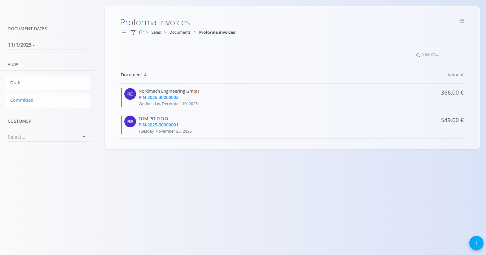
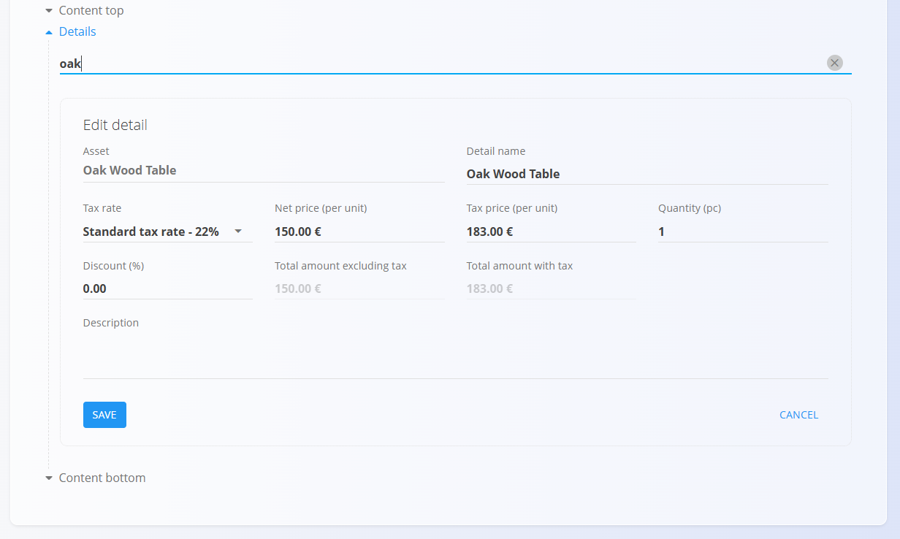
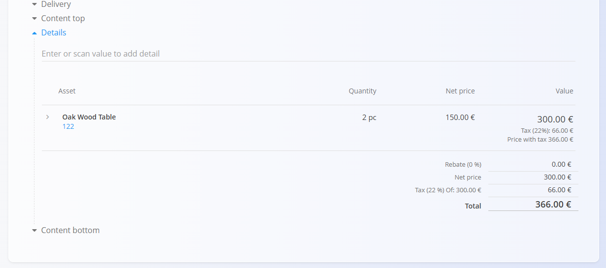

<!-- app_route: /sales/documents/proforma-invoices -->
<!-- app_label: Proforma invoices -->
<!-- canonical_source_url: https://github.com/Tom-PIT/Connected.Docs/blob/main/en/Domains/Sales/Documents/ProformaInvoices.md -->
<!-- canonical_source_title: Proforma invoices -->

# Proforma invoices

A **Proforma invoice** is a preliminary billing document used to provide customers with a detailed price quotation before goods or services are delivered. It does **not** trigger accounting or inventory changes, but it serves as a confirmed commercial offer.  

Proforma invoices are typically created from a committed [**Offer**](Offers.md), but can also be created independently via the [action button](../../../Common/UI/ActionButton.md).

To access this page, go to **Sales / Documents / Proforma invoices**.

## How proforma invoices fit into the sales workflow

Proforma invoices are used as an intermediate step when confirming commercial terms with a customer. They fit into the sales process as follows:

1. Create an **[Offer](Offers.md)** and publish it once the customer accepts the terms.  
2. Convert the committed offer into a **Proforma invoice** via *Linked documents → + Proforma invoice*, or create one manually.  
3. Send the Proforma invoice to the customer as a formal quotation.  
4. (Optional) Create one or more **[Prepayments](Prepayments.md)** from the committed proforma invoice.  
5. Convert the proforma invoice into a final **[Issued invoice](IssuedInvoices.md)** once goods/services are delivered.  
6. Reverse the proforma if needed using the [**Reversal**](../../Logistics/Documents/Reversals.md) action.

A committed proforma invoice is informational and does not affect financial or stock balances.

## Schema

  
<strong>Document</strong>

| Field | Description |
|-------|-------------|
| [**Code**](../../../Common/UI/DocumentCodes.md) | System-generated identifier of the proforma invoice. |
| **Purchase order code** | Optional reference to the customer’s purchase order. |
| **Customer** | Customer receiving the document, selected from the [**Business directory**](../../../Common/Management/BusinessDirectory.md) (mandatory). |
| **Document date** | Date when the proforma invoice is created. |
| **Validity date** | Date until which the prices and terms are valid (mandatory). |
| **Reference type** | Type of reference used on payment documents (mandatory). |
| **Reference number** | Reference number based on the selected reference type. |
| **[Organization bank account](../Management/OrganizationBankAccounts.md)** | Bank account displayed on the document (mandatory). |
| **[Cost center](../../../Common/Management/CostCenters.md)** | Optional allocation to a cost center. |
| **Purpose code** | Optional description of the document's purpose. |
| **Rebate** | Overall rebate applied to the total amount. |
| **Content top** | Introductory text from [**Predefined texts**](../../../Common/Management/PredefinedTexts.md). |
| **Content bottom** | Closing or legal text from [**Predefined texts**](../../../Common/Management/PredefinedTexts.md). |

  
<strong>Transport, Alternative currency, and Delivery</strong>

| Field | Description |
|--------|-------------|
| **[Delivery term](../../../Common/Management/DeliveryTerms.md)** | Delivery conditions  as agreed upon with the customer. |
| **[Mode of transport](../../../Common/Management/ModeOfTransport.md)** | Transport method  as agreed upon with the customer. |
| [**Alternative currency**](../../../Common/Management/Currencies.md) | Alternative currency to the default one used in the document |
| [**Exchange rates**](../Management/ExchangeRates.md) | Exchange rate of the alternative currency with respect to the default currency	|
| **Delivery** | Delivery company and address information. |

  
<strong>Intrastat</strong>

| Field | Description |
|------|-------------|
| [**Country dispatch**](../../../Common/Management/Countries.md) | Country from which the goods were dispatched. This value is typically derived from the material’s Intrastat configuration. |
| [**Nature of transaction**](../../Accounting/Management/Intrastat/NatureOfTransactions.md) | Classification of the transaction type used for Intrastat reporting (for example, direct sales or purchases). |
| [**Place of delivery**](../../Accounting/Management/Intrastat/PlaceOfDelivery.md) | Indicates where the goods are delivered, according to Intrastat definitions. |

  
<strong>Details</strong>

| Field | Description |
|--------|-------------|
| **Asset** | Product, service, or asset selected for this line. |
| **Detail name** | Display name of the selected item (can be edited if allowed). |
| **[Tax rate](../../../Common/Management/TaxRates.md)** | Tax rate applied to the line (defined in tax configuration). |
| **Net price (per unit)** | Price per unit excluding tax. |
| **Tax price (per unit)** | Price per unit including tax (calculated automatically based on tax rate). |
| **Quantity** | Quantity of the selected asset. |
| **Discount (%)** | Percentage discount applied to the net price. |
| **Total amount excluding tax** | Calculated net total (Net price × Quantity − Discount). |
| **Total amount with tax** | Total amount including tax. |
| **Tax calculation type** | Defines how tax is calculated when special VAT rules apply: • **Trilateral supplies** – For triangular EU transactions where VAT is accounted for by the final buyer (reverse charge). • **Tax is accounted** – Applies reverse charge VAT; the customer accounts for the tax instead of the seller. • **Export services** – Used for services provided to customers outside the EU (typically VAT exempt). • **Transport services** – Special VAT treatment for goods transport services. • **Passenger transport** – VAT rules specific to passenger transport activities. • **Travel agencies** – Applies the VAT margin scheme for travel agency services. • **According to customs procedures 42 and 63** – Used for imports where VAT is deferred to the destination EU country. • **Sale of recalled goods from the EU** – Special VAT handling for returned or recalled goods within the EU. |
| **Description** | Optional additional information for the line. |
| **Use alternative currency** | Option to express the line amount in a selected alternative currency. When selected, the amount is recalculated based on the exchange rate defined in the document. |

  
<strong>Ledger and Interstat details</strong>

| Field | Description |
|--------|-------------|
| **Ledger - Account revenue / expense** | General [ledger account](../../Accounting/Management/Ledger/ChartOfAccounts.md) used to post the line amount (e.g., sales revenue or purchase expense). |
| **Ledger - Account tax** | General [ledger account](../../Accounting/Management/Ledger/ChartOfAccounts.md) used to post the tax amount associated with the document line. |
| **[Intrastat – Tariff](../../Accounting/Management/Intrastat/Tariffs.md)** | Commodity code used for Intrastat reporting. |
| **Intrastat – Country of origin** | Country where the goods originate. |
| **Intrastat – Net weight (kg)** | Net weight used for statistical reporting. |
| **Intrastat – Statistical value** | Declared statistical value of goods for Intrastat reporting. |

## Management

Proforma invoices can have **Draft** and **Committed** states.

### List view

The list can be filtered by:
- **Document dates**
- **View** (Draft / Committed)
- **Customer**

Each row shows:
- Customer name  
- Document code  
- Document date  
- Document amount  

Drafts can be edited; committed proforma invoices are final unless reversed.

## Actions

### Create a new proforma invoice

Proforma invoices can be created in two ways:

- Directly from the **Proforma invoices** screen using the [action button](../../../Common/UI/ActionButton.md).  
- From a committed [**Offer**](Offers.md), via **Linked documents → + Proforma invoice**.  
  In this case, fields such as the customer, validity date, and detail items are automatically pre-filled.

Once you start a new Proforma invoice, follow these steps:

1. Use the [action button](../../../Common/UI/ActionButton.md) or the offer’s **Linked documents** panel to create a new draft proforma invoice.

2. Fill in (or edit) the required header fields:  
   - [**Customer**](../../../Common/Management/BusinessDirectory.md)  
   - **Document date**  
   - **Validity date**  
   - **Rebate** (optional)  
   - **Reference type** / **Reference number**  
   - [**Organization bank account**](../Management/OrganizationBankAccounts.md)

   

3. Add items in the **Details** section by typing or scanning a **serial number**, **EAN**, or **asset name**. The system displays all matching results.

   

4. Save the added detail line.

   

5. When the document is ready, click **Publish** to finalize it.  
   
Publishing moves the document from **Draft** to **Committed**.

> [!NOTE]  
> Committed proforma invoices cannot be edited but can be used to create **Prepayments** or serve as the basis for a final invoice.

## Edit a proforma invoice

A draft proforma invoice can be freely edited.  
You may change:

- Header fields  
- Alternative currency
- Delivery information  
- Transport  
- Detail lines (assets, quantities, pricing)  
- Content top/bottom  

Once published, the document becomes **Committed** and no further editing is allowed.

### Attachments

Use the **Attachments** section to upload and manage files related to the document, such as photos, PDFs, certificates, or supporting records.

For detailed instructions, see [**Attachments**](../../../Common/Concepts/Attachments.md).

### Linked documents

The linked documents section enables the creation of operational or follow-up documents and shows previously linked ones.

Typical actions and pre-fills:
- **[+ Prepayment](Prepayments.md)** – Creates a prepayment from the committed proforma; pre-fills customer, amounts, and references.  
  Inventory impact: none. Financial impact: record advance payment.
- **Proforma invoice** – Duplicate the details from the current proforma invoice to a new document
- **[Offer](Offers.md)** – Shows originating offer (if any); provides traceability from offer → proforma.

> [!NOTE]
> Available actions depend on document status (Draft vs Committed). Pre-fills vary by source document.

#### Alternative currency

The Alternative currency section allows prices in the document to be expressed in a currency different from the system’s default currency. This is typically used for international sales. Rates are taken from the [Exchange rates](../Management/ExchangeRates.md) code list.

When an alternative currency is selected, document prices are automatically recalculated using the specified exchange rate.

#### Transport and Intrastat sections

When **Intrastat** is set to **Obliged** in **System / Configuration / Intrastat**, additional sections become available in the receive document form.

- **Transport** - Used to capture logistics-related information about how the goods were delivered.
- **Intrastat** - Used to collect data required for Intrastat reporting. These fields are only shown when Intrastat reporting is enabled for the system.

> [!NOTE]  
Several Intrastat-related values are taken from **material code lists** (Intrastat configuration), such as country and transaction nature. These fields are not freely configurable per document and depend on predefined master data.

#### Delivery section

The Delivery section defines where the goods will be shipped. It is filled automatically from the customer or vendor data but can be adjusted for each document.  

These values affect the printed document and follow-up logistics documents, but do not modify the master data.

#### Details

Details define the ordered items and their quantities, prices, taxes, and discounts. Each detail line corresponds to a specific product, service, or asset.

##### Ledger details

The **Ledger** section defines how the document is posted to the general ledger. It determines which accounts are used for revenue, expense, and tax postings when the document is saved and posted.

When the document is posted:

- The **net amount** is posted to the selected revenue or expense account.
- The **tax amount** is posted to the selected tax account.
- The system creates corresponding journal entries in the ledger.

The available accounts are defined in the **[Chart of accounts](../../Accounting/Management/Ledger/ChartOfAccounts.md)**.

##### Intrastat details

When Intrastat reporting is enabled and the transaction involves a customer from another EU country, an additional **Intrastat** section becomes available in the detail edit form. This section collects statistical information required for Intrastat reporting.

These fields are mandatory for cross-border EU transactions when the organization is Intrastat-obliged.

### Delete a proforma invoice

Draft documents can be deleted in the edit view, **only if they contain no details**.

If the draft still includes items in the **Details** section:

1. Open the document menu (top right corner).
2. Select **Delete all details** to remove all lines at once.
3. Once the document contains no details, click **Delete** to remove the draft.

If you need to remove only a specific material instead of clearing the entire document:

1. Click the material serial number to open the **Edit detail** screen.
2. Click **Delete** inside the Edit detail window.

> [!NOTE]
> Committed invoices **cannot** be deleted, but they can be [reversed](../../Logistics/Documents/Reversals.md) or **returned to draft**.

## Menu

The menu provides additional actions available on this page.

Available actions:

- **Print**
- **Export to PDF**
- **Send as email** 
- **Delete all details** (only for drafts)
- **[Reverse document](../../Logistics/Documents/Reversals.md)**
- **Return to draft**

For details about menu actions, see [**Menu actions**](../../../Common/Concepts/MenuActions.md).

> [!NOTE]
> A reversal negates the financial effect of a committed prepayment. See **[Reversals](../../Logistics/Documents/Reversals.md)** for more details.
