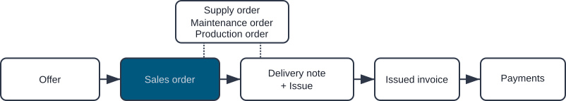
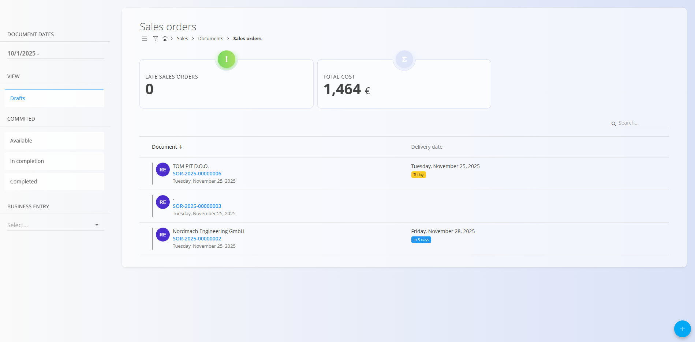

<!-- app_route: /sales/documents/sales-orders -->
<!-- app_label: Sales orders -->
<!-- canonical_source_url: https://github.com/Tom-PIT/Connected.Docs/blob/main/en/Domains/Sales/Documents/SalesOrders.md -->
<!-- canonical_source_title: Sales orders -->

# Sales orders

A **Sales order** represents the customer’s confirmed intention to purchase goods or services. It is typically created from an approved **Offer**, but it can also be created independently.  
Sales orders define *what* the customer will receive, *when*, and *under which conditions*, and they serve as the basis for delivery, production, procurement, and invoicing workflows.

To access this page, navigate to **Sales / Documents / Sales orders** in the [navigation](../../../Common/UI/Navigation.md).

## How sales orders fit into the sales workflow

Sales orders are one of the core steps in the sales chain:

1. A quotation is prepared in an **[Offer](Offers.md)**.  
2. When the customer confirms the offer, a **Sales order** is created from the offer (via [**Linked documents**](Offers.md#linked-documents)).  
3. The sales order triggers downstream operational processes:
   - [**Delivery notes**](DeliveryNotes.md)
   - [**Production orders**](../../Production/Documents/ProductionOrders.md)
   - [**Maintenance orders**](../../Maintenance/Documents/MaintenanceOrders.md)
   - [**Supply orders**](../../Supply/Documents/SupplyOrders.md)
   - [**Issued invoices**](IssuedInvoices.md)

Once the sales order is fulfilled and invoiced, it moves toward completion.

> [!NOTE]
>Your company may follow all steps or only some of them, depending on the type of business (for example, service companies may not use Delivery notes).

## Schema

  
<strong>Document</strong>

| Field | Description |
|-------|-------------|
| [**Code**](../../../Common/UI/DocumentCodes.md) | System-generated identifier of the sales order. |
| **Customer** | Customer receiving the order, taken from the [Business directory](../../../Common/Management/BusinessDirectory.md) (mandatory). |
| **Document date** | Date when the sales order is created. |
| **Delivery date** | Expected delivery date for the order (mandatory). |
| **Rebate** | Optional discount applied to the entire sales order. |
| **Purchase order** | Optional reference to a related [supply order](../../Supply/Documents/SupplyOrders.md). |
| **[Delivery term](../../../Common/Management/DeliveryTerms.md)** | Delivery conditions as agreed upon with the customer. |
| **[Mode of transport](../../../Common/Management/ModeOfTransport.md)** | Transport method agreed upon with the customer. |
| **Delivery – Company / Address** | Customer delivery details, taken from the [Business directory](../../../Common/Management/BusinessDirectory.md). |
| [**Payment methods**](../Management/PaymentMethods.md) | Payment options connected to the sales order. |

  
<strong>Transport, Alternative currency, and Delivery</strong>

| Field | Description |
|--------|-------------|
| **[Delivery term](../../../Common/Management/DeliveryTerms.md)** | Delivery conditions  as agreed upon with the customer. |
| **[Mode of transport](../../../Common/Management/ModeOfTransport.md)** | Transport method  as agreed upon with the customer. |
| [**Alternative currency**](../../../Common/Management/Currencies.md) | Alternative currency to the default one used in the document |
| [**Exchange rates**](../Management/ExchangeRates.md) | Exchange rate of the alternative currency with respect to the default currency	|
| **Delivery** | Delivery company and address information. |

  
<strong>Intrastat</strong>

| Field | Description |
|------|-------------|
| [**Country dispatch**](../../../Common/Management/Countries.md) | Country from which the goods were dispatched. This value is typically derived from the material’s Intrastat configuration. |
| [**Nature of transaction**](../../Accounting/Management/Intrastat/NatureOfTransactions.md) | Classification of the transaction type used for Intrastat reporting (for example, direct sales or purchases). |
| [**Place of delivery**](../../Accounting/Management/Intrastat/PlaceOfDelivery.md) | Indicates where the goods are delivered, according to Intrastat definitions. |

  
<strong>Details</strong>

| Field | Description |
|--------|-------------|
| [**Asset**](../../Assets/Assets/Assets.md) | Sold item or service from the **Assets** domain. |
| **Quantity** | Quantity of the asset selected. |
| **Net price** | Net price per unit, usually taken from price lists or the related document. |
| **Discount (%)** | Optional line-level discount. |
| **Value** | Calculated line totals (net, tax, and gross amounts). |
| **[Intrastat – Tariff](../../Accounting/Management/Intrastat/Tariffs.md)** | Commodity code used for Intrastat reporting. |
| **Intrastat – Country of origin** | Country where the goods originate. |
| **Intrastat – Net weight (kg)** | Net weight used for statistical reporting. |
| **Intrastat – Statistical value** | Declared statistical value of goods for Intrastat reporting. |

## Management

### Document states

Documents move through several possible states during their lifecycle:

- **Draft** – The document is not yet published. All fields can be edited freely.
- **Committed** – The document has been published. It cannot be deleted or freely modified.
    - **Available** – The document is valid and ready for further processing.
    - **In completion** – The document is partially processed (e.g., partially delivered or received).
    - **Completed** – All actions related to the document have been fully executed.

### List view

The list shows all sales orders with their current status and delivery dates.

At the top of the list, the system displays real-time summary indicators based on the currently applied filters from the left sidebar. The following indicators are available:

- **Late sales orders** – Sales orders whose planned delivery date has passed and are not yet completed.
- **Total cost** – The aggregated total value of all sales orders included in the active filter.

**Drafts:**

**Available (published):**

Filters include:

- **Document dates**
- **Drafts**
- **Committed:** Available, In completion, Completed
- **Customer**
- **Search bar**

## Actions

### Create a sales order

To create a new sales order, click the [action button](../../../Common/UI/ActionButton.md). 

See the [**How to create a sales order**](SalesOrdersCreate.md) guide for a step-by-step walkthrough of the creation process.

### Edit a sales order

Click on a sales order on the list to open the edit view. The available actions depend on the document state. While the order is in **Draft** status you can edit all sections:

- Header fields (dates, customer)
- [**Alternative currency**](SalesOrdersCreate.md#alternative-currency)
- [**Transport and Intrastat**](SalesOrdersCreate.md#transport-and-intrastat-sections)
- [**Delivery information**](SalesOrdersCreate.md#delivery)
- [**Details**](SalesOrdersCreate.md#step-3--add-details) – add, remove, or change invoice lines
- [**Payment methods**](SalesOrdersCreate.md#payment-methods) – define how the customer is expected to pay

#### Linked documents

The Linked documents section allows creation and linkage of operational documents. It also shows any previously linked documents.

For details about document relationships, traceability, and creating related documents, see [**Linked documents**](../../../Common/Concepts/LinkedDocuments.md).

> [!NOTE]
> The available **Linked document** actions depend on the document type and status.

Available actions include:

- [**+ Delivery note**](DeliveryNotes.md)
- **+ Empty [delivery note](DeliveryNotes.md)****
- **Link existing [delivery note](DeliveryNotes.md)**
- [**+ Production order**](../../Production/Documents/ProductionOrders.md)
- [**+ Maintenance order**](../../Maintenance/Documents/MaintenanceOrders.md)
- [**+ Issued invoice**](IssuedInvoices.md)
- **Link to project**
- **Copy sales order**

### Publish a sales order

When the draft is ready, click **Publish** located at the top of the page to commit the order. A Committed sales order moves to the **Available** state and enables additional document actions.

> [!NOTE]
> When you click **Publish**, the document is confirmed and moves from the **Draft** state into the **Committed** group of states.

Completing a sales order has the following effects:

- The document moves from _Available_ to _Completed_ state.
  
- Editing is restricted.

- Most **Linked document** actions are disabled.

> [!NOTE]
> Completing a sales order is an administrative action that finalizes its lifecycle. It does **not** perform additional stock movements or financial postings — those occur in the linked delivery or invoice documents.

### Complete a sales order

Once the published sales order is finalized, for example, when a [**delivery note**](DeliveryNotes.md) or [**issued invoice**](IssuedInvoices.md) has been generated from a sales order, click **Complete**:

### Delete a sales order

Draft documents can be deleted in the edit view, **only if they contain no details**.

If the draft still includes items in the **Details** section:

1. Open the document menu (top right corner).
2. Select **Delete all details** to remove all detail lines at once.
3. Once the document contains no details, click **Delete** to remove the draft.

If you need to remove only a specific material instead of clearing the entire document:

1. Click the material serial number to open the **Edit detail** screen.
2. Click **Delete** inside the Edit detail window.

> [!NOTE]
> Only **draft** sales orders can be deleted. Once a sales order is published, you can no longer delete it; instead, use **Return to draft**.  

## Menu

The menu provides additional actions available on this page.

Available actions:

- **Print**
- **Export to PDF**
- **Import details** 
- **Delete all details** (only for drafts)
- **Return to draft**

For details about menu actions, see [**Menu actions**](../../../Common/Concepts/MenuActions.md).

> [!NOTE]
> A reversal negates the financial effect of a committed prepayment. See **[Reversals](../../Logistics/Documents/Reversals.md)** for more details.

