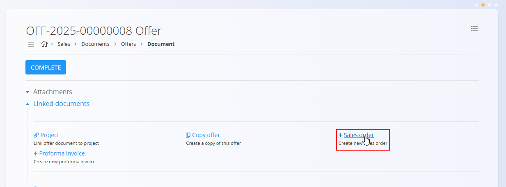

<!-- app_route: /sales/documents/sales-orders -->
<!-- app_label: Sales orders -->
<!-- app_navigation_hint: Open Sales orders, then click the action button to create a new draft order. -->
<!-- canonical_source_url: https://github.com/Tom-PIT/Connected.Docs/blob/main/en/Domains/Sales/Documents/SalesOrdersCreate.md -->
<!-- canonical_source_title: How to create a sales order -->

# How to create a sales order

New sales orders can be created:

- manually from the **Sales orders** screen using the [**action button**](../../../Common/UI/ActionButton.md)
- from a published [offer](Offers.md) using **Linked documents → + Sales order**

> [!NOTE]
> - Sales orders created manually start with empty fields.
>
> - When a sales order is created from an offer, most fields are automatically pre-filled from the source document, including customer information, delivery details, and detail items.

## Step 1 — Create the document

Create a new draft sales order using one of the following methods:

- Directly from the **Sales orders** screen using the [**action button**](../../../Common/UI/ActionButton.md)
- From a published [offer](Offers.md), via **Linked documents → + Sales order**. In this case, most fields — such as the customer, delivery information, and detail items — are automatically pre-filled based on the offer.

  

## Step 2 — Fill in header information
  
Enter the **Customer**, **Document date**, and **Delivery date** (or review them if pre-filled).  

## Step 3 — Add details

Add items into the **details** section. Details define the ordered items and their quantities, prices, taxes, and discounts. Each detail line corresponds to a specific product or service.

To add a new item:

1. Type or scan a **serial number**, **EAN**, or **material name** into the Details bar (or review them if pre-filled). The system displays **all matching materials and serial numbers**. If multiple matches exist, select the correct one from the list.

   

2. Adjust the **Quantity**, **Delivery date**, or other fields as needed.  
3. Click **Save** to confirm the added details. 
4. Repeat step 1 to add more items.

Saved detail:

### Intrastat details

When Intrastat is enabled, additional fields appear in the details section, such as: 
- **Tariff**
- **Country of origin**
- **Net weight** 
- **Statistical value**
 
These fields are required for Intrastat reporting but do not affect the sales order processing.

## Step 4 — Configure additional sections

### Delivery

Review or adjust delivery information in the **Delivery** section.

The Delivery section defines where the goods will be shipped. It is filled automatically from the customer or vendor data but can be adjusted for each document.  

These values affect the printed document and follow-up logistics documents, but do not modify the master data.

### Alternative currency

The Alternative currency section allows prices in the document to be expressed in a currency different from the system’s default currency. This is typically used for international sales. Rates are taken from the [Exchange rates](../Management/ExchangeRates.md) code list.

When an alternative currency is selected, document prices are automatically recalculated using the specified exchange rate.

### Transport and Intrastat sections

When **Intrastat** is set to **Obliged** in **System / Configuration / Intrastat**, additional sections become available in the document.

- **Transport** - Used to capture logistics-related information about how the goods were delivered.
- **Intrastat** - Used to collect data required for Intrastat reporting. These fields are only shown when Intrastat reporting is enabled for the system.

> [!NOTE]  
Several Intrastat-related values are taken from **material code lists** (Intrastat configuration), such as country and transaction nature. These fields are not freely configurable per document and depend on predefined master data.

### Payment methods

Payment method assignments appear at the bottom of the document. 

Click **Add payment method** to assign a [payment method](../Management/PaymentMethods.md) to the order. This field is informational and does not trigger any financial transactions by itself. It is used for internal tracking of how the customer intends to pay for the order.

### Attachments

Use the **Attachments** section to upload and manage files related to the document, such as photos, PDFs, certificates, or supporting records.

For detailed instructions, see [**Attachments**](../../../Common/Concepts/Attachments.md).

## Step 5 — Publish the document

Click **Publish** at the top of the page.

Once published, the Sales order moves into the **Committed → Available** state, enabling all related actions such as creating Delivery notes, Production orders, Maintenance orders, or Issued invoices via the [Linked documents](SalesOrders.md#linked-documents) section.
