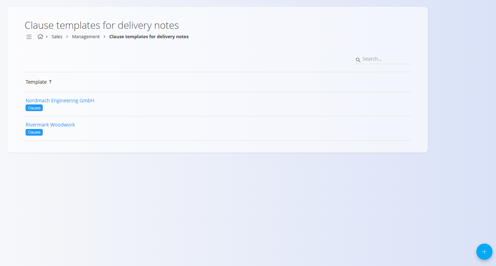
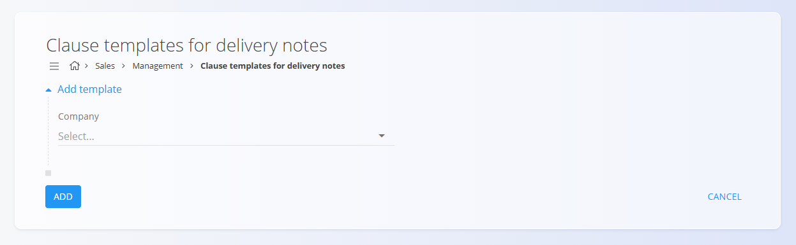
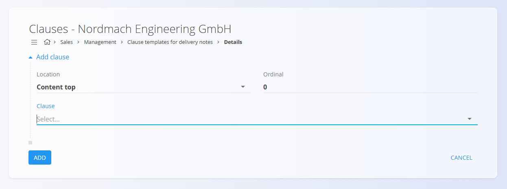
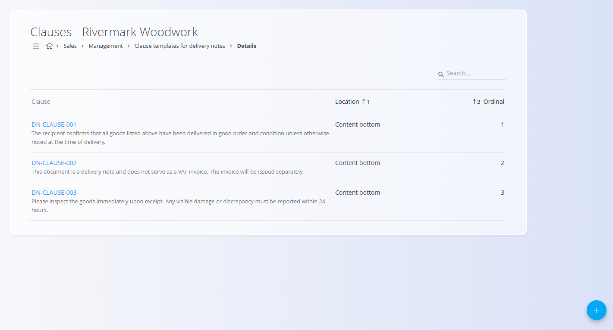

<!-- app_route: /management/sales/delivery-note-clause-templates -->
<!-- app_label: Clause templates for delivery notes -->
<!-- canonical_source_url: https://github.com/Tom-PIT/Connected.Docs/blob/main/en/Domains/Sales/Management/ClauseTemplatesDeliveryNotes.md -->
<!-- canonical_source_title: Clause templates for delivery notes -->

# Clause templates for delivery notes

The **Clause templates for delivery notes** code list allows you to define clause sets (templates) that will appear on delivery notes for specific companies. A template contains one or more clauses—such as legal notes, disclaimers, or delivery confirmations—which will be printed at the top or bottom of the delivery note in a defined order. 

To access this page, go to **Sales / Management / Clause templates for delivery notes** in the [navigation](../../../Common/UI/Navigation.md).

> [!NOTE]  
> **Prerequisites**  
> Before creating clause templates, make sure the following are set up:  
> • The partner company exists in the [Business directory](../../../Common/Management/BusinessDirectory.md).  
> • The clause text exists in the [Predefined texts](../../../Common/Management/PredefinedTexts.md) code list (entity: *Delivery note*).

## Schema

### Template fields

| Field | Description |
|--------|-------------|
| **Company** | The company for which the clause template applies. Selected from the [Business directory](../../../Common/Management/BusinessDirectory.md). (mandatory) |

### Clause fields (inside a template)

| Field | Description |
|--------|-------------|
| **Location** | Where the clause appears on the delivery note (top or bottom). |
| **Ordinal** | Numeric order of appearance (e.g., 1, 2, 3…). |
| **Clause** | A predefined text selected from [Predefined texts](../../../Common/Management/PredefinedTexts.md) (entity = *Delivery note*). |

## Management

### List view

The list displays all existing clause templates, grouped by company:

Click **Clauses** to open the clause list for that template. You may use the **Search** bar to filter templates by company name.

## Actions

### Create a new delivery note template

Click the action button to create a new template. Only one field is required:

After adding the template, you must click **Clauses** to open the clause editor.

#### Add clauses to a delivery note template

Inside the clause editor, use the action button to add clauses. Select: 
- **Location** - The place in the delivery note where the clause should appear
- **Ordinal** - The numeric order in which the clause will appear
- ***Clause** - Predefined text to use

#### Clause list

All clauses assigned to the template are shown in order:

You may reorder clauses by editing the **Ordinal** value.

### Edit delivery note templates and clauses

Click the **company name** to open the template. Click any clause to edit its location, order, or assigned predefined text.

### Delete delivery note templates and clauses

Open a template or clause and click **Delete** on the edit screen. 

If confirmed, the record is permanently removed; otherwise, the system keeps it unchanged.

> [!NOTE]  
> A clause template or clause can be deleted only if it is not required by dependent business processes.

