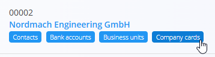
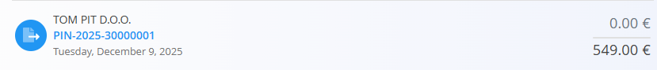

<!-- app_route: /customers/company-cards -->
<!-- app_label: Company cards -->
<!-- canonical_source_url: https://github.com/Tom-PIT/Connected.Docs/blob/main/en/Domains/Sales/Views/CompanyCards.md -->
<!-- canonical_source_title: Company cards -->

# Company cards

The **Company cards** view provides a detailed overview of all **debit and credit records** related to each company. Instead of showing a single consolidated balance, this screen lists **individual financial documents** (such as [**Issued invoices**](../Documents/IssuedInvoices.md), [**Credit notes**](../Documents/CreditNotes.md), and [**Debit notes**](../Documents/DebitNotes.md)) and indicates whether each record is **unpaid**, **partially paid**, or **fully paid**.

This view is intended for **financial monitoring**, allowing users to review payment status and **record payments directly from the list**.

This view is available via **Sales / Views / Company cards** or **Accounting / Ledger / Views / Company cards** in the [navigation](../../../Common/UI/Navigation.md).

The screen is also accessible from the [**Business directory**](../../../Common/Management/BusinessDirectory.md) page by clicking on the **Company cards** tag of a specific company entry. In that case, the list will be pre-filtered to show only records related to the selected company.

## Company cards list

Each entry represents a **single financial record** for a company, not a summarized balance.

- **Debit** → The customer owes money to your company
- **Credit** → Your company owes money to the customer (for example, due to overpayments or credit adjustments)

Clicking a row opens the related document (for example, an **issued invoice**).

### Filters

The left sidebar allows you to refine the results:

- **Created date** – Filter documents by creation date.
- **Due date** – Filter documents by due date.
- **Company card type**
    - *All*
    - *Debit*
    - *Credit*
- **Company** – Filter by a specific company.

## Payment status indicators

The Company cards view visually indicates the payment status of each debit or credit record by displaying both the **paid amount** and the **original document total**.

### Fully paid records

When a document has been **fully paid**, only the total document amount is displayed.

In this case:

- The document is completely settled.
- There is no remaining outstanding balance.

### Partially paid records

When a document has been **partially paid**, the paid amount is displayed separately from the original document total.

In this example:

- The **top amount** represents the **paid amount**.
- The **bottom amount** represents the **original document total**.

### Unpaid records

When a document has **not been paid**, the paid amount is displayed as **0.00**, while the original document total is shown below.

This indicates that:

- No payment has been recorded.
- The full document amount remains outstanding.

These visual indicators allow you to quickly distinguish between unpaid, partially paid, and fully settled documents.

## Actions

### Record payment

Payments can be recorded directly from the Company cards list without opening the related document.

Click the **paid amount**, enter the new value, and confirm the change.

For example:

- If the paid amount is **0.00**, you can enter **111.00**.
- The system records **111.00** as the amount paid for the selected document.
- The payment status is updated automatically.

## Usage notes

- This view aggregates **debit and credit documents** into a single list for easier payment monitoring.
- Recording a paid amount updates the payment status of the selected document.

For detailed document information, open the related [**Issued invoices**](../Documents/IssuedInvoices.md), [**Credit notes**](../Documents/CreditNotes.md), or [**Debit notes**](../Documents/DebitNotes.md).