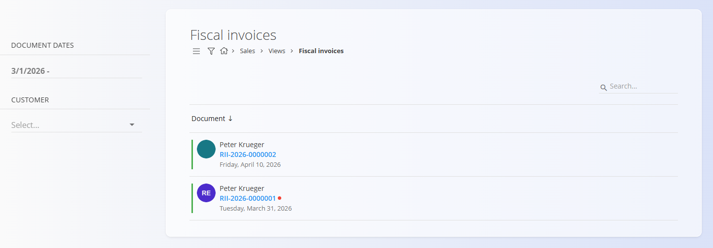

<!-- app_route: /sales/views/fiscal-invoices -->
<!-- app_label: Fiscal invoices -->
<!-- canonical_source_url: https://github.com/Tom-PIT/Connected.Docs/blob/main/en/Domains/Sales/Views/FiscalInvoices.md -->
<!-- canonical_source_title: Fiscal invoices -->

# Fiscal invoices

The **Fiscal invoices** view displays a list of **issued retail invoices** that are **fiscalized** and compliant with tax regulations.

These invoices are typically used for **retail (B2C) sales** and are reported to the tax authority according to local fiscalization rules.

To access this page, go to **Sales / Views / Fiscal invoices** in the [**navigation**](../../../Common/UI/Navigation.md).

## Fiscal invoice list

The list shows all fiscal invoices based on the selected filters.

Each entry includes:

- **Invoice number**  
- **Customer**  
- **Issue date**  

The color on the left side of each entry indicates the invoice status:
- **Green** — Successfully fiscalized and reported to the tax authority
- **Orange** — Data not yet sent to the tax authority

### Filters

Use the filters on the left side to refine the list:

- **Document dates** – filter invoices by date range  
- **Customer** – filter by customer  

## Actions

### Viewing details

Click on an **invoice number** to open the detailed view of the fiscal invoice ([retail issued invoice](../Documents/RetailIssuedInvoice.md)).