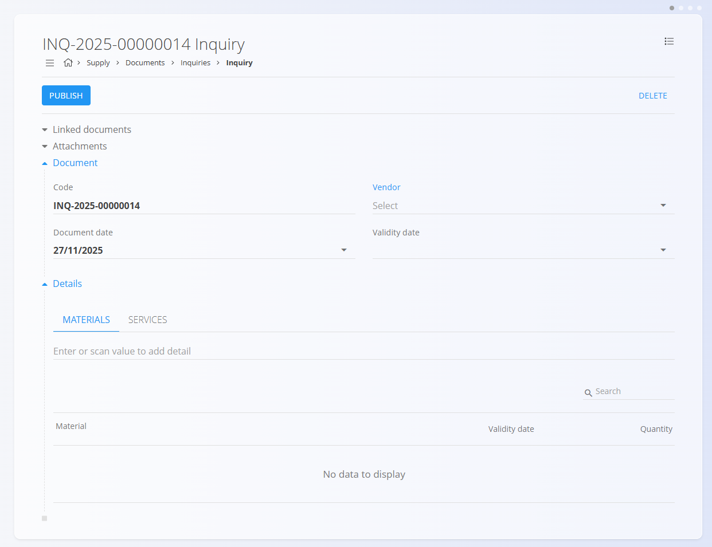

<!-- app_route: /supply/documents/inquiries -->
<!-- app_label: Inquiries -->
<!-- canonical_source_url: https://github.com/Tom-PIT/Connected.Docs/blob/main/en/Domains/Supply/Documents/Inquiries.md -->
<!-- canonical_source_title: Inquiries -->

# Inquiries

An **Inquiry** is a supply document used to request pricing, availability, and delivery information from a vendor before placing a formal order. Inquiries help your organization compare supplier responses, plan upcoming purchasing, and smoothly transition into follow-up documents such as [**Supply orders**](SupplyOrders.md).

To access this page, go to **Supply / Documents / Inquiries** in the [**navigation**](../../../Common/UI/Navigation.md).

## How inquiries fit into the supply workflow

A typical flow:

1. Create an **Inquiry** and send it to the vendor.  
2. The vendor replies with pricing, availability, and delivery information.  
3. When approved, convert the inquiry into a [**Supply order**](SupplyOrders.md) using the **Linked documents** section.  
4. From the Supply order, you can then create a [**Receive**](../../Logistics/Documents/Receives.md) document (partial or full) once the materials arrive.

> [!NOTE]  
> Inquiries are not mandatory — Supply orders can also be created directly without a prior inquiry. Your organization may follow all steps or only some of them, depending on the purchasing process.

## Schema

| Field | Description |
|-------|-------------|
| [**Code**](../../../Common/UI/DocumentCodes.md) | System-generated identifier of the inquiry. |
| **Vendor** | Vendor receiving the inquiry, selected from the [**Business directory**](../../../Common/Management/BusinessDirectory.md) (mandatory). |
| **Document date** | Date when the inquiry is created. |
| **Validity date** | Deadline by which the inquiry is valid (similar to an expiration date). |
| **Details** | List of requested materials or services (mandatory). |

### Detail fields

| Field | Description |
|--------|-------------|
| **[Material](../../Assets/Domain/Materials.md)** | Material for which information is requested. |
| **Validity date** | Expected or proposed delivery date. |
| **Quantity** | Requested quantity of the selected material. |
| **Supplier code** | Vendor’s internal material reference code (optional). |

## Management

### Document states

Documents move through several possible states during their lifecycle:

- **Draft** – The inquiry is not yet published. All fields can be edited freely.
- **Committed** – The inquiry has been published. It cannot be deleted or freely modified.
    - **Available** – The inquiry is valid and ready for further processing.
    - **In completion** – The inquiry is partially processed (e.g., partially converted or referenced).
    - **Completed** – All actions related to the inquiry have been fully executed.

### List view

The Inquiries list provides an overview of all supply requests, separated into **Drafts**, **Available**, **In completion**, and **Completed**.

### Indicators

At the top of the list, the system displays the **Late inquiries** indicator:

- **Late inquiries** – Inquiries whose validity date has passed and have not yet been completed.  
  Clicking this indicator filters the list to display only late inquiries.

### Filters

Filters on the left help narrow down results by:

- **Document dates**  
- **View**  
  - Drafts  
- **Committed**  
  - Available  
  - In completion  
  - Completed  
- **Vendor**  
- Search bar  

These filters allow quick navigation through vendor requests across different statuses and time periods.

## Actions

### Creating a new Inquiry

1. Use the [**action button**](../../../Common/UI/ActionButton.md) to create a new draft inquiry.

2. Fill in the **Vendor**, **Document date**, and **Validity date** fields.

    

3. Add items to the **Details** section. Type or scan a **serial number**, **EAN**, or **material name** into the Details bar.  
   - The system displays **all matching materials and serial numbers**.  
   - Adapt the quantity according to your requirement 

4. Save the added details.

5. When ready, click **Publish** to finalize the inquiry draft and move it to the **Available** state.

### Editing an Inquiry

Click any inquiry in the list to open it. Draft inquiries can be edited freely.

The document contains several expandable sections:  
- Linked documents  
- Attachments  
- Document  
- Details  

#### Attachments

At the top of every document, an **Attachments** section is available. 

You can upload any relevant file—such as delivery notes, transport documents, photos, or supporting records. All attached files remain stored together with the document and can be reviewed at any time.

#### Linked documents

The **Linked documents** section allows creation and tracking of dependent supply documents.

> [!NOTE]  
> The available **Linked document** actions depend on the document type and inquiry status.

Available actions include:

- **Add project** – Assign the inquiry to a project  
- **+ Supply order** – Create a [Supply order](SupplyOrders.md) directly from the inquiry  

> [!TIP]
> When a Supply order is created from an Inquiry, most relevant fields are automatically pre-filled.

### Completing an inquiry

Once the inquiry in the **Available** state is approved, click **Complete** at the top of the page. The document will now show on the **Complete** list.

> [!NOTE]  
> An inquiry is automatically moved to the **Completed** status when a new [**Supply order**](SupplyOrders.md) is created directly from it using the **Linked documents** action.

## Menu

The **Menu** in the top-right corner provides the following actions:

- **Printing** – Print the inquiry  
- **Exporting** – Export to PDF  

## Deletion

Inquiries can be deleted on the edit screen. To delete an inquiry, open the document and click **Delete** in the top-right corner.

> [!NOTE]  
> Only draft inquiries can be deleted.

