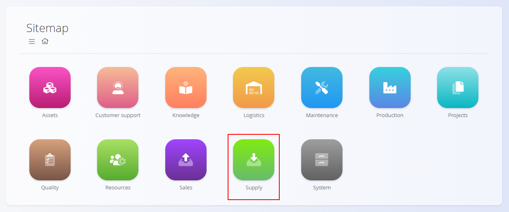
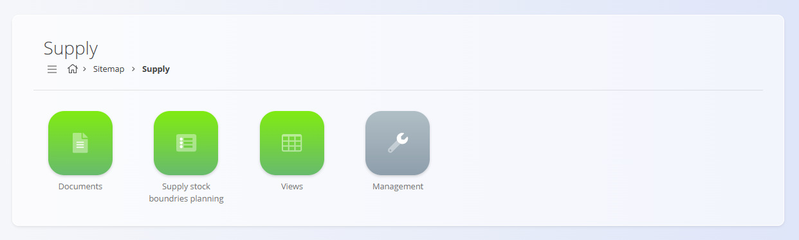

# Supply

The **Supply** domain manages all processes related to procurement, supplier interactions, and inbound material planning. It includes supplier inquiries, supply orders, planning tools, and analytical views that help maintain optimal stock levels and ensure timely replenishment.

Where the **[Sales](../../Sales/Domain/SalesDomain.md)** domain manages customer-facing activities, the Supply domain manages supplier-facing workflows that ensure materials are available when needed.

To access Supply, navigate to **Supply** in the [**navigation**](../../../Common/UI/Navigation.md).

> [!NOTE]  
> The available domains depend on each company’s configuration and business model.

## What is included in the Supply domain?

The domain is organized into several functional areas:

- **[Documents](#documents)** – procurement documents used to request or order materials  
- **[Supply stock boundaries planning](#supply-stock-boundaries-planning)** – planning tools based on stock boundary rules  
- **[Views](#views)** – analytical tools for understanding procurement trends  
- **[Management](#management)** – code lists and configuration for supplier-related processes

## Documents

The **Documents** section contains procurement-related documents used to request quotations or issue supply orders to vendors.

Available documents include:

- **[Inquiries](../Documents/Inquiries.md)** – Requests sent to suppliers asking for quotations or availability. These do not affect stock and can typically be converted to supply orders via linked documents.
- **[Supply orders](../Documents/SupplyOrders.md)** – Confirmed orders issued to suppliers for goods or services. Numbering is configured in the [Supply configuration](../Management/SupplyConfiguration.md). Receipts are registered in **Logistics** using [Receives](../../Logistics/Documents/Receives.md).

These documents initiate the procurement workflow and provide full traceability of supplier activity.

> [!NOTE]
> Supply documents follow standard states such as Draft and Committed. Availability of actions depends on the current state.

## Supply stock boundaries planning

The **[Supply stock boundaries planning](../Documents/SupplyStockBoundariesPlanning.md)** section provides planning tools based on stock boundary rules and material replenishment thresholds. Stock boundary rules are defined in **Logistics** under [Stock boundaries](../../Logistics/Management/StockBoundaries.md).

It supports proactive planning and prevents stockouts or overstocking.

## Views

The **Views** section provides analytical insight into supply orders and procurement patterns. These views are read-only.

Available views include:

- **[Supply order details](../Views/SupplyOrderDetails.md)** – Detailed information on supply orders, including items, deadlines, and supplier metrics.  
- **[Supply orders report](../Views/SupplyOrdersReport.md)** – Aggregated overview of supply order volume, trends, and statuses.

These screens support analysis and decision-making but do **not** create transactions.

## Management

The **Management** section contains configuration and master data required by procurement processes.

Available configuration and code lists include:

- **[Configuration](../Management/SupplyConfiguration.md)** – Supply settings and procurement rules, including document numbering for supply orders.  
- **[Supplier materials](../Management/SupplierMaterials.md)** – Mapping of which suppliers can provide which materials; may include lead times, MOQs, and price sources.  
- **[Expenses](../Management/Expenses.md)** – Expense categories (e.g., freight, customs) used on supply orders; affect the total procurement cost.  
- **[Business directory](../../../Common/Management/BusinessDirectory.md)** – Supplier and partner records.  
- **[Cost centers](../../../Common/Management/CostCenters.md)** – Financial allocation of procurement expenses.  
- **[Currencies](../../../Common/Management/Currencies.md)** – Currency definitions used in quotations and supply orders.  
- **[Predefined texts](../../../Common/Management/PredefinedTexts.md)** – Standard text blocks used in procurement documents.  
- **[Countries](../../../Common/Management/Countries.md)** – Geographic information used in supplier profiles.  
- **[Measure units](../../../Common/Management/MeasureUnits.md)** – Measurement units used across supply documents.  
- **[Tax rates](../../../Common/Management/TaxRates.md)** – Tax definitions applied during procurement.

These elements determine how the procurement processes behave and how supply-related data is structured.

> [!TIP]
See all management entries in the **[Management Index](../../../ManagementIndex.md)**.

## Supply Processes

Procurement operations typically follow a structured lifecycle:

### **1. Inquiry**  
An [inquiry](../Documents/Inquiries.md) is requested from the supplier, providing pricing, availability, and expected delivery dates.

### **2. Ordering**  
A [supply order](../Documents/SupplyOrders.md) is created and issued based on material needs or supplier agreements.

### **3. Delivery & Receipt**  
Goods are delivered by suppliers and processed through **Logistics** [**Receives**](../../Logistics/Documents/Receives.md).

### **4. Planning & Replenishment**  
[**Stock boundaries**](../../Logistics/Management/StockBoundaries.md) and planning views (see [**Supply stock boundaries planning**](../Documents/SupplyStockBoundariesPlanning.md)) help determine when new procurement cycles should begin.

### **5. Analysis**  
Views provide insights into supplier performance, order timelines, and overall procurement efficiency.

## Supply and Other Domains

Supply integrates with other operational domains:

| Area | Interaction |
|------|-------------|
| **[Materials](../../Assets/Domain/Materials.md)** | Defines the items being procured. |
| **[Logistics](../../Logistics/Domain/LogisticsDomain.md)** | Receives incoming goods and updates stock. |
| **[Production](../../Production/Domain/ProductionDomain.md)** | Requires purchased materials for manufacturing processes. |
| **[Sales](../../Sales/Domain/SalesDomain.md)** | Relies on procurement to ensure availability of sold items. |

## Summary

The Supply domain manages all procurement activities, ensuring timely replenishment of materials and smooth collaboration with suppliers.  

It supports inquiries, ordering, planning, and analysis, while integrating tightly with logistics, finance, production, and materials management.

