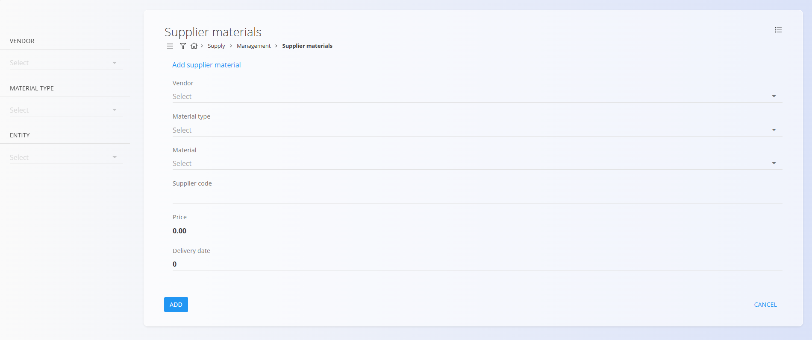

<!-- app_route: /management/supply/supplier-materials -->
<!-- app_label: Supplier materials -->
<!-- canonical_source_url: https://github.com/Tom-PIT/Connected.Docs/blob/main/en/Domains/Supply/Management/SupplierMaterials.md -->
<!-- canonical_source_title: Supplier materials -->

# Supplier materials

Supplier materials represent the list of materials that vendors provide to your organization. Each entry links an existing material from the [**Materials**](../../Assets/Domain/Materials.md) domain with a specific vendor and includes additional information such as the supplier’s material code, price, and delivery time.

This code list ensures that procurement processes can correctly identify which materials are available from each vendor and at what cost.

To access this code list, go to **Supply / Management / Supplier materials** in the [navigation](../../../Common/UI/Navigation.md).

## Schema

| Field | Description |
|-------|-------------|
| **Vendor** | Vendor providing the material. Must exist in the [**Business directory**](../../../Common/Management/BusinessDirectory.md) (mandatory). |
| **[Material type](../../Assets/Domain/Materials.md)** | Type of material ([**Raw material**](../../Assets/Materials/RawMaterials.md), [**Semi-product**](../../Assets/Materials/SemiProducts.md), [**Product**](../../Assets/Materials/Products.md), [**Repro material**](../../Assets/Materials/ReproMaterials.md)). Must match an existing material type (mandatory). |
| **[Material](../../Assets/Domain/Materials.md)** | Material supplied by the vendor. Must already exist in the **Materials** domain (mandatory). |
| **Supplier code** | The vendor’s internal code for this material. |
| **Price** | Net price at which the vendor supplies the material. |
| **Delivery date** | Delivery time expressed in days. |

## Management

### List of supplier materials

The user interface contains a list of all supplier materials, showing:

- Vendor  
- Material (with its code and name)  
- Price  

A search field is available in the upper-right corner.


### Filters

The left sidebar contains the following filters:

- **Vendor**  
- **Material type**  
- **Entity**

These filters allow narrowing the results based on supplier and material category.

## Actions

Click the [action button](../../../Common/UI/ActionButton.md) to display the available actions:

- **New**  
- **Import**

### Create a new supplier material

Click the [action button](../../../Common/UI/ActionButton.md) and select **New**. The input form includes fields:

- Vendor  
- Material type  
- Material  
- Supplier code  
- Price  
- Delivery date  



After entering the required information, click **Add** to save the record or **Cancel** to return to the list view.

### Import supplier materials

Click the [action button](../../../Common/UI/ActionButton.md) and select **Import**. This functionality allows bulk creation or updating of supplier materials using a spreadsheet file.

This screen behaves similarly to the **[Import materials](../../Assets/Materials/ImportMaterials.md)** page. It provides:

- File type selection (CSV or XLSX)  
- Downloadable example file  
- Drag-and-drop upload area  
- Preview of past imports  


#### Spreadsheet structure

A supplier materials import file must contain the following columns:

```
SupplierName,MaterialCode,Price,SupplierCode,DeliveryDate
```

Example row:

```
Rivermark Woodwork,CODE003,20,SupplierMaterial001,0
```

### Edit a supplier material

To edit an existing supplier material, click its entry in the list. The system opens the edit view where all fields can be modified.

When you are done editing, click **Save**. If you do not want to save the changes, click **Cancel**.

## Delete a supplier material

Click on a supplier material and click **Delete** to remove it from the system. A confirmation pop-up will appear. After confirming the deletion, the record will be permanently removed from the system.

> [!NOTE]  
> A supplier material can be deleted only if it is not referenced by other records.

## Menu

This page includes menu actions in two places.

Menu actions are available through the **Menu** button located in the top-right corner of the list or document page.

### List menu

The list menu provides actions for the currently displayed list.

Available actions:

- **Export to CSV**

### Document menu

The document menu provides actions for the currently opened document.

Available actions:

- **Export to CSV**

For details about menu actions, see [**Menu actions**](../../../Common/Concepts/MenuActions.md).


