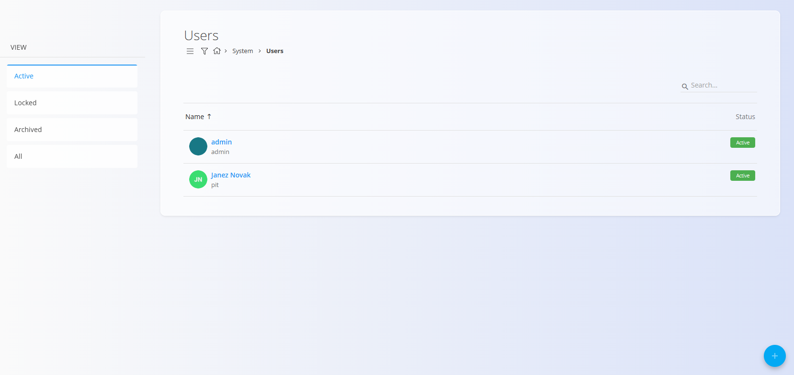
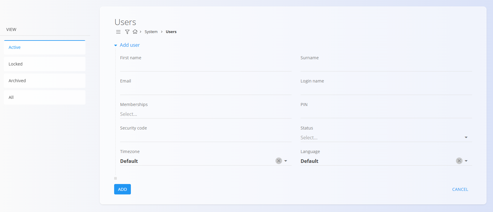
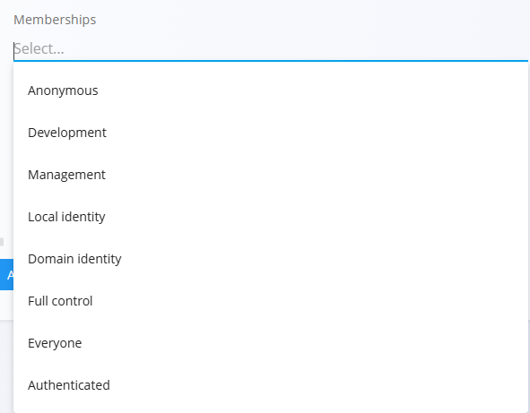

<!-- app_route: /management/users -->
<!-- app_label: Users -->
<!-- canonical_source_url: https://github.com/Tom-PIT/Connected.Docs/blob/main/en/Domains/System/Management/Users.md -->
<!-- canonical_source_title: Users -->

# Users

The **Users** code list contains all user accounts registered in the system. User accounts define login credentials, role-based access rights, personal profile details (name, email, time zone, language), and whether the user may access specific system areas (warehouse/domain rules still under review). These settings ensure that each user has appropriate permissions according to their responsibilities. 

To access the Users page, go to **System / Users** in the [**navigation**](../../../Common/UI/Navigation.md).

## Schema

| Field | Description |
|-------|-------------|
| **First name** | User’s given name. |
| **Last name** | User’s family name. |
| **Email** | Email address used for account identification and communication. |
| **Username** | Login name used for signing into the system. |
| **Roles** | One or more system roles determining access rights. |
| **PIN** | Optional numeric code for simplified authentication scenarios. |
| **Security code** | Optional additional authentication code (usage rules may vary by system). |
| **Status** | User status: *Active*, *Inactive*, or *Locked*. |
| **Time zone** | Defines the user’s default time zone for all date- and time-related operations. |
| **Language** | User interface language (Default, Slovenian, English). |

## Management

You can access the **Users** code list from **System / Users** in the [**navigation**](../../../Common/UI/Navigation.md). The list displays all system users with their status indicators:

- **Green** — Active  
- **Grey** — Inactive or Locked  

You may **search**, **sort**, or open a user to edit its details.

## Actions

### Create a new user

Click the [action button](../../../Common/UI/ActionButton.md) to create a new user.

The form includes personal details, login credentials, assigned roles, and localization settings.

Available **Membership** roles can be selected from the dropdown:

Click **Add** to create the user or **Cancel** to return to the list.

> **Note:** Roles define the user’s access rights within the system. Role structures are configured individually, according to your business model and operational needs. Because of this, the exact meaning and scope of each role may differ between implementations.

## Edit a user

To modify an existing user, click the user’s **Name** in the list. The edit screen allows updating all fields, including roles and status.  

Click **Save** to confirm changes or **Cancel** to discard them.

