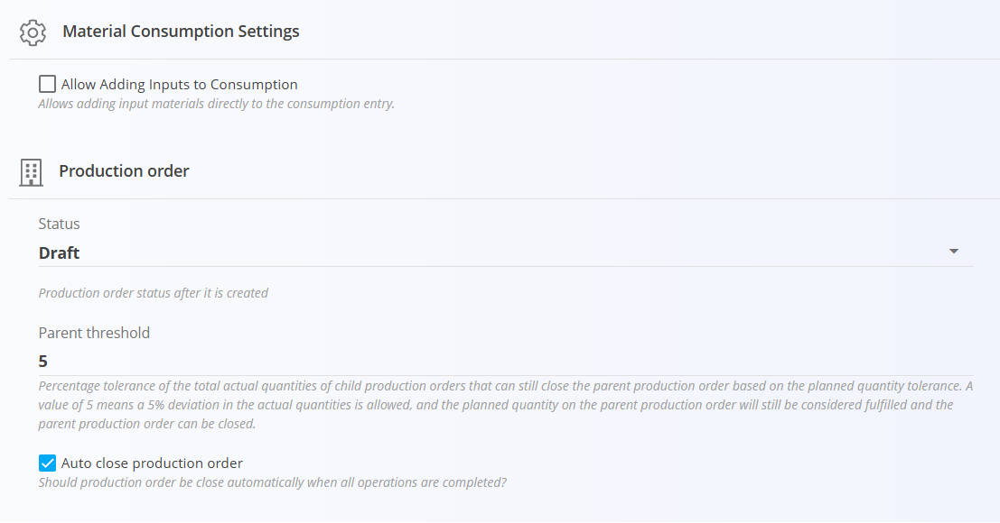
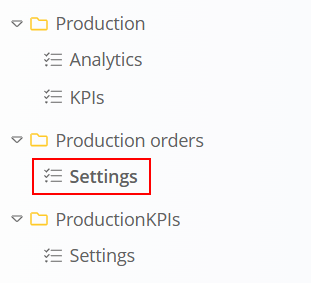

<!-- app_route: /management/configuration -->
<!-- app_label: Configuration -->
<!-- canonical_source_url: https://tom-pit.github.io/Connected.Docs/en/Domains/System/Settings/ProductionOrderConfiguration/ -->
<!-- canonical_source_title: Production order configuration -->

# Production order configuration

Production order configuration settings define the default behavior of production orders, including their initial status, completion rules, and material consumption behavior.

To access these settings, go to **System / Configuration** in the [navigation](../../../Common/UI/Navigation.md), then select **Production orders / Settings** in the left sidebar.

## Material Consumption Settings

### Allow adding inputs to consumption

When enabled, additional input materials can be added directly to a consumption entry.

When disabled, consumption is limited to the [input materials](../../Production/Management/Inputs.md) already defined for the production operation.

## Production order

The **Production order** section defines how production orders behave when they are created and completed.

### Status

Defines the default status assigned to a production order when it is created.

New production orders have a **Draft** status by default when first create. Select a different status when you require new production orders to have a different status, e.g. *Active*

### Parent threshold

Defines the percentage tolerance allowed when determining whether a **parent production order** can be completed based on the actual quantities produced by its child production orders.

For example, if the parent production order has a planned quantity of **100** and the **Parent threshold** is set to **5**, a combined actual quantity of **95** from the child production orders is considered sufficient to fulfill the parent order.

A value of **0** means that no quantity deviation is allowed.

> [!NOTE]
> This setting applies to production orders that contain child production orders.

### Auto close production order

When enabled, the production order is automatically closed after all of its operations are completed.

When disabled, the production order must be closed manually after the operations are completed.