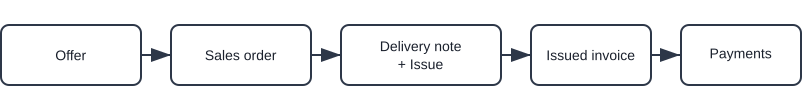

# Sales process (without prepayment)

This guide walks through a typical sales process without using prepayments. Use links for details; do not duplicate configuration here.

> [!TIP]
> Follow this guide step‑by‑step to configure the platform. Use the links to open each code list or setting if you need further details, then return to this page to continue with the next step.

## Overview

Flow: Offer → Sales order → Delivery note/Issues → Issued invoice → Payments

> [!NOTE]
> - In some use cases the process starts directly with a **Sales Order**. The **Offer** step is optional.
> - Inventory movement occurs at **Issue**. 
> - **Issued Invoice** records revenue and payments.

## Steps

### 1. Create and publish a sales offer (optional)

Create a commercial offer to confirm prices, quantities, and validity with the customer.

1. Go to **Sales / Documents / Offers**
2. Use the **[action button](../Common/UI/ActionButton.md)** to create a draft [sales offer](../Sales/Documents/Offers.md)
3. Fill customer, validity, and add items
4. Click **Publish** to confirm the commercial terms

### 2. Create a sales order

Create a sales order to reserve stock and plan fulfillment.

1. From the committed offer, use **Linked documents → [+ Sales order](../Sales/Documents/SalesOrders.md)**
2. Confirm quantities and delivery details, then click **Publish**

### 2a. Restock or produce (if needed)

If items are unavailable, see **[Restock or produce](05.RestockOrProduce.md)** for options to procure or manufacture before delivery.

For production companies, a quick way to create a production order is from the published sales order: 
- **Linked documents → [**+ Production order**](../Domains/Production/Documents/ProductionOrders.md)** 

This creates a Production order draft that can be committed later in the **[Production domain](../Domains/Production/Domain/ProductionDomain.md)**.

### 3. Deliver goods

The sales order is ready; prepare the shipment and move stock out of the warehouse.

1. From the sales order, open **Linked documents → [+ Delivery note](../Sales/Documents/DeliveryNotes.md)**.  
   Verify customer, delivery address, and add the items to be shipped.
2. In the delivery note, open **Linked documents → [+ Full issue](../Domains/Logistics/Documents/Issues.md)**.  
   Select the warehouse and location(s), confirm quantities to pick.
3. Click **Publish** to commit the issue.  
   This moves stock out and updates inventory balances.
4. (Optional) Verify the change in **[Stock view by location](../Domains/Logistics/Views/StockViewByLocation.md)**.

### 4. Issue the final invoice and record payments

Invoice delivered goods and record payment(s).

1. From the sales order or the delivery note, open **Linked documents → [+ Issued invoice](../Sales/Documents/IssuedInvoices.md)**
2. Review the final totals and add **Payment methods** if needed
3. Click **Publish**
4. Record incoming payments (partial or full) via the **Payment** button

> [!TIP]
> - Use **Linked documents** to step through each stage and confirm auto-filled data (customer, items).
> - Open **[Company cards](../Sales/Views/CompanyCards.md)** to review customer history, orders, and balances.