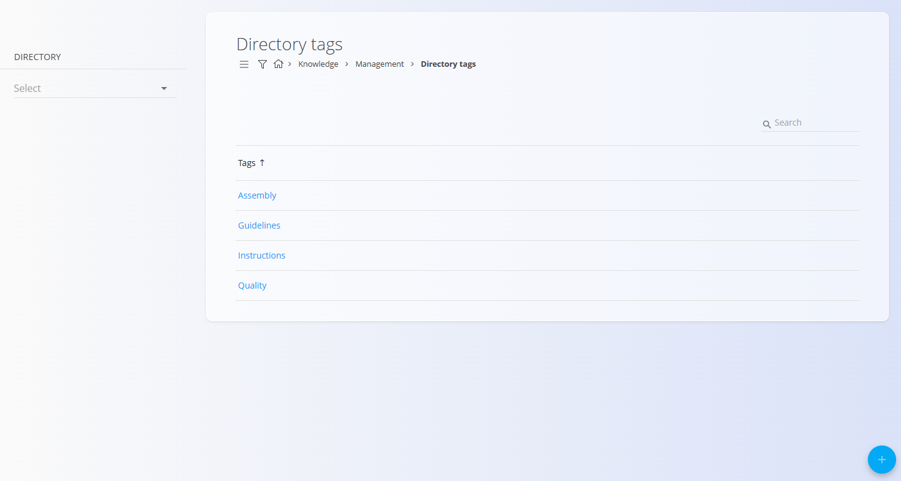
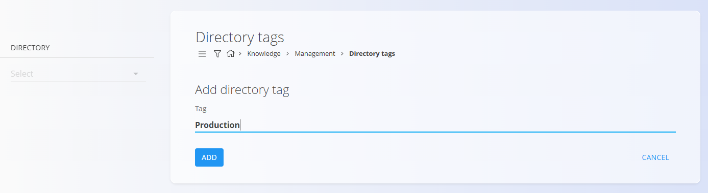
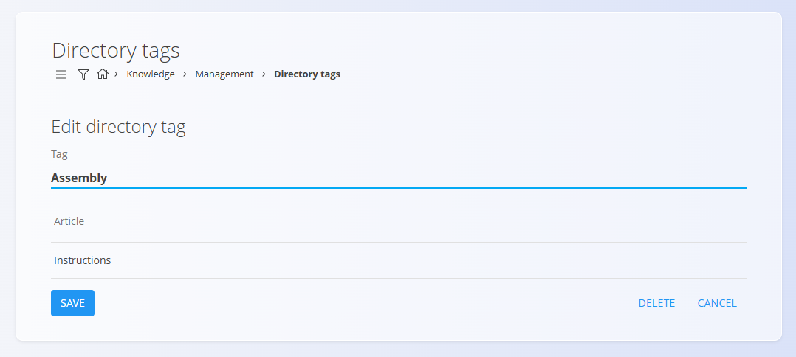

# Directory tags

The **Directory tags** code list defines tags that can be assigned to **Knowledge articles**. Tags help categorize content and improve searching and filtering within the [**Knowledge base**](../KnowledgeBase/KnowledgeBase.md).

Directory tags are shared across the **Knowledge** domain and can be reused by multiple directories and articles.

To access this screen, go to **Knowledge / Management / Directory tags** in the [navigation](../../Common/UI/Navigation.md).

## Schema

| Field | Description |
|------|-------------|
| **Tag** | Name of the directory tag (mandatory). |

## Management

### Directory tags list

The list view displays all configured directory tags.

Each row shows:
- **Tag** – tag name used to classify Knowledge [articles](Articles.md)

You can use the **Search** bar to quickly filter tags by name.

Clicking a tag opens it for editing.

## Actions

Click the **action button** to add a new directory tag.

### Add new directory tag

Enter the required **Tag** name.
 

Click **Add** to save the new tag.

The tag becomes immediately available for use in Knowledge [articles](Articles.md).

## Editing an existing directory tag

Click a directory tag in the list to open its edit screen.

From the edit screen you can:

- **Modify the tag name**
- **Review articles** that currently use this tag (read-only list)

The **Articles** section helps you understand where the tag is used before making changes or deleting it.

Click **Save** to confirm changes, or **Cancel** to discard them and return to the list.

## Deletion

Click **Delete** on the edit screen to open a confirmation dialog:

**Are you sure you want to delete this record?**

If confirmed, the tag is permanently removed; otherwise, the system keeps it unchanged.

## Related

- **[**Knowledge base**](../KnowledgeBase/KnowledgeBase.md)** – browse articles and filter by tags
- **[Directories](Directories.md)** – containers that hold articles and TOCs
- **[Articles](Articles.md)** – content items that can use directory tags

---

