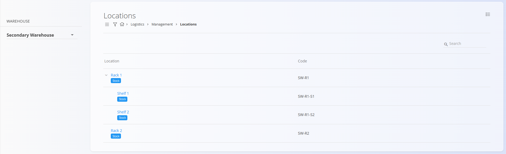
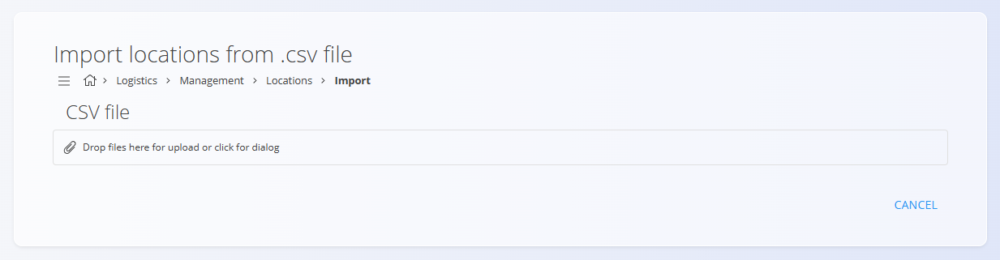
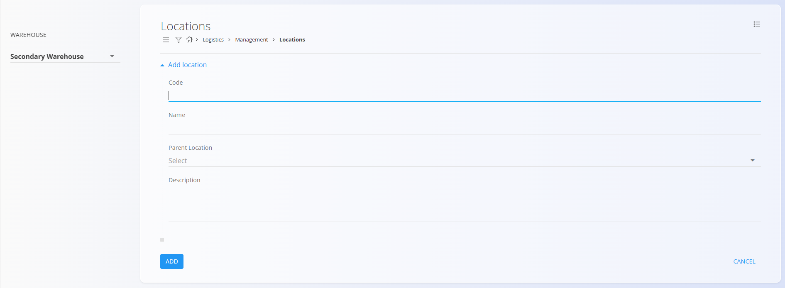

# Locations

This code list represents the storage locations within individual warehouses. Each location defines a specific area or subdivision, such as a rack, shelf, or compartment, and enables precise organization and tracking of materials within a warehouse.

For a detailed explanation of how warehouse locations work, watch the [Warehouses and warehouse locations](https://www.youtube.com/watch?v=3sEE9Mrtx6M) video.

---

## Schema

| Field | Description |
|-------|-------------|
| **Code** | Unique code identifying the location, often structured to reflect the hierarchy of the warehouse. |
| **Name** | Name or label of the location, for example **Rack 1** or **Shelf 2**. |
| **Parent location** | Defines another location within which this location is nested. For example, a shelf may belong to a specific rack. |
| **Description** | Optional description providing additional details about the location. |

---

## Management

To access the **Locations** code list, go to **Logistics / Management / Locations** in the [navigation](../../Common/UI/Navigation.md).

### List of locations

The interface displays a list of all locations for the selected warehouse. Use the warehouse selector on the left to change the warehouse. If no records exist yet, the list is empty.



Each record displays a **Stock** tag that opens the interface for managing the stock associated with the selected location. 

See [Stock view by location](../Views/StockViewByLocation.md) for more details.

---

## Actions

Click on the [action button](../../Common/UI/ActionButton.md) to display the following actions:

- Import  
- New  

### Import
You can import locations from a **CSV** file. This is useful when you are setting up warehouse structures with many racks, shelves, and bins.




Drag and drop the file into the upload area or click to open the file dialog. The file must contain the required fields in a valid structure.

After importing, you can review and adjust locations in the Locations management screen.

Click **Cancel** to return to the list without importing.

>[!NOTE]
>Each location is tied to a **warehouse**, so make sure that all referenced [**warehouses**](Warehouses.md) already exist in the system.


#### Example CSV structure

```csv
WarehouseCode,Code,Name,ParentLocationCode,Description
MAIN,CR01,Central rack,,Main central rack in the warehouse
MAIN,CR01-SH01,Shelf 1,CR01,First shelf in the central rack
MAIN,CR01-SH02,Shelf 2,CR01,Second shelf in the central rack
SEC,SEC-R1,Rack 1,,Rack in secondary warehouse
```

### New

The **New** action opens the input form for creating a new entry. The form includes the following fields:

- **Code**
- **Name**
- **Parent location**
- **Description**
- **Active**



After entering the required information, click **Add** to save the location or **Cancel** to return to the list view.

---

## Editing

To edit an existing location, click the location’s **Name** in the list. The interface switches to edit mode, displaying the existing values. 

Click **Save** to confirm changes or **Cancel** to discard them.

## Deletion

Click **Delete** on the edit screen to open a confirmation dialog: 

**Are you sure you want to delete this record?**  

If confirmed, the location is permanently removed; otherwise, the system keeps the record unchanged.

> [!NOTE]
>A location can be deleted only if it is not used in any dependent entries, such as stock records or warehouse operations.  
