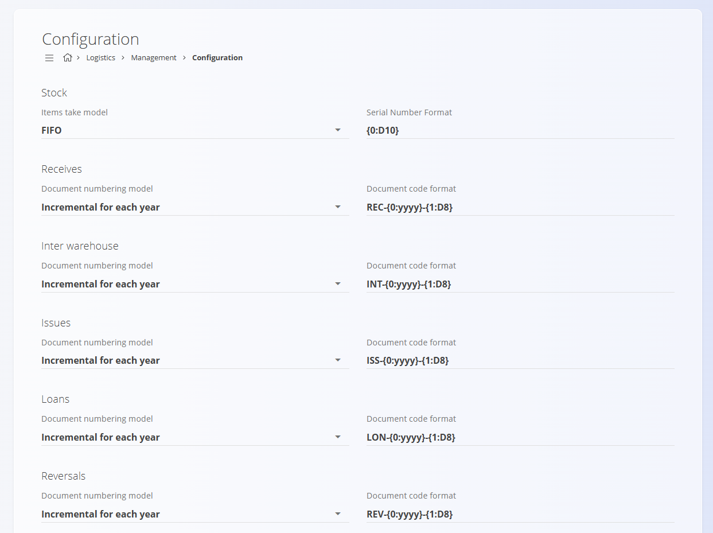

# Logistics configuration

Configure logistics settings affecting stock behavior, serial formats, and document numbering. Any changes are saved automatically.

To access **Logistics configuration**, go to **Logistics / Management / Configuration** in the [navigation](../../Common/UI/Navigation.md).

## Stock settings

| Field | Description |
|-------|-------------|
| **Items take model** | Rule used to consume stock:   • **FIFO:** oldest stock first   • **LIFO:** newest stock first    • **Best before:** earliest expiry first |
| **Serial number format** | Format for generated serial numbers (pattern or mask). |

> [!TIP]
>
> Apply a consistent serial format to simplify scanning and tracking.

## Document numbering settings

Choose the numbering model and format for Logistics documents (Receives, Issues, Inter‑warehouse, etc.).

| Field | Description |
|-------|-------------|
| **Document numbering model** | **Incremental for each year** or **Incremental** (continuous). |
| **Document code format** | Pattern defining structure (e.g., PREFIX‑{YYYY}-{NNNNNN}). |

Behavior:
- Incremental for each year: sequence resets annually.
- Incremental: a global sequence that never resets.

