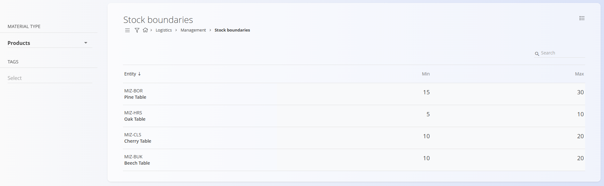

# Stock boundaries

This code list represents the stock boundaries for individual materials or products in the system. Each record defines the minimum and maximum stock quantity allowed for a particular material type, ensuring optimal inventory levels and preventing shortages or overstocking.  

For a detailed explanation of how stock boundaries work, watch the [Stock boundaries](https://www.youtube.com/watch?v=rcbxvffOBdM) video.

---

## Schema

The code list has the following schema:

| Field | Description |
|-------|--------------|
| **Entity** | The material or product to which the stock boundaries apply. The entity is displayed with its code and name. |
| **Min** | The minimum allowed stock quantity for the selected material or product. When the quantity drops below this value, the system highlights the condition in the [Dashboard](../Documents/Dashboard.md). |
| **Max** | The maximum allowed stock quantity for the selected material or product. When this value is exceeded, the system highlights the condition in the [Dashboard](../Documents/Dashboard.md). |

---

## Management

To access the **Stock boundaries** code list, go to **Logistics / Management / Stock boundaries** in the [navigation](../../Common/UI/Sitemap.md).

### List of Stock Boundaries

The user interface displays a list of all materials and their defined stock boundaries.  
Use the **Material type** selector on the left to filter results by category, and the **Tags** filter to refine the displayed records.

Each record shows the **Entity**, **Min**, and **Max** stock quantities.  
If no value is defined for **Min** or **Max**, the table displays **0** by default.

Stock boundaries can be edited directly within the table by clicking the numeric value in the **Min** or **Max** column and entering a new number. The changes are saved automatically once the field is updated.

---

## Actions

Click on the [action button](../../Common/UI/ActionButton.md) to display the following action:

- Import  

### Import

The **Import** action allows bulk creation or update of stock boundary records using a CSV file. Prepare the file with the required fields (**Entity**, **Min**, **Max**) and upload it to automatically populate the list.

---

## Menu

The **Menu** in the top-right corner provides the following option: **Export to CSV**, which exports all visible records to a CSV file for reporting, analysis, or backup purposes.

---

## Editing

Stock boundaries are edited directly within the list view.  
Click on any numeric value in the **Min** or **Max** column to modify it. Enter the new value, and it will be saved automatically when you leave the field.  

If no values are specified, the system displays **0** as the default.  
Any stock quantity below the defined minimum or above the defined maximum is visually indicated in the [Dashboard](../Documents/Dashboard.md) under **Logistics / Dashboard**.
