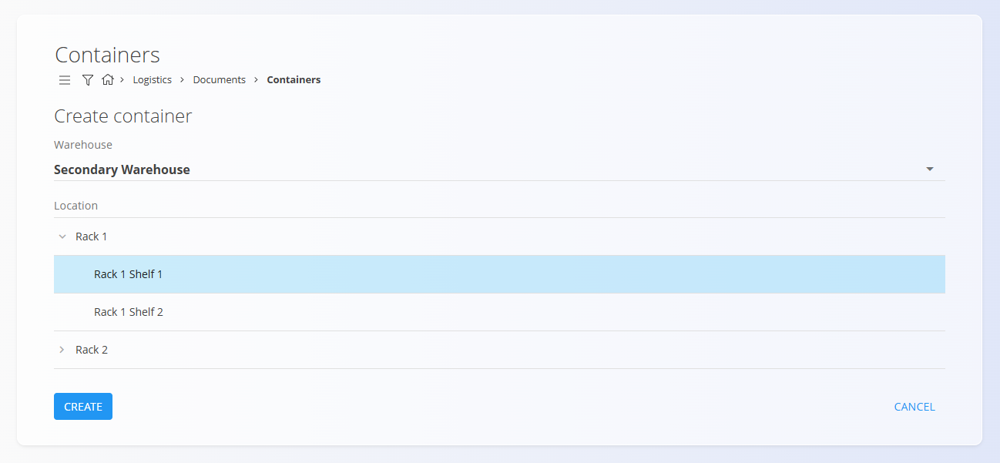
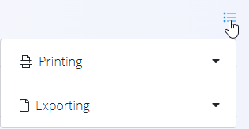

# Containers

A container groups one or more items under a single serial code (often an SSCC – Serial Shipping Container Code). This lets you pack, move, and scan a whole set at once without opening it. Items placed in a container are reserved to that container and cannot be used in other transactions until the container is dissolved or items are removed.

> [!TIP]
> For a full demonstration, see the **[Containers](https://www.youtube.com/watch?v=2V9K1jTsyQI)** video tutorial.

To access this page, go to **Logistics / Documents / Containers** in the [navigation](../../Common/UI/Navigation.md).

## Schema

### Document section

| Field | Description |
|---|---|
| [**Code**](../../Common/UI/DocumentCodes.md) | Unique SSCC container identifier (a system‑generated code with this structure: CTR‑YYYY‑NNNNNNNN). |
| [**Warehouse**](../Management/Warehouses.md) | Warehouse where the container resides. |
| **Document date** | Date the container document was created. |
| [**Location**](../Management/Locations.md) | Warehouse location (e.g., Rack/Shelf). |

### Detail section

| Field | Description |
|---|---|
| [**Material**](../../Assets/Domain/Materials.md) | Packed item (product, semi product, raw or repro material). |
| **Serial number** | Serial/lot identifier of the packed item. |
| **Best before** | Expiration date if tracked. |
| **Warehouse location** | Per‑line location if applicable. |
| **Quantity (pc)** | Quantity of the packed line. |

## List of container documents

The Containers page shows all container documents. Use filters such as:
- **Document dates**
- **View** (Draft, Packaged)
- **Warehouse**
- **Author**

## Actions

Containers are created manually from this page.

1. Click the [**action button**](../../Common/UI/ActionButton.md) to create a new container document.
2. Specify the Warehouse and Location.

    

3. The draft container is created. Edit the **Document date** if needed.

    

4. Type or scan a serial number, EAN, or material name into the Details bar. The system displays all matching materials and serial numbers. If multiple items are found, make sure to select the correct one.

    

5. **Select the right quantity** and click **Save** to save the detail. Repeat with other details if needed.
 
    

6. When ready, click **Package** to reserve the content and make it ready for logistics operations.

The packaged container is now ready, and the status changes to **Packaged**. You can use the menu to print or export labels with the container SSCC code.

> [!NOTE]
> Items in a Packaged container are reserved and cannot be transacted (issue/receive/move) individually. To release them, dissolve the container or remove the line from the container.

### Using containers

- Picking/issuing: scan the container code during **[Issues](Issues.md)** to add all content at once
- Receiving/put‑away: scan on **[Receives](Receives.md)** to place the full set into stock
- Moves: use **[Inter warehouse](InterWarehouse.md)** or **[Move serial](MoveSerial.md)** and scan the container to move all items together
- Stock checks: use **[Stock](Stock.md)** / **[Stock view by location](../Views/StockViewByLocation.md)** to verify container presence and position

## Reviewing a container

- Header shows container code, warehouse, date, and location
- Details list packed items, serials, storage location, and quantities
- Document Connections (if applicable) show related logistics transactions

> [!TIP]
> - Click on the **Location** link to open the [**Stock view by location**](../Views/StockViewByLocation.md) filtered to show only items in that location. 
> - Click on a material's serial number to open the [**Stock view by serial number**](Stock.md#stock-view-by-serial-number).

## Menu

Use the document menu for actions:

- **Printing** (if configured) — prints the container (SSCC) label
- **Exporting** — exports the container (SSCC) label as a PDF file

## Deletion
- Draft containers can be deleted freely
- Packaged containers cannot be deleted; use **Dissolve** to release contents.

---
