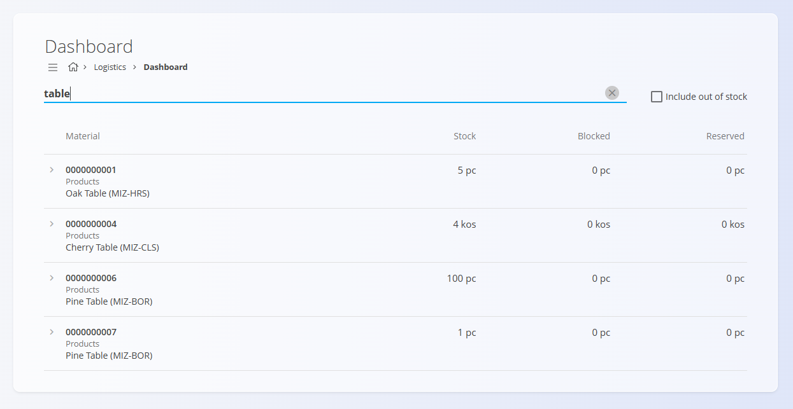

# Dashboard

The **Dashboard** provides a quick overview of stock-related conditions across all materials. It is designed to highlight potential stock issues—such as low quantities, overstock, and out-of-stock situations—allowing users to react quickly.

For a detailed explanation of how the dashboard works, watch the [Dashboard overview](https://www.youtube.com/watch?v=mEU18GmypkY) video.

To access the dashboard, go to **Logistics / Dashboard** in the [navigation](../../Common/UI/Navigation.md).

---

## Stock Indicators

The dashboard displays four main indicators. Clicking any indicator updates the list below to show only the materials matching that condition. If no indicator is selected, the dashboard displays recently created logistics documents.

### Below Minimum  
Materials with stock quantity lower than the defined **minimum stock level**.  

Minimum values are configured in **[Stock boundaries](../CodeLists/StockBoundaries.md)**.

### Over Maximum  
Materials with stock quantity higher than the defined **maximum stock level**.  

Maximum values are configured in **[Stock boundaries](../CodeLists/StockBoundaries.md)**.

### Out of Stock  
Materials that currently have **zero available stock**.

### Below Blocked  
Materials with a stock quantity **lower than the blocked quantity threshold**.

---

## Search and Scan

You can search for a material by typing its **serial number**, **material code**, or **name** into the search bar. 

The option **Include out of stock** allows you to expand the results to include materials with zero stock.

Press enter or click the **Stock** button to display matching results. If the search bar is empty, the button directly takes you to the [**Stock**](Stock.md) overview page.

A results screen appears showing a list of materials with the following columns:

- **Material**  
- **Stock**  
- **Blocked**  
- **Reserved**

---

## Material List

Below the indicators, the dashboard shows a list of materials relevant to the current indicator selection. The list includes:

- Material type  
- Material / Product name  
- Current stock or min/max value  

A search field on the right allows further filtering of visible items.

>[!NOTE]
>Click on a material to open its [Stock by material](Stock.md#stock-view-by-material) view.

