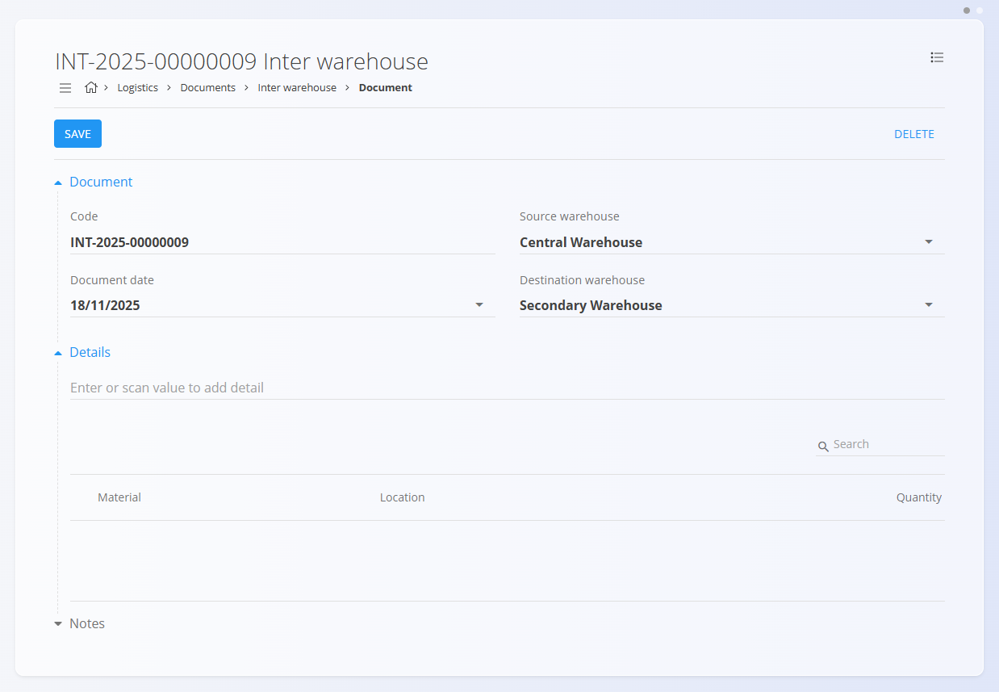
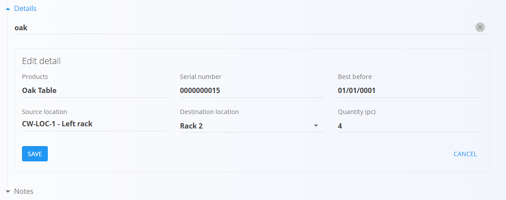

# Inter warehouse

An **Inter warehouse** document is used to transfer materials from one warehouse to another.  
It records source and destination warehouses, the moved items, and their quantities.

For a full walkthrough of how inter warehouse transfers work, watch the  
[Inter warehouse](https://www.youtube.com/watch?v=xtyKDh7_qgI) video.

To access Inter warehouse documents, go to **Logistics / Documents / Inter warehouse** in the [navigation](../../Common/UI/Navigation.md).

---

## Schema

### Document section

| Field | Description |
|-------|-------------|
| **Code** | System-generated unique identifier for the inter warehouse document. |
| **Document date** | Date when the transfer is registered. |
| **Source warehouse** | Warehouse from which the materials will be removed. |
| **Destination warehouse** | Warehouse where the materials will be received. |
| **Notes** | Additional remarks related to the document. |

### Detail section

| Field | Description |
|-------|-------------|
| **Material** | The material being transferred (product, semi product, raw material, or repro). |
| **Serial number** | The serial number of the unit being transferred. |
| **Best before** | Expiration date (for materials with shelf life). |
| **Source location** | Storage location in the source warehouse. |
| **Destination location** | Storage location where the material will be placed. |
| **Quantity (pc)** | Quantity to be transferred. |

---

## List of inter warehouse documents

The **Inter warehouse** page displays all transfer documents. You can search for a specific document using the search bar, or filter the list using the left sidebar, which includes:

- **Document dates**
- **View**  
  - *Drafts* — documents created but not yet published  
  - *Committed* — published/confirmed transfers
- **Author**
- **Source warehouse**
- **Destination warehouse**

A color indicator next to each document shows its status:

- **Green** — committed  
- **Gray** — draft

You can click any document to open and review its details.

---

## Actions

Click the **action button** to create a new inter warehouse document.

### Creating an inter warehouse document

1. Click **Add new**. Then select the **Source warehouse** and **Destination warehouse**.

   

2. In the **Details** section, scan or type a **serial number**, **EAN**, or material **name**.  
   - If only one match exists → details autofill immediately.  
   - If multiple matches exist → a selection list appears:

   

3. Select the correct item, and the system automatically fills all fields.
4. Adjust **Destination location** or **Quantity** if needed.  

   

5. Click **Save** to save the detail. You can add more items by repeating step 3.
6. Click **Save** on the top-left corner to save the transfer document.
7. When the physical transfer is completed at the destination warehouse, open the draft and click **Publish** to confirm the stock movement.

A newly created inter warehouse document appears in **Drafts**. Once published, it moves to **Committed** and stock is transferred immediately.

---

## Notes

Each document includes a **Notes** section where you can enter any comments or additional information related to the transaction. Notes are saved together with the document and remain visible both in draft and committed versions.

---

## Menu

Inside an inter warehouse document, the **menu (hamburger icon)** in the top-right corner provides:

- **Printing**
- **Exporting (PDF)**

These options are available for both *draft* and *committed* documents.

---

## Deletion

Draft documents can be deletedon the edit screen, but only if they contain **no material entries**.

If the draft still includes materials in the **Details** section:

1. Click the material serial number to open the **Edit detail** screen.  
2. Click **Delete** inside the Edit detail window to remove the material.  
3. Repeat this for all remaining materials.

Once the document contains no materials, you can click **Delete** to remove the draft.

Committed documents **cannot** be deleted.
