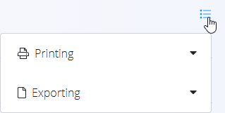

# Inventories

An **Inventory** document is used to verify and correct stock quantities at a specific warehouse location. It compares the **theoretical stock** stored in the system with the **actual stock** physically present on the shelves. If differences are found, you can update the quantities and publish the document to adjust the stock levels accordingly.

Inventory checks are performed per location and show all materials stored there, along with indicators of missing or excess items. You can open the **Stock view by location** or the **Stock view by serial number** directly from related screens to understand how stock levels were formed. Minimum and maximum thresholds shown in summaries can be configured in the **[Stock boundaries](../Management/StockBoundaries.md)** code list.

> [!TIP]
> For a full demonstration, see the **[Inventory](https://www.youtube.com/watch?v=Rc4qqTdxKn8)** video tutorial.

To access Inventories, go to **Logistics / Documents / Inventories** in the [navigation](../../Common/UI/Navigation.md).

## Schema

### Document section

| Field | Description |
|-------|-------------|
| [**Code**](../../Common/UI/DocumentCodes.md) | System-generated unique identifier for the inventory document. |
| **Document date** | Date when the inventory count is performed or recorded. |
| [**Warehouse**](../Management/Warehouses.md) | Warehouse where the inventory verification is taking place. |
| [**Location**](../Management/Locations.md) | Specific location within the selected warehouse that is being verified. |

### Detail section

| Field | Description |
|-------|-------------|
| [**Material**](../../Assets/Domain/Materials.md) | The material stored at the selected location ([product](../../Assets/Materials/Products.md), [semi product](../../Assets/Materials/SemiProducts.md), [raw material](../../Assets/Materials/RawMaterials.md), or [repro material](../../Assets/Materials/ReproMaterials.md)). |
| **Location** | Storage location where the inventory is being performed. |
| **Theoretical** | Quantity currently recorded in the system. |
| **Actual** | Physically verified quantity (editable). |

## List of inventory documents

The **Inventories** page displays all inventory documents.  
You can filter the list using the left sidebar, which includes:

- **Document dates**
- **View**  
  - *Drafts* — documents created but not yet published  
  - *Committed* — published inventory adjustments
- **Author**
- **Warehouse**

A color indicator next to each document shows its status:

- **Green** — committed  
- **Gray** — draft

Click any document to open and review its contents.

**List view example:**

## Actions

Click the **action button** to create a new inventory document.

### Creating an inventory document

1. Click **Add new** to create a new inventory session. 

   

2. After selecting a warehouse and location, the system automatically loads all materials recorded at that location.

3. In the **Summary** section, you will see:  
   - **Non allocated** — number of materials that still need to be verified  
   - **Missing** — number of materials with lower actual than theoretical  
   - **Excess** — number of materials with higher actual than theoretical

4. In the **Details** section, the **Actual** column shows **0** by default. Edit the values in this column to reflect the real number found physically at the location. When an actual value is lower or higher than the theoretical value, it will be reflected in the **Missing** and **Excess** sections of the **Summary**.

   

5. Once all materials have been checked and actual values are entered, the **Non allocated** section of the **Summary** will turn green and show **0**.
5. Click **Publish** to confirm the inventory. This action updates the system stock levels to match the actual physical quantities.

A newly created inventory document appears in **Drafts**. Once published, it moves to **Committed** and stock levels are corrected.

 > [!NOTE]
 > The values shown under **Missing** and **Excess** indicate how many **different materials** have discrepancies. They do not represent the number of missing or extra pieces, only the number of materials affected.

## Notes

Use the **Notes** section to record any comments related to the inventory process.

## Menu

Inside an inventory document, the **menu (hamburger icon)** provides the following options:

- **Printing**
- **Exporting (PDF)**  

These options are available for both *draft* and *committed* documents.

## Deletion

Click **Delete** to remove a **draft** inventory document. Committed inventory documents **cannot** be deleted or reversed.
